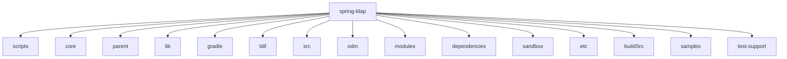

# 基础信息

|      |      |
|------|------|
| 名称 | spring-ldap |
| 编码语言 | .java |
| 代码路径 | spring-ldap |
| 概述说明 | Spring LDAP框架核心模块，简化LDAP操作，支持上下文管理、对象映射、认证策略、路径处理、异常处理、事务管理等。 |

# 说明

## 概述

该代码模块是一个基于Spring LDAP框架的综合工具集，涵盖了LDAP操作、LDIF文件处理、ODM（对象目录映射）管理、虚拟列表视图控制以及项目构建与版本管理等多个方面。模块的核心目标是通过提供丰富的工具类和功能实现，简化LDAP相关的开发工作，确保数据操作的高效性、安全性和一致性。模块支持多种认证机制、事务管理、分页搜索、排序控制等功能，并提供了灵活的扩展点，便于开发者根据具体需求进行定制化开发。此外，模块还包含了对LDAP模板、LDIF文件解析、ODM数据管理、虚拟列表视图控制以及项目构建与版本管理的测试和验证，确保系统在各种业务场景下的稳定性和可靠性。

## 主要业务场景

1. **LDAP操作与管理**：
   - **LDAP上下文管理**：通过`AbstractContextSource`、`LdapContextSource`等类，模块提供了LDAP上下文的创建、管理和资源释放功能，支持连接池管理和匿名访问，确保与LDAP服务器的高效交互。
   - **对象映射与处理**：通过`AbstractContextMapper`、`DefaultIncrementalAttributesMapper`等类，模块简化了从`DirContextOperations`到目标对象的映射过程，支持分页查询和多值属性处理，提升了数据处理的灵活性和性能。
   - **认证与安全**：模块提供了多种认证策略，如`DefaultTlsDirContextAuthenticationStrategy`、`DigestMd5DirContextAuthenticationStrategy`等，支持TLS、DIGEST-MD5和EXTERNAL等认证机制，确保LDAP操作的安全性。
   - **分页搜索与排序控制**：通过`PagedResultsRequestControl`、`SortControlDirContextProcessor`等类，模块支持对LDAP查询结果进行分页处理和排序控制，确保查询结果按照指定顺序返回。
   - **事务管理**：`ContextSourceTransactionManager`和`TransactionAwareContextSourceProxy`等类提供了对LDAP事务的管理功能，确保在LDAP操作中事务的一致性和完整性。

2. **LDIF文件处理**：
   - **LDAP属性验证**：通过`DefaultSchemaSpecification`、`BasicSchemaSpecification`等类，模块验证`LdapAttributes`对象的属性是否符合预定义的策略，确保数据在LDAP目录中的一致性和有效性。
   - **LDIF文件解析**：`LdifParser`类负责从资源中读取LDIF文件，并解析其内容，确保数据准确获取。`SeparatorPolicy`类则负责评估LDIF文件的行格式，确保LDIF文件的内容能够被准确解析。
   - **属性验证**：`DefaultAttributeValidationPolicy`类专门用于验证LDAP属性，支持多种格式，包括标准、Base64、URL和UTF8，确保数据的一致性和规范性。

3. **ODM（对象目录映射）管理**：
   - **LDAP数据管理**：通过`OdmManagerImpl`类，开发者可以执行对LDAP数据的增删改查及搜索操作，适用于需要与LDAP服务器进行交互的业务场景。
   - **LDAP模式处理**：通过`SchemaReader`、`SchemaViewer`、`SchemaToJava`等类，模块支持LDAP模式的读取、解析、查看和转换为Java代码，简化了从LDAP模式到Java类的映射过程。
   - **对象与属性的管理**：`ObjectSchema`和`AttributeSchema`类分别管理对象的必须属性和可选属性，确保属性的一致性和完整性。

4. **虚拟列表视图控制**：
   - **复杂列表管理**：模块适用于需要精细控制列表视图的场景，特别是那些涉及大量数据展示和操作的应用。通过上下文感知和动态排序功能，用户可以高效地浏览和操作列表内容。
   - **LDAP数据处理**：模块中的组件专门用于处理LDAP请求和响应，支持分页和偏移量设置，提升系统性能。
   - **数据状态追踪**：通过`VirtualListViewResultsCookie`类，模块能够有效地管理和追踪列表视图中的数据和状态，确保视图的准确性和一致性。

5. **项目构建与版本管理**：
   - **GitHub版本发布管理**：通过`Release`类和`GitHubReleasePlugin`插件，模块支持GitHub版本发布任务的管理，包括版本标签、提交记录、发布名称、内容描述等。
   - **里程碑状态验证**：通过`GitHubMilestoneApi`类，模块能够查找里程碑编号并检查未关闭的问题，确保所有问题均已解决或关闭。
   - **Maven/Gradle工件发布**：模块支持将工件发布到Artifactory、Maven Central、OSS仓库及本地Maven仓库，提供签名管理、POM文件定制、许可证管理等功能。
   - **文件格式转换**：通过`RncToXsd`类，模块支持将RNC文件转换为XSD文件，确保文件格式的准确性和一致性。

通过这些功能，该模块为开发者提供了一个完整的LDAP操作、LDIF文件处理、ODM管理、虚拟列表视图控制以及项目构建与版本管理的解决方案，适用于需要与LDAP服务器进行交互、处理LDAP数据、管理复杂列表视图以及自动化构建与版本管理的各种应用场景。

### 包内部结构视图

该流程图展示了`spring-ldap`项目的目录结构，其中`spring-ldap`作为根节点，包含了多个子目录和模块，如`core`、`src`、`gradle`等。这些子目录分别负责不同的功能模块，如核心代码、源代码、构建工具等，共同构成了项目的完整架构。

# 文件列表 File List

| 名称   | 类型  | 说明 |
|-------|------|-------------|
| [core](core/src/main/java/org/_module.md) | folder | 测试LDAP模板的查找、排序和分页功能，确保系统稳定性和可靠性。 |
| [_module.md](src/main/javadoc/_module.md) | folder | None |
| [buildSrc](buildSrc/src/main/java/trang/_module.md) | folder | 该模块提供GitHub版本发布、里程碑管理、构建系统工件发布、项目配置、依赖锁定及文件格式转换等综合功能，确保版本控制和发布流程的一致性与可追溯性。 |
| [test-support](test-support/src/main/java/org/_module.md) | folder | None |
| [sandbox](sandbox/src/main/java/org/_module.md) | folder | 虚拟列表视图控制工具集成排序和视图管理，优化数据展示，提升用户体验。 |
| [odm](odm/src/main/java/org/_module.md) | folder | LDAP模块提供数据管理和模式转换功能，支持增删改查及Java代码生成。 |
| [ldif](ldif/ldif-core/src/main/java/org/_module.md) | folder | LDAP属性验证与合规性检查，LDIF文件解析与处理。 |

