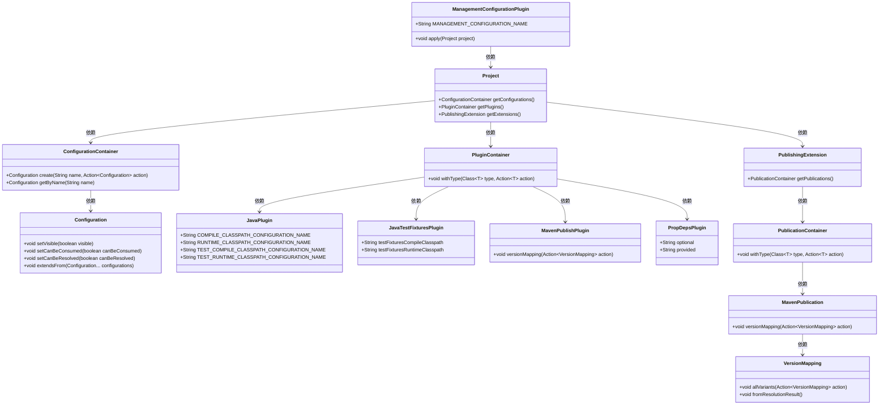
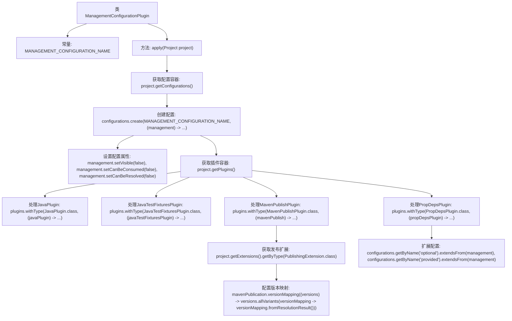

# 基础信息

|      |      |
|------|------|
| 名称 | ManagementConfigurationPlugin |
| 编码语言 | .java |
| 代码路径 | spring-ldap/buildSrc/src/main/groovy/io/spring/gradle/convention/ManagementConfigurationPlugin.java |
| 包名 | io.spring.gradle.convention |
| 依赖项 | ['org.gradle.api.Plugin', 'org.gradle.api.Project', 'org.gradle.api.artifacts.ConfigurationContainer', 'org.gradle.api.plugins.JavaPlugin', 'org.gradle.api.plugins.JavaTestFixturesPlugin', 'org.gradle.api.plugins.PluginContainer', 'org.gradle.api.publish.PublishingExtension', 'org.gradle.api.publish.maven.MavenPublication', 'org.gradle.api.publish.maven.plugins.MavenPublishPlugin', 'org.springframework.gradle.propdeps.PropDepsPlugin'] |
| 概述说明 | 管理配置插件实现，创建不可见、不可消费、不可解析配置，扩展类路径和发布配置。 |

# 说明

管理配置插件的实现旨在创建一种不可见、不可消费且不可解析的配置。该配置通过扩展多个类路径和发布配置来实现，确保其在系统中具有特定的隔离性和安全性。这种配置方式适用于需要严格控制访问和使用的场景，确保配置信息不会被误用或暴露。

# 类列表 Class Summary

| 名称   | 类型  | 说明 |
|-------|------|-------------|
| ManagementConfigurationPlugin | class | 管理配置插件实现，创建不可见、不可消费、不可解析的配置，并扩展多个类路径和发布配置。 |

## 类 ManagementConfigurationPlugin

|      |      |
|------|------|
| 访问范围 | public |
| 类型 | class |
| 名称 | ManagementConfigurationPlugin |
| 说明 | 管理配置插件实现，创建不可见、不可消费、不可解析的配置，并扩展多个类路径和发布配置。 |

### UML类图

### 描述
`ManagementConfigurationPlugin` 是一个插件类，用于管理项目的配置。它通过 `apply` 方法在项目中创建一个名为 "management" 的配置，并根据不同类型的插件（如 `JavaPlugin`、`JavaTestFixturesPlugin`、`MavenPublishPlugin` 和 `PropDepsPlugin`）来扩展该配置。该类依赖于 `Project`、`ConfigurationContainer`、`PluginContainer` 等类，并通过这些类的方法来实现配置的创建和扩展。

### 内部方法调用关系图

这段代码定义了一个`ManagementConfigurationPlugin`类，实现了`Plugin<Project>`接口。其主要功能是通过`apply`方法配置项目的管理配置。首先，它创建了一个名为`management`的配置，并设置了其可见性和消费、解析属性。然后，它根据不同的插件类型（如`JavaPlugin`、`JavaTestFixturesPlugin`、`MavenPublishPlugin`和`PropDepsPlugin`）进行相应的配置扩展和版本映射。最终，这些配置被应用到项目的各个部分，确保项目的依赖管理和发布配置正确无误。

### 字段列表 Field List

| 名称  | 类型  | 说明 |
|-------|-------|------|
| MANAGEMENT_CONFIGURATION_NAME = "management" | String | 定义了一个名为MANAGEMENT_CONFIGURATION_NAME的静态常量字符串，值为"management"。 |

### 方法列表 Method List

| 名称  | 类型  | 说明 |
|-------|-------|------|
| apply | void | 创建管理配置并扩展多个类路径配置。 |

