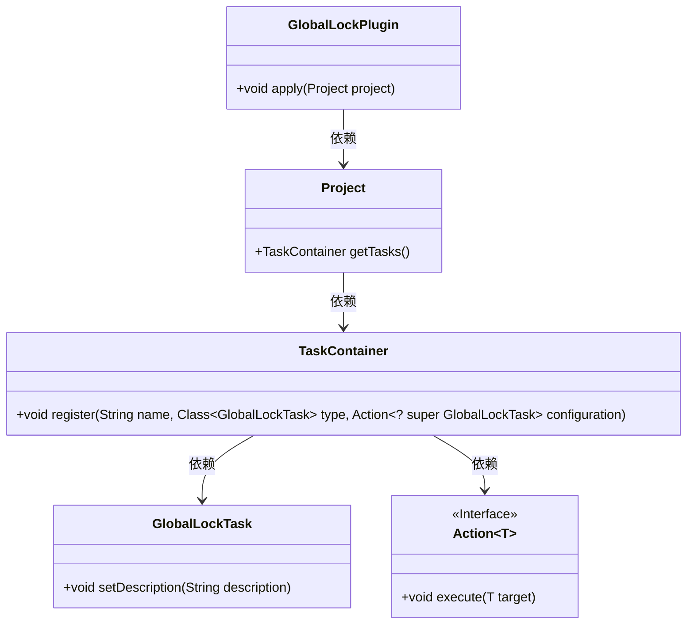
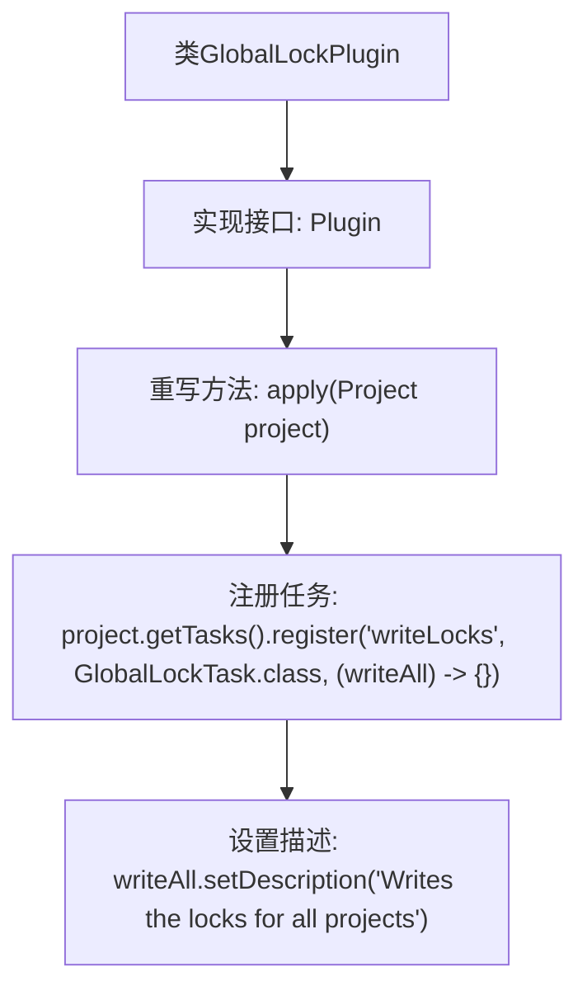

# 基础信息

|      |      |
|------|------|
| 名称 | GlobalLockPlugin |
| 编码语言 | .java |
| 代码路径 | spring-ldap/buildSrc/src/main/java/lock/GlobalLockPlugin.java |
| 包名 | None |
| 依赖项 | ['org.gradle.api.Plugin', 'org.gradle.api.Project'] |
| 概述说明 | GlobalLockPlugin注册writeLocks任务，用于项目锁写入。 |

# 说明

GlobalLockPlugin注册了一个名为writeLocks的任务，该任务的主要功能是为所有项目写入锁。通过这一机制，插件确保了在多个项目并发操作时，能够有效地管理和控制资源的访问权限，避免冲突和数据不一致的问题。这一任务的注册使得全局锁的管理更加系统化和自动化，提升了项目管理的效率和安全性。

# 类列表 Class Summary

| 名称   | 类型  | 说明 |
|-------|------|-------------|
| GlobalLockPlugin | class | GlobalLockPlugin注册了writeLocks任务，用于写入所有项目的锁。 |

## 类 GlobalLockPlugin

|      |      |
|------|------|
| 访问范围 | public |
| 类型 | class |
| 名称 | GlobalLockPlugin |
| 说明 | GlobalLockPlugin注册了writeLocks任务，用于写入所有项目的锁。 |

### UML类图

类图描述：`GlobalLockPlugin` 类实现了 `Plugin<Project>` 接口，并在 `apply` 方法中注册了一个名为 "writeLocks" 的任务。该任务通过 `TaskContainer` 类的 `register` 方法进行注册，并接受一个 `GlobalLockTask` 类型的任务和一个 `Action` 接口的配置。`GlobalLockTask` 类包含一个 `setDescription` 方法，用于设置任务描述。

### 内部方法调用关系图

这段代码定义了一个名为 `GlobalLockPlugin` 的类，该类实现了 `Plugin<Project>` 接口，并重写了 `apply` 方法。在 `apply` 方法中，通过 `project.getTasks().register` 注册了一个名为 `writeLocks` 的任务，该任务属于 `GlobalLockTask` 类，并在任务中设置了描述信息为 "Writes the locks for all projects"。流程图清晰地展示了类的继承关系和方法的调用流程。

### 字段列表 Field List

| 名称  | 类型  | 说明 |
|-------|-------|------|

### 方法列表 Method List

| 名称  | 类型  | 说明 |
|-------|-------|------|
| apply | void | 重写apply方法，注册writeLocks任务并设置描述。 |

