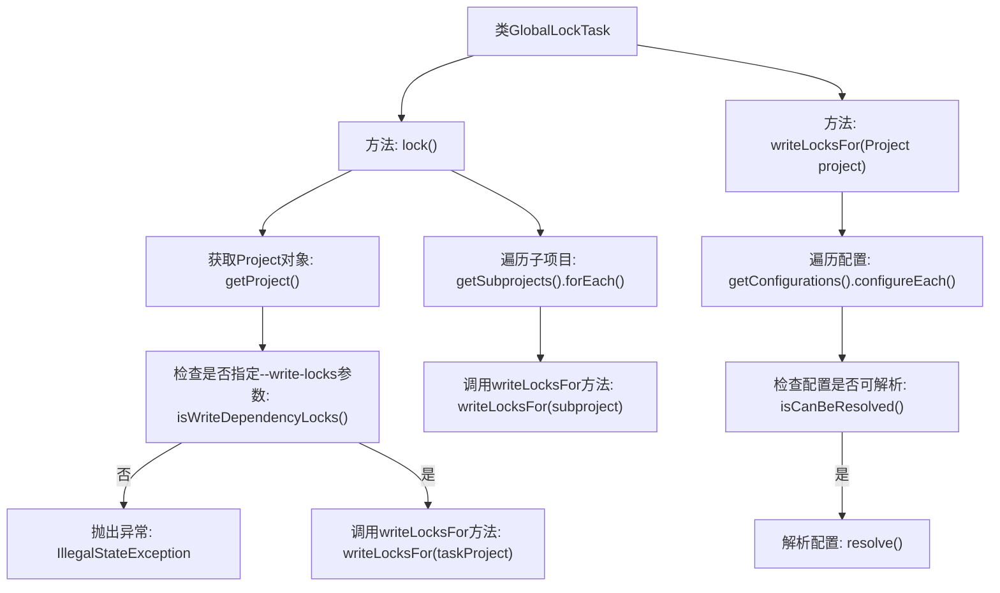

# 基础信息

|      |      |
|------|------|
| 名称 | GlobalLockTask |
| 编码语言 | .java |
| 代码路径 | spring-ldap/buildSrc/src/main/java/lock/GlobalLockTask.java |
| 包名 | None |
| 依赖项 | ['java.util.function.Consumer', 'org.gradle.api.Action', 'org.gradle.api.DefaultTask', 'org.gradle.api.Project', 'org.gradle.api.artifacts.Configuration', 'org.gradle.api.tasks.TaskAction'] |
| 概述说明 | GlobalLockTask类锁定项目依赖，需指定--write-locks参数。 |

# 说明

GlobalLockTask类的主要功能是锁定项目的依赖关系。在使用该类时，必须指定--write-locks参数，以确保依赖锁定的操作能够正确执行。通过这种方式，可以有效地管理和控制项目依赖的版本，避免因依赖更新而导致的不兼容或意外问题。

# 类列表 Class Summary

| 名称   | 类型  | 说明 |
|-------|------|-------------|
| GlobalLockTask | class | GlobalLockTask类用于锁定项目依赖，需指定--write-locks参数。 |


## 类 GlobalLockTask

|      |      |
|------|------|
| 访问范围 | public |
| 类型 | class |
| 名称 | GlobalLockTask |
| 说明 | GlobalLockTask类用于锁定项目依赖，需指定--write-locks参数。 |


### UML类图

```mermaid
classDiagram
    class GlobalLockTask {
        +lock()
        -writeLocksFor(Project project)
    }
    class Project {
        +getGradle() Gradle
        +getSubprojects() List~Project~
        +getConfigurations() ConfigurationContainer
    }
    class Gradle {
        +getStartParameter() StartParameter
    }
    class StartParameter {
        +isWriteDependencyLocks() boolean
    }
    class ConfigurationContainer {
        +configureEach(Action~Configuration~ action)
    }
    class Configuration {
        +isCanBeResolved() boolean
        +resolve()
    }
    interface <<Interface>> Action~T~ {
        +execute(T t)
    }
    interface <<Interface>> Consumer~T~ {
        +accept(T t)
    }

    GlobalLockTask --> Project : 使用
    Project --> Gradle : 依赖
    Gradle --> StartParameter : 依赖
    Project --> ConfigurationContainer : 依赖
    ConfigurationContainer --> Configuration : 包含
    GlobalLockTask ..> Action~Configuration~ : 依赖
    GlobalLockTask ..> Consumer~Project~ : 依赖
```

**描述：**
`GlobalLockTask` 类是一个任务类，用于在Gradle项目中执行全局锁定操作。它依赖于 `Project` 类来获取项目信息，并通过 `Gradle` 和 `StartParameter` 类检查是否启用了写依赖锁的功能。`GlobalLockTask` 还使用了 `ConfigurationContainer` 和 `Configuration` 类来配置和解析项目中的依赖项。此外，它通过 `Action` 和 `Consumer` 接口来处理配置和子项目的操作。


### 内部方法调用关系图



这段代码定义了一个名为`GlobalLockTask`的类，主要用于在Gradle项目中处理依赖锁的写入操作。`lock()`方法首先检查是否指定了`--write-locks`参数，如果没有则抛出异常。如果参数正确，则调用`writeLocksFor`方法为当前项目及其所有子项目写入依赖锁。`writeLocksFor`方法会遍历项目的所有配置，检查配置是否可解析，并在可解析的情况下进行解析操作。

### 字段列表 Field List

| 名称  | 类型  | 说明 |
|-------|-------|------|

### 方法列表 Method List

| 名称  | 类型  | 说明 |
|-------|-------|------|
| lock | void | 锁定项目依赖需指定--write-locks参数，并递归处理子项目。 |
| writeLocksFor | void | 为项目配置的每个可解析配置执行解析操作。 |


