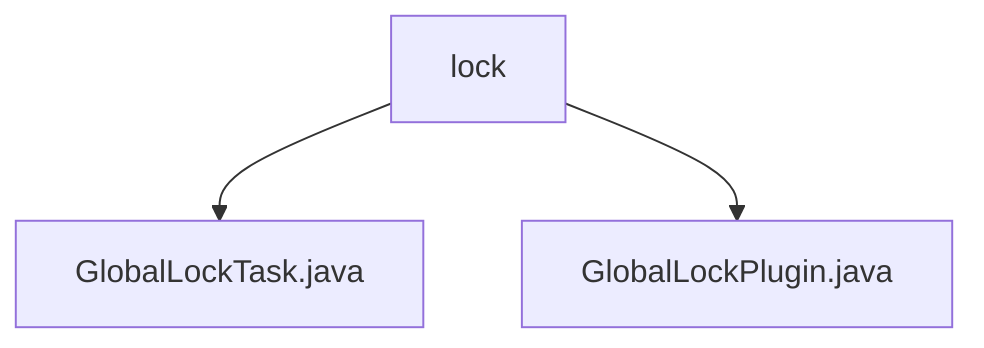

# 基础信息

|      |      |
|------|------|
| 名称 | lock |
| 编码语言 | .java |
| 代码路径 | spring-ldap/buildSrc/src/main/java/lock |
| 包名 | spring-ldap.buildSrc.src.main.java.lock |
| 概述说明 | GlobalLockTask锁定项目依赖，需指定--write-locks参数。GlobalLockPlugin注册writeLocks任务，确保多项目并发时资源管理一致。 |

# 说明

## 概述

该代码模块主要用于管理和控制项目的依赖关系，确保在多个项目并发操作时能够有效地避免依赖冲突和数据不一致的问题。模块通过提供全局锁机制，自动化地锁定和写入项目依赖的版本信息，从而提升项目管理的效率和安全性。

## 主要业务场景

1. **依赖关系锁定**：`GlobalLockTask`类的主要功能是锁定项目的依赖关系。在使用该类时，必须指定`--write-locks`参数，以确保依赖锁定的操作能够正确执行。通过这种方式，可以有效地管理和控制项目依赖的版本，避免因依赖更新而导致的不兼容或意外问题。

2. **全局锁管理**：`GlobalLockPlugin`注册了一个名为`writeLocks`的任务，该任务的主要功能是为所有项目写入锁。通过这一机制，插件确保了在多个项目并发操作时，能够有效地管理和控制资源的访问权限，避免冲突和数据不一致的问题。这一任务的注册使得全局锁的管理更加系统化和自动化。

### 包内部结构视图

该流程图展示了`spring-ldap/buildSrc/src/main/java/lock`目录下的文件结构。`lock`目录包含两个文件：`GlobalLockTask.java`和`GlobalLockPlugin.java`。这两个文件直接位于`lock`目录下，没有更深层次的嵌套结构。

# 文件列表 File List

| 名称   | 类型  | 说明 |
|-------|------|-------------|
| [GlobalLockTask.java](GlobalLockTask.md) | file | GlobalLockTask类锁定项目依赖，需指定--write-locks参数。 |
| [GlobalLockPlugin.java](GlobalLockPlugin.md) | file | GlobalLockPlugin注册writeLocks任务，用于项目锁写入。 |

