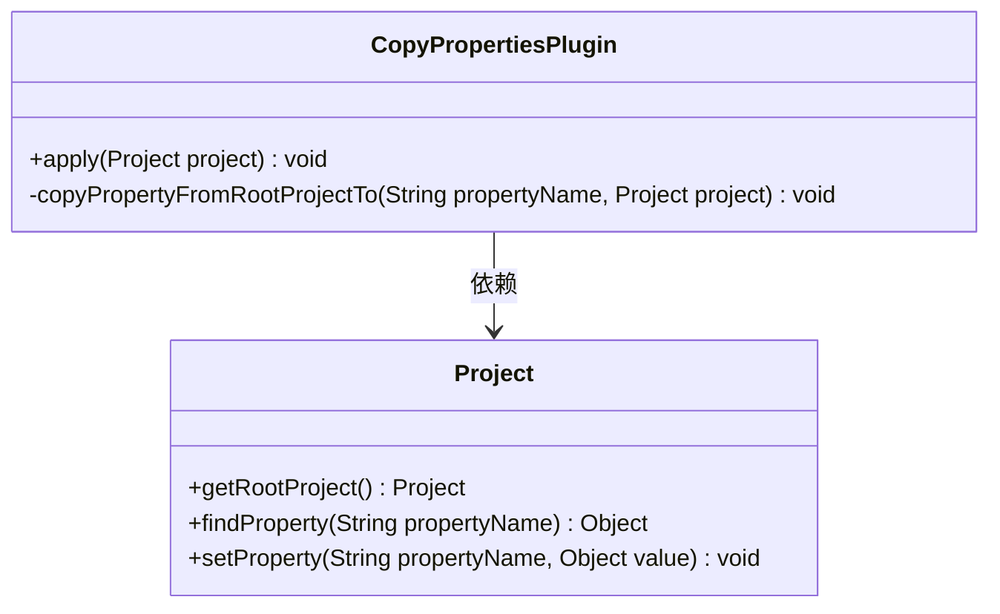
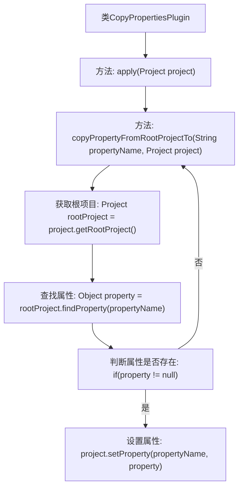

# 基础信息

|      |      |
|------|------|
| 名称 | CopyPropertiesPlugin |
| 编码语言 | .java |
| 代码路径 | spring-ldap/buildSrc/src/main/java/org/springframework/gradle/CopyPropertiesPlugin.java |
| 包名 | org.springframework.gradle |
| 依赖项 | ['org.gradle.api.Plugin', 'org.gradle.api.Project'] |
| 概述说明 | 复制根项目的group、version、description属性到当前项目。 |

# 说明

CopyPropertiesPlugin是一个插件，用于将根项目的group、version和description属性复制到当前项目中。该插件的主要功能是确保当前项目能够继承并保持一致的项目属性，从而简化配置管理，减少重复设置，提升开发效率。通过自动复制这些关键属性，开发者无需手动同步，降低了出错风险，确保了项目间的一致性。

# 类列表 Class Summary

| 名称   | 类型  | 说明 |
|-------|------|-------------|
| CopyPropertiesPlugin | class | CopyPropertiesPlugin复制根项目的group、version、description属性到当前项目。 |

## 类 CopyPropertiesPlugin

|      |      |
|------|------|
| 访问范围 | public |
| 类型 | class |
| 名称 | CopyPropertiesPlugin |
| 说明 | CopyPropertiesPlugin复制根项目的group、version、description属性到当前项目。 |

### UML类图

这段代码定义了一个 `CopyPropertiesPlugin` 类，实现了 `Plugin<Project>` 接口。该类的主要功能是将根项目中的 `group`、`version` 和 `description` 属性复制到当前项目中。`copyPropertyFromRootProjectTo` 方法负责从根项目中查找指定属性，并将其设置到当前项目中。类图中的 `Project` 类提供了获取根项目、查找属性和设置属性的方法。`CopyPropertiesPlugin` 类依赖于 `Project` 类来完成其功能。

### 内部方法调用关系图

该流程图描述了`CopyPropertiesPlugin`类的工作流程。首先，`apply`方法调用`copyPropertyFromRootProjectTo`方法三次，分别传递不同的属性名。在`copyPropertyFromRootProjectTo`方法中，首先获取根项目，然后查找指定属性，如果属性存在，则将其设置到当前项目中。流程图清晰地展示了方法的调用顺序和条件判断的逻辑。

### 字段列表 Field List

| 名称  | 类型  | 说明 |
|-------|-------|------|

### 方法列表 Method List

| 名称  | 类型  | 说明 |
|-------|-------|------|
| copyPropertyFromRootProjectTo | void | 将根项目属性复制到指定项目。 |
| apply | void | 该方法将根项目的group、version和description属性复制到当前项目中。 |

