# 基础信息

|      |      |
|------|------|
| 名称 | gradle |
| 编码语言 | .java |
| 代码路径 | spring-ldap/buildSrc/src/main/java/org/springframework/gradle |
| 包名 | spring-ldap.buildSrc.src.main.java.org.springframework.gradle |
| 概述说明 | 模块简化GitHub版本发布和里程碑管理，支持灵活配置和安全操作。 |

# 说明

## 概述

该代码模块是一个综合性的工具集，旨在简化和自动化GitHub项目的版本发布、里程碑管理以及构建系统中的工件发布流程。模块通过多个插件和API工具，提供了从版本信息管理、发布任务创建、API交互到版本验证的完整解决方案。模块的设计采用了构建器模式、插件机制和API封装，使得操作更加灵活、可控且安全。主要功能包括GitHub版本发布、里程碑状态验证、变更日志生成、Maven/Gradle工件发布以及版本一致性检查。

## 主要业务场景

1. **GitHub版本发布管理**：
   - 通过`Release`类管理发布信息，包括版本标签、提交记录、发布名称、内容描述等。
   - 使用`GitHubReleasePlugin`插件创建GitHub发布任务，支持模拟发布以验证配置。
   - `GitHubReleaseApi`类提供灵活的API工具，支持自定义基础URL和授权令牌，确保发布过程的安全性。

2. **里程碑状态验证**：
   - 通过`GitHubMilestoneApi`类查找里程碑编号并检查未关闭的问题，确保所有问题均已解决或关闭，提升项目管理效率。

3. **变更日志生成**：
   - 使用`GitHubChangelogPlugin`插件生成变更日志，支持配置生成任务和依赖库，简化变更日志的生成流程。

4. **Maven/Gradle工件发布**：
   - 支持将工件发布到Artifactory、Maven Central、OSS仓库及本地Maven仓库。
   - 提供签名管理、POM文件定制、许可证管理等功能，确保发布包符合规范。
   - 通过插件简化仓库地址、认证信息等配置，提升发布流程的稳定性和自动化程度。

5. **版本一致性检查**：
   - 使用`CheckAntoraVersionPlugin`插件验证`antora.yml`文件中的版本信息与Gradle项目版本是否一致，确保版本控制的准确性。

6. **项目属性管理**：
   - 通过`CopyPropertiesPlugin`插件将根项目的`group`、`version`和`description`属性复制到当前项目，确保项目间的一致性，减少重复配置。

通过这些功能，该模块为开发者提供了一个完整的版本管理和发布解决方案，确保版本控制、发布流程和项目管理的一致性和可追溯性。

### 包内部结构视图

```mermaid
graph TD
    gradle --> github
    gradle --> propdeps
    gradle --> sagan
    gradle --> maven
    gradle --> antora
    github --> release
    github --> milestones
    github --> changelog
    github --> RepositoryRef.java
    release --> Release.java
    release --> GitHubReleasePlugin.java
    release --> CreateGitHubReleaseTask.java
    release --> GitHubReleaseApi.java
    milestones --> GitHubMilestonePlugin.java
    milestones --> GitHubMilestoneApi.java
    milestones --> Milestone.java
    milestones --> GitHubMilestoneHasNoOpenIssuesTask.java
    changelog --> GitHubChangelogPlugin.java
    sagan --> Release.java
    sagan --> SaganDeleteReleaseTask.java
    sagan --> SaganCreateReleaseTask.java
    sagan --> SaganApi.java
    sagan --> SaganPlugin.java
    maven --> PublishArtifactsPlugin.java
    maven --> SpringMavenPlugin.java
    maven --> SpringNexusPublishPlugin.java
    maven --> SpringSigningPlugin.java
    maven --> PublishAllJavaComponentsPlugin.java
    maven --> MavenPublishingConventionsPlugin.java
    maven --> PublishLocalPlugin.java
    antora --> CheckAntoraVersionPlugin.java
    antora --> CheckAntoraVersionTask.java
```

该流程图展示了`spring-ldap/buildSrc/src/main/java/org/springframework/gradle`目录下的层级结构。`gradle`作为根节点，包含了`github`、`propdeps`、`sagan`、`maven`和`antora`等子节点。每个子节点进一步细分为具体的文件或任务，如`release`节点下包含`Release.java`和`GitHubReleasePlugin.java`等文件。整个结构清晰地反映了项目的模块划分和文件组织。

# 文件列表 File List

| 名称   | 类型  | 说明 |
|-------|------|-------------|
| [propdeps](propdeps/_module.md) | package | None |
| [CopyPropertiesPlugin.java](CopyPropertiesPlugin.md) | file | 复制根项目的group、version、description属性到当前项目。 |
| [antora](antora/_module.md) | package | CheckAntoraVersionPlugin插件验证antora.yml与Gradle项目版本一致性，防止版本冲突。 |
| [maven](maven/_module.md) | package | 多个插件简化发布流程，支持Maven和Artifactory集成，提升开发效率和工件管理。 |
| [sagan](sagan/_module.md) | package | Release类管理版本信息，SaganDeleteReleaseTask删除GitHub发布，SaganCreateReleaseTask创建发布，SaganApi提供发布操作，SaganPlugin管理版本任务。 |
| [github](github/_module.md) | package | GitHub模块简化版本发布和里程碑管理，提供灵活API和安全操作。 |

