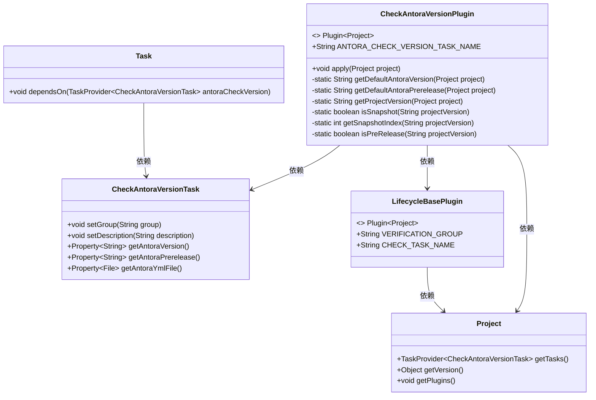

# 基础信息

|      |      |
|------|------|
| 名称 | CheckAntoraVersionPlugin |
| 编码语言 | .java |
| 代码路径 | spring-ldap/buildSrc/src/main/java/org/springframework/gradle/antora/CheckAntoraVersionPlugin.java |
| 包名 | org.springframework.gradle.antora |
| 依赖项 | ['org.gradle.api.Action', 'org.gradle.api.GradleException', 'org.gradle.api.Plugin', 'org.gradle.api.Project', 'org.gradle.api.Task', 'org.gradle.api.tasks.TaskProvider', 'org.gradle.language.base.plugins.LifecycleBasePlugin'] |
| 概述说明 | CheckAntoraVersionPlugin插件验证antora.yml与Gradle版本一致性。 |

# 说明

CheckAntoraVersionPlugin插件的主要功能是验证antora.yml文件中的版本信息与Gradle项目的版本是否一致。该插件通过对比两个版本号，确保它们匹配，从而避免因版本不一致导致的潜在问题。这一工具在项目构建过程中起到了重要的版本控制作用，帮助开发者及时发现并解决版本冲突。

# 类列表 Class Summary

| 名称   | 类型  | 说明 |
|-------|------|-------------|
| CheckAntoraVersionPlugin | class | CheckAntoraVersionPlugin插件用于验证antora.yml版本与Gradle版本是否匹配。 |

## 类 CheckAntoraVersionPlugin

|      |      |
|------|------|
| 访问范围 | public |
| 类型 | class |
| 名称 | CheckAntoraVersionPlugin |
| 说明 | CheckAntoraVersionPlugin插件用于验证antora.yml版本与Gradle版本是否匹配。 |

### UML类图

### 描述
`CheckAntoraVersionPlugin` 是一个 Gradle 插件，用于检查 `antora.yml` 文件中的版本属性是否与 Gradle 项目的版本匹配。它通过 `CheckAntoraVersionTask` 任务来执行版本检查，并依赖于 `LifecycleBasePlugin` 来确保任务在验证阶段执行。插件通过 `Project` 对象获取项目版本，并根据版本信息设置默认的 `antoraVersion` 和 `antoraPrerelease` 值。

### 内部方法调用关系图

```mermaid
graph TD
    A["类CheckAntoraVersionPlugin"]
    B["常量: ANTORA_CHECK_VERSION_TASK_NAME"]
    C["方法: apply(Project project)"]
    D["方法: getDefaultAntoraVersion(Project project)"]
    E["方法: getDefaultAntoraPrerelease(Project project)"]
    F["方法: getProjectVersion(Project project)"]
    G["方法: isSnapshot(String projectVersion)"]
    H["方法: getSnapshotIndex(String projectVersion)"]
    I["方法: isPreRelease(String projectVersion)"]
    J["任务注册: project.getTasks().register(ANTORA_CHECK_VERSION_TASK_NAME, CheckAntoraVersionTask.class, new Action<>())"]
    K["设置任务组: antoraCheckVersion.setGroup(LifecycleBasePlugin.VERIFICATION_GROUP)"]
    L["设置任务描述: antoraCheckVersion.setDescription('Checks the antora.yml version properties match the Gradle version')"]
    M["设置默认Antora版本: antoraCheckVersion.getAntoraVersion().convention(project.provider(() -> getDefaultAntoraVersion(project)))"]
    N["设置默认Antora预发布版本: antoraCheckVersion.getAntoraPrerelease().convention(project.provider(() -> getDefaultAntoraPrerelease(project)))"]
    O["设置Antora YML文件路径: antoraCheckVersion.getAntoraYmlFile().fileProvider(project.provider(() -> project.file('antora.yml')))"]
    P["插件配置: project.getPlugins().withType(LifecycleBasePlugin.class, new Action<>())"]
    Q["任务依赖配置: project.getTasks().named(LifecycleBasePlugin.CHECK_TASK_NAME).configure(new Action<>())"]
    R["任务依赖设置: check.dependsOn(antoraCheckVersion)"]

    A --> B
    A --> C
    C --> J
    J --> K
    J --> L
    J --> M
    J --> N
    J --> O
    C --> P
    P --> Q
    Q --> R
    C --> D
    C --> E
    D --> F
    D --> G
    D --> H
    E --> F
    E --> G
    E --> I
```

这段代码定义了一个Gradle插件`CheckAntoraVersionPlugin`，用于检查`antora.yml`文件中的版本属性是否与Gradle版本匹配。插件通过`apply`方法注册了一个任务`antoraCheckVersion`，并配置了任务的组、描述、默认版本和文件路径。此外，插件还配置了与`LifecycleBasePlugin`的依赖关系，确保在运行检查任务时，`antoraCheckVersion`任务会被执行。代码中还包含了一些辅助方法，用于处理版本字符串的解析和判断。

### 字段列表 Field List

| 名称  | 类型  | 说明 |
|-------|-------|------|
| ANTORA_CHECK_VERSION_TASK_NAME = "antoraCheckVersion" | String | 定义静态常量ANTORA_CHECK_VERSION_TASK_NAME，值为"antoraCheckVersion"。 |

### 方法列表 Method List

| 名称  | 类型  | 说明 |
|-------|-------|------|
| getDefaultAntoraPrerelease | String | 获取项目默认预发布版本，若为快照或预发布则返回相应值，否则返回空。 |
| isPreRelease | boolean | 判断项目版本是否为预发布版本。 |
| isSnapshot | boolean | 判断项目版本是否为快照版本。 |
| getSnapshotIndex | int | 该方法返回项目版本字符串中“-SNAPSHOT”的最后索引位置。 |
| getDefaultAntoraVersion | String | 获取项目默认Antora版本，若为快照则截取版本号前缀。 |
| apply | void | 注册任务检查Antora版本，确保与Gradle版本匹配。 |
| getProjectVersion | String | 获取项目版本，若为空则抛出异常。 |

