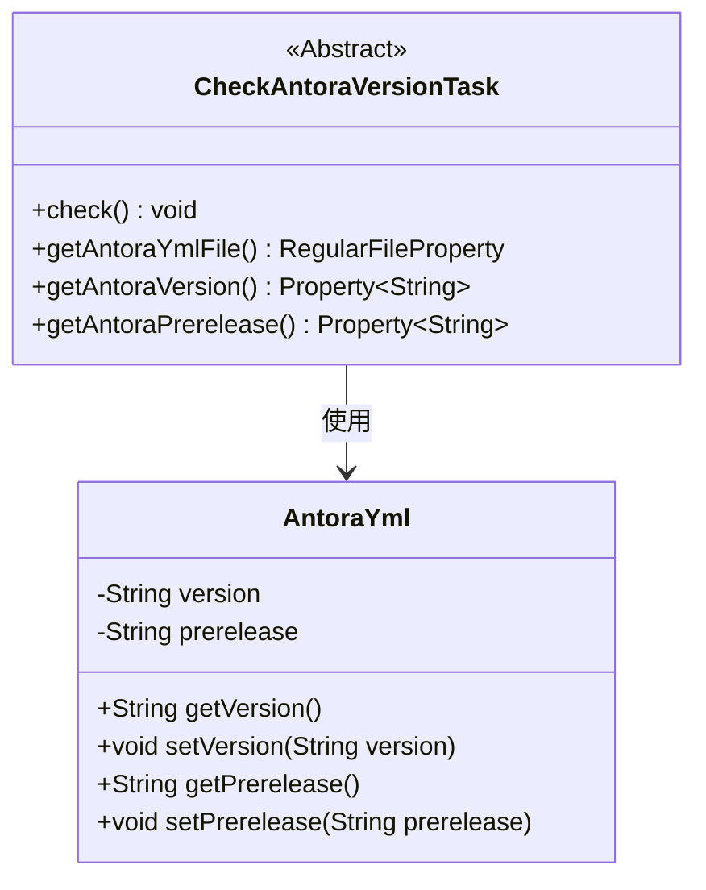
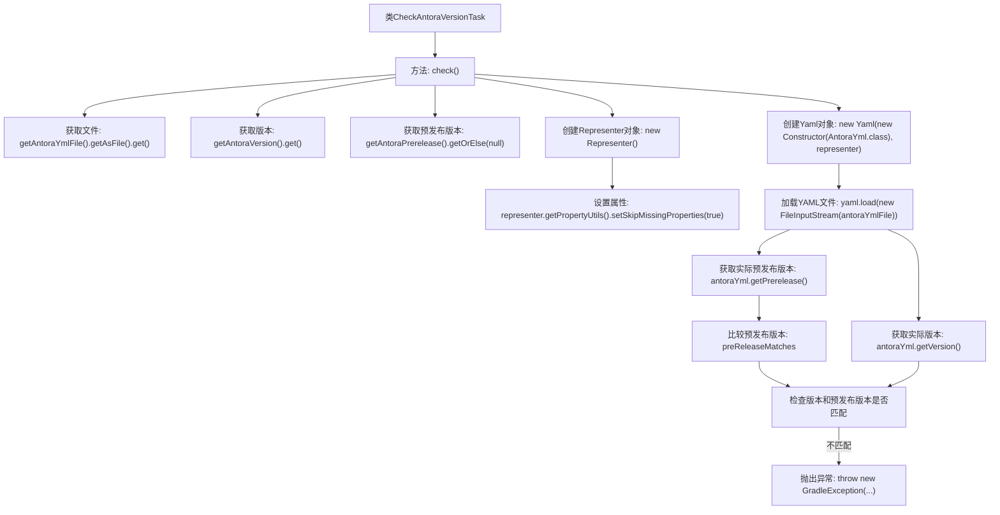

# 基础信息

|      |      |
|------|------|
| 名称 | CheckAntoraVersionTask |
| 编码语言 | .java |
| 代码路径 | spring-ldap/buildSrc/src/main/java/org/springframework/gradle/antora/CheckAntoraVersionTask.java |
| 包名 | org.springframework.gradle.antora |
| 依赖项 | ['java.io.File', 'java.io.FileInputStream', 'java.io.FileNotFoundException', 'org.gradle.api.DefaultTask', 'org.gradle.api.GradleException', 'org.gradle.api.file.RegularFileProperty', 'org.gradle.api.provider.Property', 'org.gradle.api.tasks.Input', 'org.gradle.api.tasks.InputFile', 'org.gradle.api.tasks.TaskAction', 'org.yaml.snakeyaml.Yaml', 'org.yaml.snakeyaml.constructor.Constructor', 'org.yaml.snakeyaml.representer.Representer'] |
| 概述说明 | 检查Antora版本，验证YML文件版本与预发布版本是否一致，不一致则报错。 |

# 说明

该任务旨在检查Antora版本，通过验证YML文件中的版本号与预发布版本是否一致。如果发现两者不匹配，系统将抛出异常。这一过程确保版本信息的一致性，防止因版本不匹配导致的潜在问题。任务的核心在于精确比对版本号，确保软件构建和发布的准确性。

# 类列表 Class Summary

| 名称   | 类型  | 说明 |
|-------|------|-------------|
| CheckAntoraVersionTask | class | 检查Antora版本任务，验证YML文件中的版本和预发布版本是否匹配，不匹配则抛出异常。 |

## 类 CheckAntoraVersionTask

|      |      |
|------|------|
| 访问范围 | public abstract |
| 类型 | class |
| 名称 | CheckAntoraVersionTask |
| 说明 | 检查Antora版本任务，验证YML文件中的版本和预发布版本是否匹配，不匹配则抛出异常。 |

### UML类图

这段代码定义了一个抽象类 `CheckAntoraVersionTask`，用于检查 Antora 配置文件的版本和预发布版本是否与预期一致。`CheckAntoraVersionTask` 类包含三个抽象方法用于获取文件路径、版本和预发布版本，并在 `check` 方法中通过 YAML 解析器读取配置文件并验证版本信息。`AntoraYml` 类用于存储和操作配置文件的版本和预发布版本信息。

### 内部方法调用关系图

这段代码定义了一个抽象类 `CheckAntoraVersionTask`，用于检查 `antora.yml` 文件中的版本和预发布版本是否与预期值匹配。流程图展示了从获取文件、版本信息到加载YAML文件并进行版本比较的完整流程。如果版本或预发布版本不匹配，将抛出 `GradleException` 异常。

### 字段列表 Field List

| 名称  | 类型  | 说明 |
|-------|-------|------|

### 方法列表 Method List

| 名称  | 类型  | 说明 |
|-------|-------|------|
| getAntoraVersion | Property<String> | 抽象方法获取Antora版本字符串属性。 |
| getAntoraYmlFile | RegularFileProperty | 获取Antora配置文件的抽象方法。 |
| getAntoraPrerelease | Property<String> | 抽象方法获取Antora预发布版本字符串属性。 |
| check | void | 检查Antora YML文件版本和预发布版本是否匹配，不匹配则抛出异常。 |

