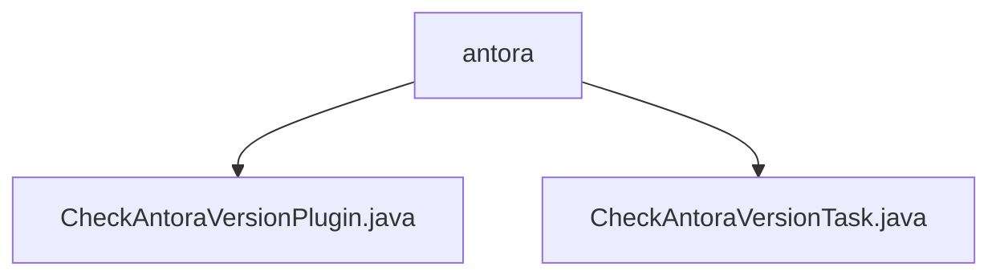

# 基础信息

|      |      |
|------|------|
| 名称 | antora |
| 编码语言 | .java |
| 代码路径 | spring-ldap/buildSrc/src/main/java/org/springframework/gradle/antora |
| 包名 | spring-ldap.buildSrc.src.main.java.org.springframework.gradle.antora |
| 概述说明 | CheckAntoraVersionPlugin插件验证antora.yml与Gradle项目版本一致性，防止版本冲突。 |

# 说明

## 概述
`CheckAntoraVersionPlugin` 是一个用于验证 `antora.yml` 文件中的版本信息与 Gradle 项目版本是否一致的插件。该插件通过对比两个版本号，确保它们匹配，从而避免因版本不一致导致的潜在问题。该插件在项目构建过程中起到了重要的版本控制作用，帮助开发者及时发现并解决版本冲突。

## 主要业务场景
1. **版本验证**：在项目构建过程中，`CheckAntoraVersionPlugin` 会检查 `antora.yml` 文件中的版本号与 Gradle 项目的版本号是否一致。如果发现两者不匹配，系统将抛出异常，确保版本信息的一致性。
2. **版本控制**：通过精确比对版本号，该插件确保软件构建和发布的准确性，防止因版本不匹配导致的潜在问题。
3. **异常处理**：当版本号不匹配时，插件会抛出异常，提示开发者进行相应的调整，确保项目构建过程的顺利进行。

### 包内部结构视图

该流程图展示了`antora`目录下的两个文件`CheckAntoraVersionPlugin.java`和`CheckAntoraVersionTask.java`的层级关系。`antora`作为父节点，包含这两个子节点，清晰地反映了文件在目录结构中的位置关系。

# 文件列表 File List

| 名称   | 类型  | 说明 |
|-------|------|-------------|
| [CheckAntoraVersionTask.java](CheckAntoraVersionTask.md) | file | 检查Antora版本，验证YML文件版本与预发布版本是否一致，不一致则报错。 |
| [CheckAntoraVersionPlugin.java](CheckAntoraVersionPlugin.md) | file | CheckAntoraVersionPlugin插件验证antora.yml与Gradle版本一致性。 |

