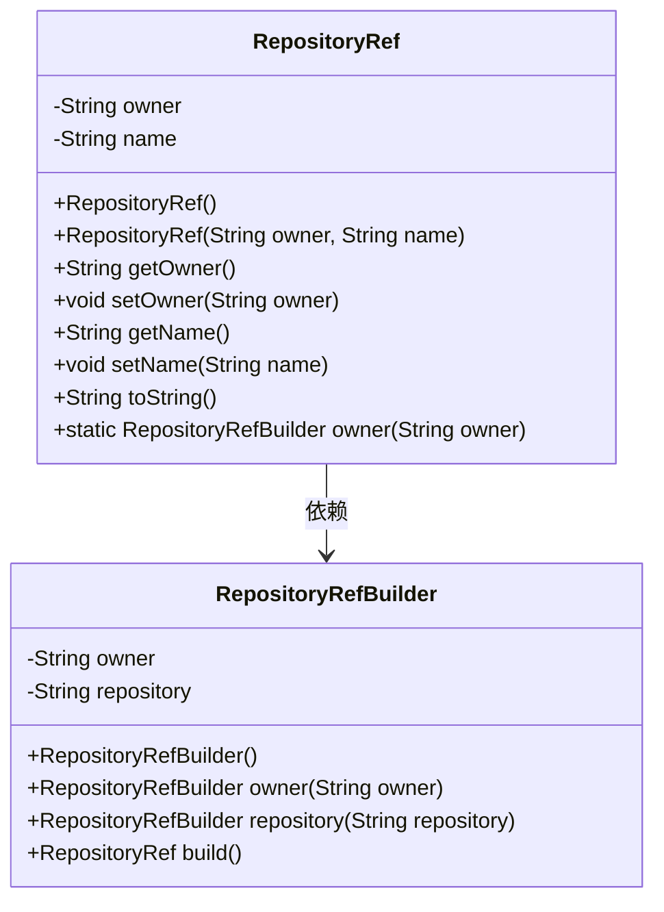
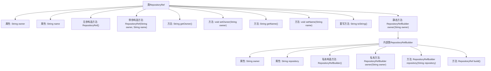

# 基础信息

|      |      |
|------|------|
| 名称 | RepositoryRef |
| 编码语言 | .java |
| 代码路径 | spring-ldap/buildSrc/src/main/java/org/springframework/gradle/github/RepositoryRef.java |
| 包名 | org.springframework.gradle.github |
| 依赖项 | [] |
| 概述说明 | 定义RepositoryRef类，含owner和name属性，支持构造、获取、设置和构建操作。 |

# 说明

RepositoryRef类是一个用于表示代码仓库引用的类，包含两个主要属性：owner和name。该类支持多种操作，包括构造、获取、设置和构建。构造操作用于初始化类的实例，获取操作用于读取owner和name属性的值，设置操作用于修改这些属性的值，构建操作用于生成或处理与仓库引用相关的数据或结构。通过这些操作，RepositoryRef类能够有效地管理和操作代码仓库的引用信息。

# 类列表 Class Summary

| 名称   | 类型  | 说明 |
|-------|------|-------------|
| RepositoryRef | class | 定义RepositoryRef类，包含owner和name属性，支持构造、获取、设置和构建操作。 |

## 类 RepositoryRef

|      |      |
|------|------|
| 访问范围 | public |
| 类型 | class |
| 名称 | RepositoryRef |
| 说明 | 定义RepositoryRef类，包含owner和name属性，支持构造、获取、设置和构建操作。 |

### UML类图

这段代码定义了一个`RepositoryRef`类，用于表示仓库的引用信息，包含所有者（owner）和仓库名称（name）。`RepositoryRef`类提供了构造函数、getter和setter方法，以及一个`toString`方法。此外，`RepositoryRef`类还包含一个静态内部类`RepositoryRefBuilder`，用于通过构建器模式创建`RepositoryRef`对象。`RepositoryRefBuilder`类允许链式调用，逐步设置属性并最终构建`RepositoryRef`对象。这种设计模式使得对象的创建更加灵活和可读。

### 内部方法调用关系图

这段代码定义了一个`RepositoryRef`类，包含两个属性`owner`和`name`，以及相关的构造方法、getter和setter方法。此外，代码还包含一个内部类`RepositoryRefBuilder`，用于构建`RepositoryRef`对象。`RepositoryRefBuilder`类提供了链式调用的方法，允许逐步设置属性并最终构建`RepositoryRef`对象。代码通过`toString`方法提供了对象的字符串表示，并通过静态方法`owner`启动构建过程。

### 字段列表 Field List

| 名称  | 类型  | 说明 |
|-------|-------|------|
| owner | String | 定义私有字符串类型变量owner。 |
| name | String | 声明一个私有字符串变量name。 |

### 方法列表 Method List

| 名称  | 类型  | 说明 |
|-------|-------|------|
| getOwner | String | 该方法返回所有者信息。 |
| setOwner | void | 设置对象的所有者属性。 |
| toString | String | 重写toString方法，返回RepositoryRef的owner和name信息。 |
| setName | void | 方法setName用于设置对象的名字属性。 |
| owner | RepositoryRefBuilder | 静态方法`owner`创建并返回配置了指定所有者的`RepositoryRefBuilder`实例。 |
| getName | String | 返回name属性的字符串值。 |

