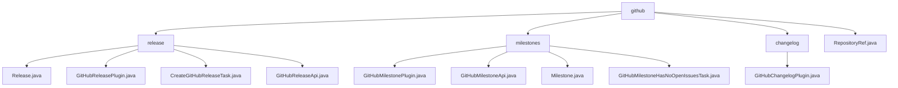

# 基础信息

|      |      |
|------|------|
| 名称 | github |
| 编码语言 | .java |
| 代码路径 | spring-ldap/buildSrc/src/main/java/org/springframework/gradle/github |
| 包名 | spring-ldap.buildSrc.src.main.java.org.springframework.gradle.github |
| 概述说明 | GitHub模块简化版本发布和里程碑管理，提供灵活API和安全操作。 |

# 说明

## 概述
该代码模块主要用于管理和简化GitHub上的软件版本发布流程以及里程碑状态验证。模块的核心功能包括创建发布版本、配置发布信息、验证发布配置、通过API进行实际发布操作，以及自动扫描和验证GitHub项目中的里程碑状态。模块的设计采用了构建器模式和插件机制，使得发布信息的创建、发布过程和里程碑管理更加灵活、可控且安全。

## 主要业务场景
1. **发布信息管理**：通过`Release`类，用户可以管理软件发布的详细信息，包括版本标签、提交记录、发布名称、内容描述、草稿状态、预发布版本以及是否自动生成发布说明。构建器模式的使用使得发布信息的创建过程更加灵活。
2. **GitHub发布任务创建**：`GitHubReleasePlugin`插件用于注册和创建GitHub发布任务。该插件依赖于生成日志的功能，并需要提供有效的GitHub访问令牌进行身份验证和授权。
3. **发布版本创建**：`CreateGitHubReleaseTask`类支持在GitHub上创建发布版本，用户可以通过配置版本号、目标分支和发布内容来执行发布操作。用户还可以选择模拟发布以验证配置的正确性，确保发布过程的安全性和可控性。
4. **API发布工具**：`GitHubReleaseApi`类提供了一个灵活的工具，允许用户自定义基础URL和授权令牌，以便根据需要调整API的访问方式和权限控制，确保版本发布过程的安全性和适应性。
5. **里程碑状态验证**：通过`GitHubMilestoneApi`类，用户可以查找特定里程碑的编号并检查是否存在未关闭的问题，确保所有问题均已解决或关闭，从而提升项目管理的效率和准确性。
6. **变更日志生成**：`GitHubChangelogPlugin`插件用于生成变更日志，用户可以通过配置生成任务来定制日志内容，同时还可以设置依赖库以确保生成过程的顺利进行。该插件简化了变更日志的生成流程，帮助开发者更高效地管理和记录项目变更。
7. **代码仓库引用管理**：`RepositoryRef`类用于表示代码仓库引用，包含`owner`和`name`两个主要属性。该类支持多种操作，包括构造、获取、设置和构建，能够有效地管理和操作代码仓库的引用信息。

该模块旨在简化GitHub版本发布和里程碑管理的流程，提供灵活的操作选项，确保发布过程和项目管理可控且安全。

### 包内部结构视图

该流程图展示了`spring-ldap/buildSrc/src/main/java/org/springframework/gradle/github`路径下的层级结构。`github`作为根节点，包含`release`、`milestones`、`changelog`和`RepositoryRef.java`四个子节点。每个子节点进一步细分为具体的文件或插件类，如`release`节点下包含`Release.java`和`GitHubReleasePlugin.java`等文件。

# 文件列表 File List

| 名称   | 类型  | 说明 |
|-------|------|-------------|
| [RepositoryRef.java](RepositoryRef.md) | file | 定义RepositoryRef类，含owner和name属性，支持构造、获取、设置和构建操作。 |
| [changelog](changelog/_module.md) | package | GitHubChangelogPlugin生成变更日志，配置任务及依赖库。 |
| [milestones](milestones/_module.md) | package | GitHub插件自动检查里程碑问题状态，确保所有问题已关闭，提升项目管理效率。 |
| [release](release/_module.md) | package | Release类管理软件发布，支持构建器模式。GitHubReleasePlugin注册发布任务，需GitHub令牌。CreateGitHubReleaseTask支持配置版本号、分支和内容，可模拟发布。GitHubReleaseApi自定义URL和令牌，灵活管理发布。 |

