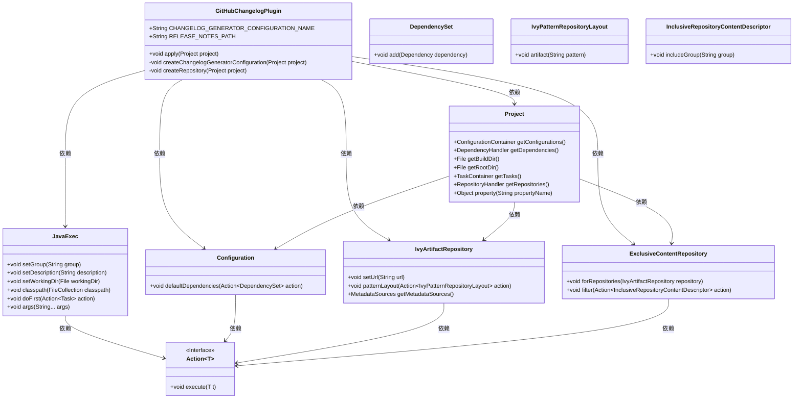
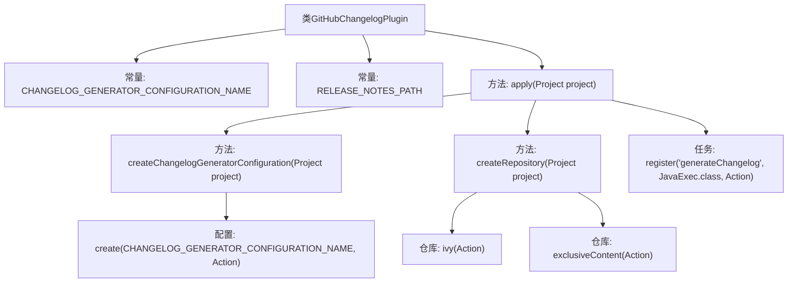

# 基础信息

|      |      |
|------|------|
| 名称 | GitHubChangelogPlugin |
| 编码语言 | .java |
| 代码路径 | spring-ldap/buildSrc/src/main/java/org/springframework/gradle/github/changelog/GitHubChangelogPlugin.java |
| 包名 | org.springframework.gradle.github.changelog |
| 依赖项 | ['java.io.File', 'java.nio.file.Paths', 'org.gradle.api.Action', 'org.gradle.api.Plugin', 'org.gradle.api.Project', 'org.gradle.api.Task', 'org.gradle.api.artifacts.Configuration', 'org.gradle.api.artifacts.DependencySet', 'org.gradle.api.artifacts.repositories.ExclusiveContentRepository', 'org.gradle.api.artifacts.repositories.InclusiveRepositoryContentDescriptor', 'org.gradle.api.artifacts.repositories.IvyArtifactRepository', 'org.gradle.api.artifacts.repositories.IvyPatternRepositoryLayout', 'org.gradle.api.tasks.JavaExec'] |
| 概述说明 | GitHubChangelogPlugin生成变更日志，配置任务及依赖库。 |

# 说明

GitHubChangelogPlugin是一个用于生成变更日志的工具，用户可以通过配置生成任务来定制日志内容，同时还可以设置依赖库以确保生成过程的顺利进行。该插件简化了变更日志的生成流程，帮助开发者更高效地管理和记录项目变更。

# 类列表 Class Summary

| 名称   | 类型  | 说明 |
|-------|------|-------------|
| GitHubChangelogPlugin | class | GitHubChangelogPlugin用于生成变更日志，配置生成任务并设置依赖库。 |

## 类 GitHubChangelogPlugin

|      |      |
|------|------|
| 访问范围 | public |
| 类型 | class |
| 名称 | GitHubChangelogPlugin |
| 说明 | GitHubChangelogPlugin用于生成变更日志，配置生成任务并设置依赖库。 |

### UML类图

这段代码定义了一个名为 `GitHubChangelogPlugin` 的插件类，实现了 `Plugin<Project>` 接口。该插件的主要功能是通过 `apply` 方法在项目中注册一个名为 `generateChangelog` 的任务，用于生成变更日志。插件还负责创建配置和仓库，以便从指定的 GitHub 仓库下载依赖项。代码中使用了多个内部类和接口，如 `JavaExec`、`Configuration`、`IvyArtifactRepository` 等，来完成这些功能。整个流程涉及多个步骤，包括配置创建、仓库设置和任务注册。

### 内部方法调用关系图

这段代码定义了一个`GitHubChangelogPlugin`类，用于生成项目的变更日志。`apply`方法是插件的入口，它调用了`createRepository`和`createChangelogGeneratorConfiguration`方法来配置仓库和生成器。`apply`方法还注册了一个名为`generateChangelog`的任务，该任务使用`JavaExec`类来执行生成变更日志的操作。`createRepository`方法配置了Ivy仓库，并设置了仓库的URL和布局模式。`createChangelogGeneratorConfiguration`方法创建了一个配置项，用于管理生成器的依赖。

### 字段列表 Field List

| 名称  | 类型  | 说明 |
|-------|-------|------|
| CHANGELOG_GENERATOR_CONFIGURATION_NAME = "changelogGenerator" | String | 定义了名为changelogGenerator的静态常量字符串。 |
| RELEASE_NOTES_PATH = "changelog/release-notes.md" | String | 发布说明文件路径为changelog/release-notes.md。 |

### 方法列表 Method List

| 名称  | 类型  | 说明 |
|-------|-------|------|
| apply | void | 该方法创建仓库、配置日志生成器，并注册生成变更日志任务。 |
| createRepository | void | 创建仓库并设置URL、布局和内容过滤器。 |
| createChangelogGeneratorConfiguration | void | 创建配置以生成变更日志，默认依赖为spring-io:github-changelog-generator:0.0.6。 |

