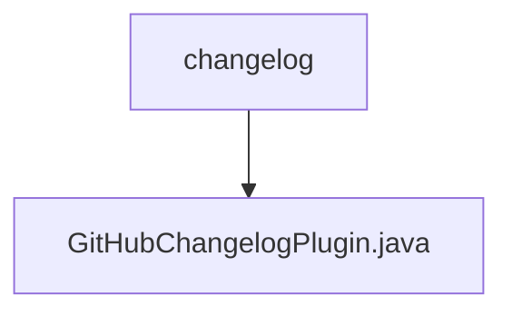

# 基础信息

|      |      |
|------|------|
| 名称 | changelog |
| 编码语言 | .java |
| 代码路径 | spring-ldap/buildSrc/src/main/java/org/springframework/gradle/github/changelog |
| 包名 | spring-ldap.buildSrc.src.main.java.org.springframework.gradle.github.changelog |
| 概述说明 | GitHubChangelogPlugin生成变更日志，配置任务及依赖库。 |

# 说明

GitHubChangelogPlugin是一个用于生成变更日志的工具，用户可以通过配置生成任务来定制日志内容，同时还可以设置依赖库以确保生成过程的顺利进行。该插件简化了变更日志的生成流程，帮助开发者更高效地管理和记录项目变更。

### 包内部结构视图

该流程图展示了`spring-ldap`项目中`buildSrc`模块下的`changelog`目录及其包含的`GitHubChangelogPlugin.java`文件的层级关系。`changelog`作为父节点，`GitHubChangelogPlugin.java`作为子节点，清晰地表示了文件在项目中的位置。

# 文件列表 File List

| 名称   | 类型  | 说明 |
|-------|------|-------------|
| [GitHubChangelogPlugin.java](GitHubChangelogPlugin.md) | file | GitHubChangelogPlugin生成变更日志，配置任务及依赖库。 |

