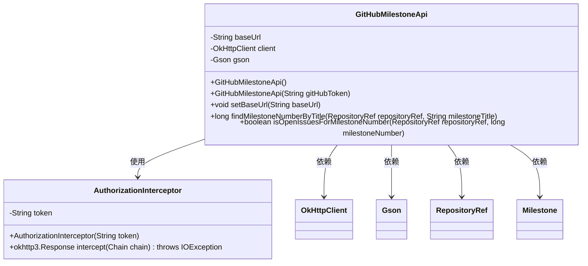
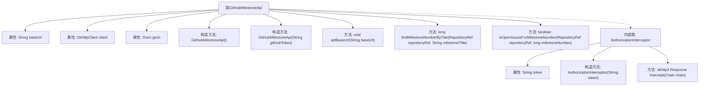
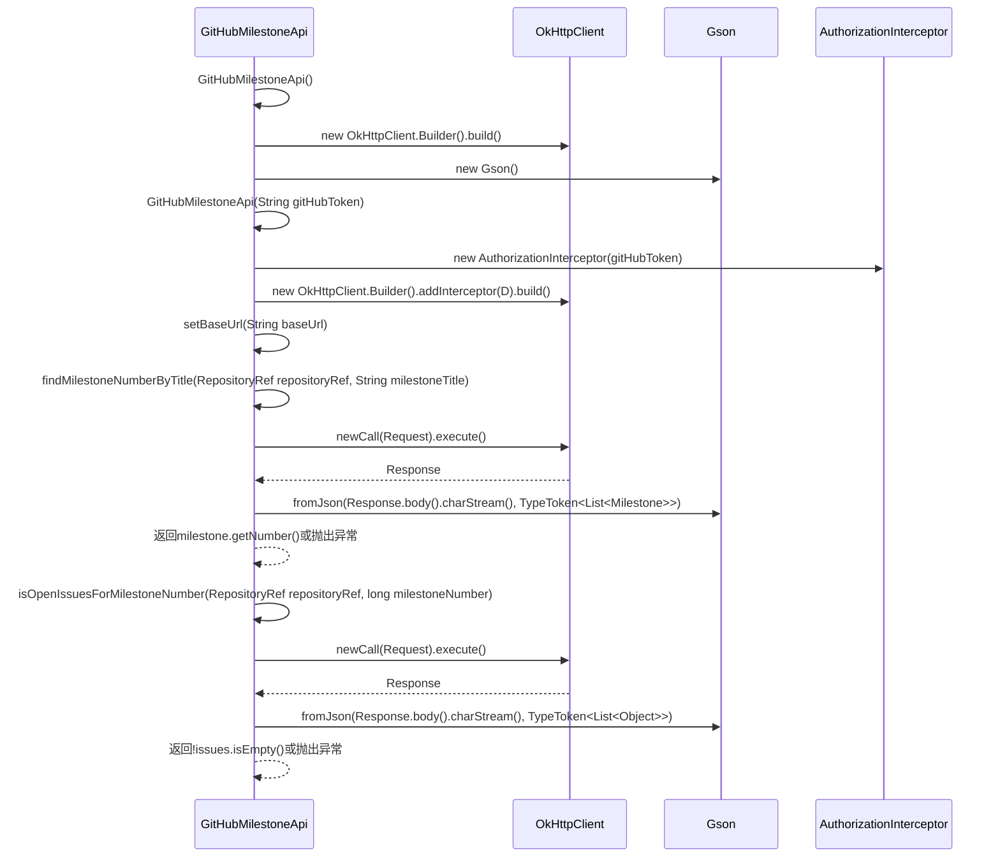

# 基础信息

|      |      |
|------|------|
| 名称 | GitHubMilestoneApi |
| 编码语言 | .java |
| 代码路径 | spring-ldap/buildSrc/src/main/java/org/springframework/gradle/github/milestones/GitHubMilestoneApi.java |
| 包名 | org.springframework.gradle.github.milestones |
| 依赖项 | ['java.io.IOException', 'java.util.List', 'com.google.common.reflect.TypeToken', 'com.google.gson.Gson', 'okhttp3.Interceptor', 'okhttp3.OkHttpClient', 'okhttp3.Request', 'okhttp3.Response', 'org.springframework.gradle.github.RepositoryRef'] |
| 概述说明 | GitHubMilestoneApi类通过标题查找里程碑编号并检查未关闭问题。 |

# 说明

GitHubMilestoneApi类的主要功能是通过标题查找特定里程碑的编号，并检查该里程碑是否存在未关闭的问题。该类旨在提供一种便捷的方式来管理和验证GitHub项目中的里程碑状态，确保所有相关问题在里程碑完成前得到妥善处理。通过这一功能，开发者可以更高效地跟踪项目进度，确保每个里程碑的完整性和准确性。

# 类列表 Class Summary

| 名称   | 类型  | 说明 |
|-------|------|-------------|
| GitHubMilestoneApi | class | GitHubMilestoneApi类用于通过标题查找里程碑编号并检查里程碑是否存在未关闭问题。 |

## 类 GitHubMilestoneApi

|      |      |
|------|------|
| 访问范围 | public |
| 类型 | class |
| 名称 | GitHubMilestoneApi |
| 说明 | GitHubMilestoneApi类用于通过标题查找里程碑编号并检查里程碑是否存在未关闭问题。 |

### UML类图

这段代码定义了一个`GitHubMilestoneApi`类，用于与GitHub API交互，主要功能包括查找里程碑编号和检查里程碑是否有未关闭的问题。类中包含两个构造函数，分别用于初始化HTTP客户端和带有授权拦截器的HTTP客户端。`findMilestoneNumberByTitle`方法通过标题查找里程碑编号，`isOpenIssuesForMilestoneNumber`方法检查指定里程碑是否有未关闭的问题。`AuthorizationInterceptor`是一个内部类，用于在HTTP请求中添加授权头。

### 内部方法调用关系图

**描述：**
该代码定义了一个`GitHubMilestoneApi`类，用于与GitHub API交互，查找里程碑编号并检查是否有未关闭的问题。类中包含两个构造方法，分别用于初始化`OkHttpClient`对象，并支持通过GitHub令牌进行授权。`findMilestoneNumberByTitle`方法通过API请求获取里程碑列表，并根据标题查找对应的编号；`isOpenIssuesForMilestoneNumber`方法则检查指定里程碑是否有未关闭的问题。内部类`AuthorizationInterceptor`用于在请求中添加授权头。

### 字段列表 Field List

| 名称  | 类型  | 说明 |
|-------|-------|------|
| client | OkHttpClient | 声明了一个私有的OkHttpClient实例变量。 |
| gson = new Gson() | Gson | 私有变量gson初始化为Gson实例。 |
| baseUrl = "https://api.github.com" | String | 定义了一个私有字符串变量baseUrl，其值为GitHub API的地址。 |

### 方法列表 Method List

| 名称  | 类型  | 说明 |
|-------|-------|------|
| setBaseUrl | void | 设置基础URL的方法，将传入值赋给类变量。 |
| isOpenIssuesForMilestoneNumber | boolean | 检查指定仓库里程碑是否存在未关闭问题。 |
| findMilestoneNumberByTitle | long | 通过API查找仓库里程碑编号，失败时抛出异常。 |

