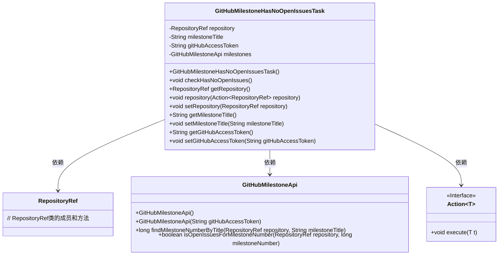
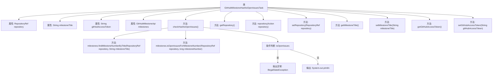

# 基础信息

|      |      |
|------|------|
| 名称 | GitHubMilestoneHasNoOpenIssuesTask |
| 编码语言 | .java |
| 代码路径 | spring-ldap/buildSrc/src/main/java/org/springframework/gradle/github/milestones/GitHubMilestoneHasNoOpenIssuesTask.java |
| 包名 | org.springframework.gradle.github.milestones |
| 依赖项 | ['org.gradle.api.Action', 'org.gradle.api.DefaultTask', 'org.gradle.api.tasks.Input', 'org.gradle.api.tasks.Optional', 'org.gradle.api.tasks.TaskAction', 'org.springframework.gradle.github.RepositoryRef'] |
| 概述说明 | 检查GitHub仓库里程碑，确认无未关闭问题。 |

# 说明

GitHub里程碑无未解决问题检查任务旨在验证指定仓库的里程碑是否已无未关闭的问题。该任务通过检查里程碑中所有问题的状态，确保所有问题均已关闭，从而确认里程碑的完成情况。此过程有助于项目管理，确保每个里程碑的达成，并为后续开发工作提供清晰的状态参考。

# 类列表 Class Summary

| 名称   | 类型  | 说明 |
|-------|------|-------------|
| GitHubMilestoneHasNoOpenIssuesTask | class | GitHub里程碑无未解决问题检查任务，验证指定仓库里程碑是否无未关闭问题。 |

## 类 GitHubMilestoneHasNoOpenIssuesTask

|      |      |
|------|------|
| 访问范围 | public |
| 类型 | class |
| 名称 | GitHubMilestoneHasNoOpenIssuesTask |
| 说明 | GitHub里程碑无未解决问题检查任务，验证指定仓库里程碑是否无未关闭问题。 |

### UML类图

**类图描述：**  
`GitHubMilestoneHasNoOpenIssuesTask` 类用于检查指定 GitHub 仓库中某个里程碑是否没有未关闭的 issue。它依赖于 `RepositoryRef` 类来标识仓库，依赖于 `GitHubMilestoneApi` 类来与 GitHub API 进行交互，并通过 `Action<RepositoryRef>` 接口来配置仓库信息。该类通过 `checkHasNoOpenIssues` 方法执行检查，并根据结果抛出异常或输出信息。

### 内部方法调用关系图

这段代码定义了一个名为`GitHubMilestoneHasNoOpenIssuesTask`的类，用于检查GitHub仓库中某个里程碑是否没有未关闭的issue。类中包含多个属性和方法，用于设置和获取仓库、里程碑标题、GitHub访问令牌等信息。`checkHasNoOpenIssues`方法是核心逻辑，它通过调用`GitHubMilestoneApi`的方法来查找里程碑编号并检查是否存在未关闭的issue。如果存在未关闭的issue，则抛出异常；否则，输出提示信息。

### 字段列表 Field List

| 名称  | 类型  | 说明 |
|-------|-------|------|
| milestoneTitle | String | 私有字符串变量milestoneTitle用于存储里程碑标题。 |
| milestones = new GitHubMilestoneApi() | GitHubMilestoneApi | 创建GitHub里程碑API实例。 |
| repository = new RepositoryRef() | RepositoryRef | 声明并初始化私有RepositoryRef类型变量repository。 |
| gitHubAccessToken | String | 代码定义了一个可选的私有字符串变量gitHubAccessToken。 |

### 方法列表 Method List

| 名称  | 类型  | 说明 |
|-------|-------|------|
| setRepository | void | 设置仓库引用对象。 |
| setMilestoneTitle | void | 设置里程碑标题的方法。 |
| getGitHubAccessToken | String | 获取GitHub访问令牌的方法。 |
| getMilestoneTitle | String | 获取里程碑标题的公共方法。 |
| getRepository | RepositoryRef | 获取仓库引用的公共方法。 |
| repository | void | 定义方法repository，接收Action<RepositoryRef>参数并执行。 |
| setGitHubAccessToken | void | 设置GitHub访问令牌并初始化里程碑API。 |
| checkHasNoOpenIssues | void | 检查指定仓库里程碑是否无未解决问题，若有则抛出异常。 |

