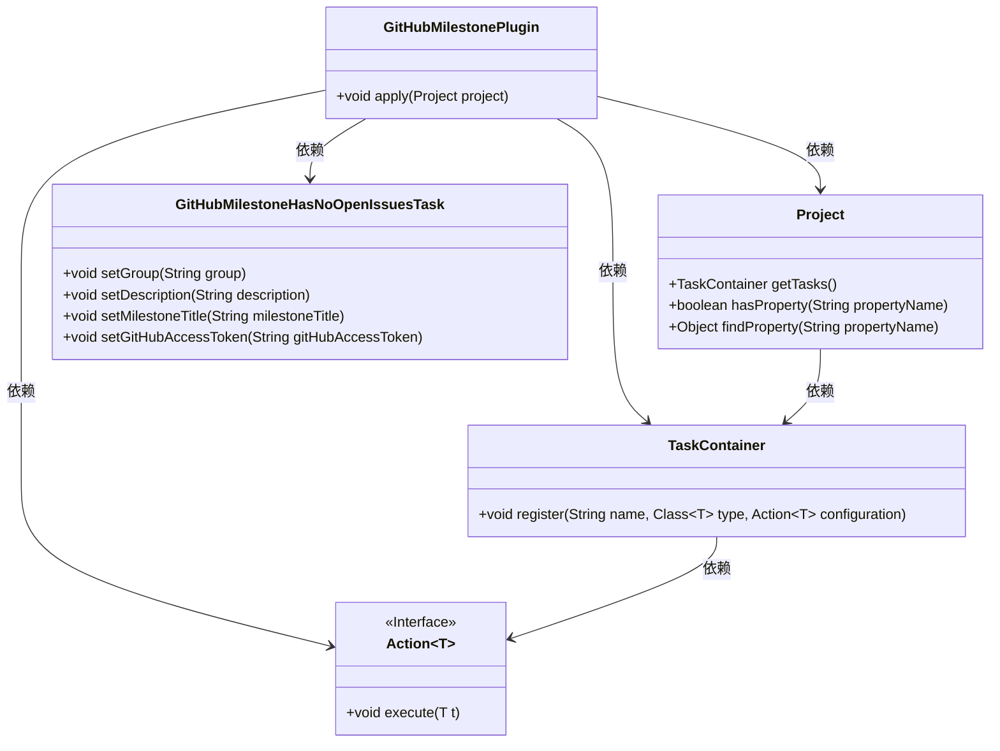
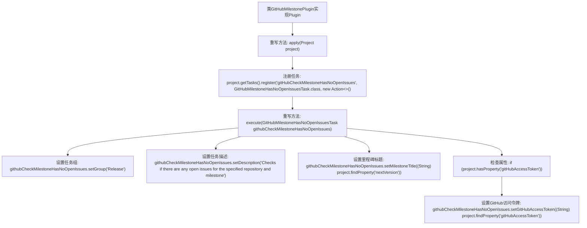

# 基础信息

|      |      |
|------|------|
| 名称 | GitHubMilestonePlugin |
| 编码语言 | .java |
| 代码路径 | spring-ldap/buildSrc/src/main/java/org/springframework/gradle/github/milestones/GitHubMilestonePlugin.java |
| 包名 | org.springframework.gradle.github.milestones |
| 依赖项 | ['org.gradle.api.Action', 'org.gradle.api.Plugin', 'org.gradle.api.Project'] |
| 概述说明 | 检查GitHub插件注册任务的里程碑，确保无未解决问题。 |

# 说明

GitHub插件注册任务的主要目标是检查指定里程碑中是否存在未解决的问题。该任务通过插件自动扫描相关里程碑，确保所有问题均已解决或关闭，以避免遗漏未处理的问题。此功能有助于项目管理，确保里程碑按计划完成，提升开发流程的效率和准确性。

# 类列表 Class Summary

| 名称   | 类型  | 说明 |
|-------|------|-------------|
| GitHubMilestonePlugin | class | GitHub插件注册任务，检查里程碑无未解决问题。 |

## 类 GitHubMilestonePlugin

|      |      |
|------|------|
| 访问范围 | public |
| 类型 | class |
| 名称 | GitHubMilestonePlugin |
| 说明 | GitHub插件注册任务，检查里程碑无未解决问题。 |

### UML类图

这段代码描述了一个名为 `GitHubMilestonePlugin` 的插件类，它实现了 `Plugin<Project>` 接口。该插件在应用时会注册一个名为 `gitHubCheckMilestoneHasNoOpenIssues` 的任务，任务类型为 `GitHubMilestoneHasNoOpenIssuesTask`。任务的配置通过 `Action<GitHubMilestoneHasNoOpenIssuesTask>` 接口完成，设置了任务的组、描述、里程碑标题以及GitHub访问令牌（如果存在）。类图展示了这些类之间的依赖关系，清晰地描述了插件如何与项目、任务容器、任务配置和任务类进行交互。

### 内部方法调用关系图

这段代码描述了一个名为`GitHubMilestonePlugin`的插件类，它实现了`Plugin<Project>`接口。在`apply`方法中，插件注册了一个名为`gitHubCheckMilestoneHasNoOpenIssues`的任务，该任务属于`Release`组，并设置了任务描述和里程碑标题。如果项目中存在`gitHubAccessToken`属性，则将该属性值设置为GitHub访问令牌。

### 字段列表 Field List

| 名称  | 类型  | 说明 |
|-------|-------|------|

### 方法列表 Method List

| 名称  | 类型  | 说明 |
|-------|-------|------|
| apply | void | 注册任务检查GitHub里程碑是否有未解决问题。 |

