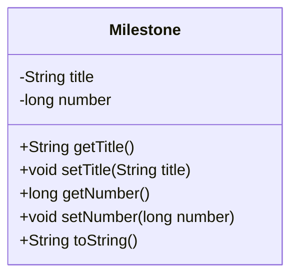
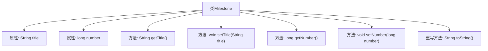

# 基础信息

|      |      |
|------|------|
| 名称 | Milestone |
| 编码语言 | .java |
| 代码路径 | spring-ldap/buildSrc/src/main/java/org/springframework/gradle/github/milestones/Milestone.java |
| 包名 | org.springframework.gradle.github.milestones |
| 依赖项 | [] |
| 概述说明 | Milestone类含title和number属性，提供getter、setter方法，并重写toString方法。 |

# 说明

Milestone类具有两个属性：title和number。该类为这两个属性提供了getter和setter方法，用于获取和设置它们的值。此外，Milestone类还重写了toString方法，以便在需要时将对象转换为字符串表示形式。

# 类列表 Class Summary

| 名称   | 类型  | 说明 |
|-------|------|-------------|
| Milestone | class | Milestone类包含title和number属性，提供getter和setter方法，并重写toString方法。 |

## 类 Milestone

|      |      |
|------|------|
| 访问范围 | public |
| 类型 | class |
| 名称 | Milestone |
| 说明 | Milestone类包含title和number属性，提供getter和setter方法，并重写toString方法。 |

### UML类图

**描述**：`Milestone` 类用于表示一个里程碑，包含两个私有属性：`title`（标题）和 `number`（编号）。类中提供了这些属性的 `getter` 和 `setter` 方法，以及一个重写的 `toString` 方法，用于返回对象的字符串表示形式。该类主要用于管理和操作里程碑的相关信息。

### 内部方法调用关系图

这段代码定义了一个名为`Milestone`的类，包含两个私有属性`title`和`number`，分别表示里程碑的标题和编号。类中提供了获取和设置这两个属性的方法，以及重写了`toString`方法，用于返回对象的字符串表示。流程图展示了类的结构及其内部方法的关系，清晰地反映了属性的定义、方法的调用以及重写方法的实现。

### 字段列表 Field List

| 名称  | 类型  | 说明 |
|-------|-------|------|
| title | String | 定义了一个私有字符串类型的变量title。 |
| number | long | 定义了一个长整型私有变量number。 |

### 方法列表 Method List

| 名称  | 类型  | 说明 |
|-------|-------|------|
| setNumber | void | 设置长整型数值的方法。 |
| toString | String | 重写toString方法，返回Milestone对象的标题和编号。 |
| getTitle | String | 获取并返回标题字符串的方法。 |
| getNumber | long | 获取number值的方法。 |
| setTitle | void | 设置标题的方法，将传入的字符串赋值给类变量title。 |

