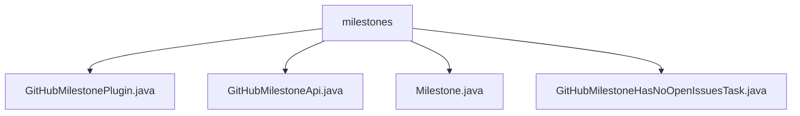

# 基础信息

|      |      |
|------|------|
| 名称 | milestones |
| 编码语言 | .java |
| 代码路径 | spring-ldap/buildSrc/src/main/java/org/springframework/gradle/github/milestones |
| 包名 | spring-ldap.buildSrc.src.main.java.org.springframework.gradle.github.milestones |
| 概述说明 | GitHub插件自动检查里程碑问题状态，确保所有问题已关闭，提升项目管理效率。 |

# 说明

## 概述
该代码模块主要用于管理和验证GitHub项目中的里程碑状态，确保所有相关问题在里程碑完成前得到妥善处理。模块通过插件和任务的形式，自动扫描相关里程碑，检查是否存在未关闭的问题，从而提升项目管理的效率和准确性。

## 主要业务场景
1. **GitHub插件注册任务**：通过插件自动扫描指定里程碑，检查是否存在未解决的问题，确保所有问题均已解决或关闭，以避免遗漏未处理的问题。
2. **GitHubMilestoneApi类**：通过标题查找特定里程碑的编号，并检查该里程碑是否存在未关闭的问题，提供便捷的方式来管理和验证里程碑状态。
3. **Milestone类**：包含`title`和`number`两个属性，提供getter和setter方法，并重写`toString`方法，用于获取和设置里程碑的标题和编号，以及将对象转换为字符串表示形式。
4. **GitHub里程碑无未解决问题检查任务**：验证指定仓库的里程碑是否已无未关闭的问题，通过检查里程碑中所有问题的状态，确保所有问题均已关闭，从而确认里程碑的完成情况。

### 包内部结构视图

该流程图展示了`milestones`文件夹下的四个文件之间的层级关系。`milestones`作为根节点，包含了四个子节点，分别是`GitHubMilestonePlugin.java`、`GitHubMilestoneApi.java`、`Milestone.java`和`GitHubMilestoneHasNoOpenIssuesTask.java`。这些文件都位于`milestones`目录下，展示了它们在项目结构中的从属关系。

# 文件列表 File List

| 名称   | 类型  | 说明 |
|-------|------|-------------|
| [GitHubMilestoneHasNoOpenIssuesTask.java](GitHubMilestoneHasNoOpenIssuesTask.md) | file | 检查GitHub仓库里程碑，确认无未关闭问题。 |
| [GitHubMilestonePlugin.java](GitHubMilestonePlugin.md) | file | 检查GitHub插件注册任务的里程碑，确保无未解决问题。 |
| [Milestone.java](Milestone.md) | file | Milestone类含title和number属性，提供getter、setter方法，并重写toString方法。 |
| [GitHubMilestoneApi.java](GitHubMilestoneApi.md) | file | GitHubMilestoneApi类通过标题查找里程碑编号并检查未关闭问题。 |

