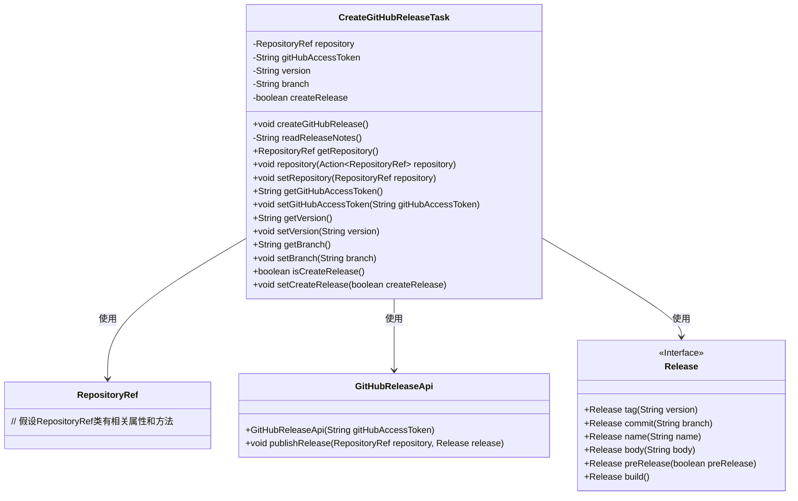

# 基础信息

|      |      |
|------|------|
| 名称 | CreateGitHubReleaseTask |
| 编码语言 | .java |
| 代码路径 | spring-ldap/buildSrc/src/main/java/org/springframework/gradle/github/release/CreateGitHubReleaseTask.java |
| 包名 | org.springframework.gradle.github.release |
| 依赖项 | ['java.io.File', 'java.io.IOException', 'java.nio.file.Files', 'java.nio.file.Paths', 'org.gradle.api.Action', 'org.gradle.api.DefaultTask', 'org.gradle.api.Project', 'org.gradle.api.tasks.Input', 'org.gradle.api.tasks.Optional', 'org.gradle.api.tasks.TaskAction', 'org.springframework.gradle.github.RepositoryRef', 'org.springframework.gradle.github.changelog.GitHubChangelogPlugin'] |
| 概述说明 | 创建GitHub发布任务类，支持版本、分支、内容配置，可选执行或模拟发布。 |

# 说明

该任务类用于在GitHub上创建发布版本，支持配置版本号、目标分支和发布内容。用户可以选择实际执行发布操作或进行模拟发布，以验证配置的正确性。该功能旨在简化GitHub版本发布流程，提供灵活的操作选项，确保发布过程可控且安全。

# 类列表 Class Summary

| 名称   | 类型  | 说明 |
|-------|------|-------------|
| CreateGitHubReleaseTask | class | 创建GitHub发布任务类，支持版本、分支、发布内容配置，可选择执行或模拟发布。 |

## 类 CreateGitHubReleaseTask

|      |      |
|------|------|
| 访问范围 | public |
| 类型 | class |
| 名称 | CreateGitHubReleaseTask |
| 说明 | 创建GitHub发布任务类，支持版本、分支、发布内容配置，可选择执行或模拟发布。 |

### UML类图

这段代码定义了一个`CreateGitHubReleaseTask`类，用于在GitHub上创建发布。该类包含多个输入属性，如`repository`、`gitHubAccessToken`、`version`等，并通过`createGitHubRelease`方法执行发布操作。`CreateGitHubReleaseTask`类依赖于`RepositoryRef`、`GitHubReleaseApi`和`Release`类来实现其功能。`RepositoryRef`类用于表示GitHub仓库的引用，`GitHubReleaseApi`类用于与GitHub API进行交互，而`Release`接口则用于构建发布信息。

### 内部方法调用关系图

```mermaid
graph TD
    A["类CreateGitHubReleaseTask"]
    B["属性: RepositoryRef repository"]
    C["属性: String gitHubAccessToken"]
    D["属性: String version"]
    E["属性: String branch"]
    F["属性: boolean createRelease"]
    G["方法: createGitHubRelease()"]
    H["方法: readReleaseNotes()"]
    I["方法: getRepository()"]
    J["方法: repository(Action<RepositoryRef> repository)"]
    K["方法: setRepository(RepositoryRef repository)"]
    L["方法: getGitHubAccessToken()"]
    M["方法: setGitHubAccessToken(String gitHubAccessToken)"]
    N["方法: getVersion()"]
    O["方法: setVersion(String version)"]
    P["方法: getBranch()"]
    Q["方法: setBranch(String branch)"]
    R["方法: isCreateRelease()"]
    S["方法: setCreateRelease(boolean createRelease)"]
    T["内部调用: Release.tag()"]
    U["内部调用: Release.commit()"]
    V["内部调用: Release.name()"]
    W["内部调用: Release.body()"]
    X["内部调用: Release.preRelease()"]
    Y["内部调用: Release.build()"]
    Z["内部调用: System.out.printf()"]
    AA["内部调用: GitHubReleaseApi.publishRelease()"]
    AB["内部调用: getProject()"]
    AC["内部调用: project.file()"]
    AD["内部调用: Files.readString()"]
    AE["内部调用: throw new RuntimeException()"]

    A --> B
    A --> C
    A --> D
    A --> E
    A --> F
    A --> G
    A --> H
    A --> I
    A --> J
    A --> K
    A --> L
    A --> M
    A --> N
    A --> O
    A --> P
    A --> Q
    A --> R
    A --> S
    G --> T
    G --> U
    G --> V
    G --> W
    G --> X
    G --> Y
    G --> Z
    G --> AA
    H --> AB
    H --> AC
    H --> AD
    H --> AE
```

这段代码定义了一个名为`CreateGitHubReleaseTask`的类，用于创建GitHub发布。它包含多个属性和方法，用于设置和获取仓库、访问令牌、版本、分支等信息。`createGitHubRelease`方法是主要任务，负责读取发布说明、构建发布对象，并根据条件发布到GitHub。`readReleaseNotes`方法用于从文件中读取发布说明。整个流程涉及多个内部调用和条件判断，确保发布过程正确执行。

### 字段列表 Field List

| 名称  | 类型  | 说明 |
|-------|-------|------|
| version | String | 定义私有字符串变量version。 |
| gitHubAccessToken | String | 可选私有GitHub访问令牌字段。 |
| createRelease = false | boolean | 私有布尔变量createRelease默认值为false。 |
| branch = "main" | String | 代码定义了一个可选私有字符串变量，默认值为"main"。 |
| repository = new RepositoryRef() | RepositoryRef | 声明私有RepositoryRef类型变量repository并初始化。 |

### 方法列表 Method List

| 名称  | 类型  | 说明 |
|-------|-------|------|
| setBranch | void | 设置分支属性的方法。 |
| setGitHubAccessToken | void | 设置GitHub访问令牌的方法。 |
| getBranch | String | 获取分支名称的方法。 |
| getRepository | RepositoryRef | 获取仓库引用的方法。 |
| getVersion | String | 该方法返回版本号字符串。 |
| setRepository | void | 设置仓库引用到当前对象。 |
| setVersion | void | 设置版本号的公共方法。 |
| readReleaseNotes | String | 读取项目发布说明文件，失败时抛出异常。 |
| getGitHubAccessToken | String | 该方法返回GitHub访问令牌。 |
| isCreateRelease | boolean | 该方法返回一个布尔值，表示是否创建发布。 |
| setCreateRelease | void | 该方法用于设置是否创建发布，参数为布尔值。 |
| repository | void | 定义一个方法，通过执行传入的repository操作来操作当前repository对象。 |
| createGitHubRelease | void | 创建GitHub发布版本，读取发布说明，设置版本、分支、名称，判断是否为预发布，输出信息，调用API发布。 |

