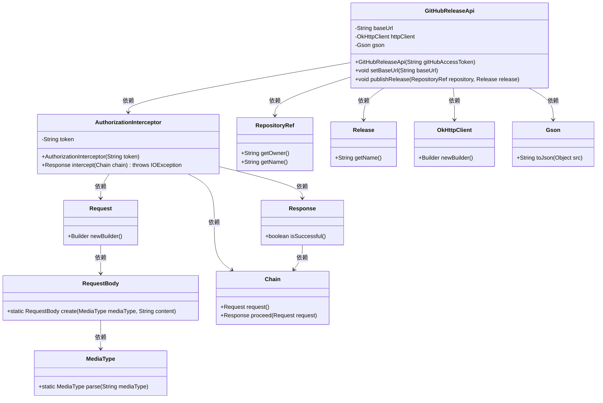
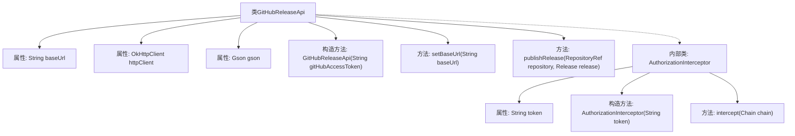
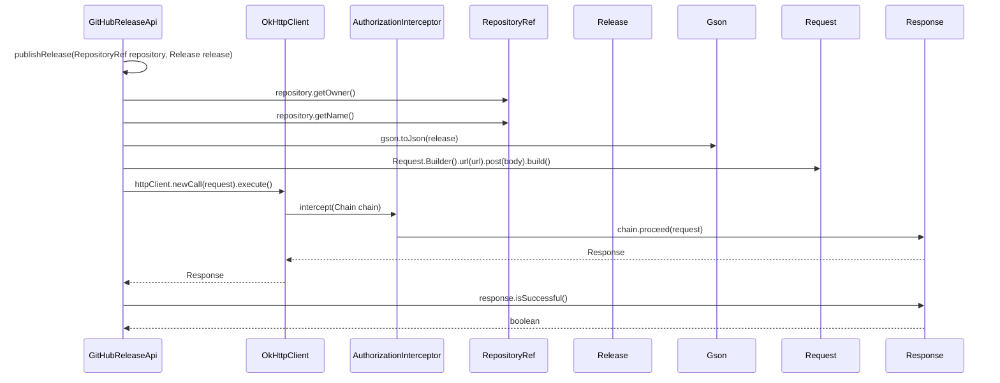

# 基础信息

|      |      |
|------|------|
| 名称 | GitHubReleaseApi |
| 编码语言 | .java |
| 代码路径 | spring-ldap/buildSrc/src/main/java/org/springframework/gradle/github/release/GitHubReleaseApi.java |
| 包名 | org.springframework.gradle.github.release |
| 依赖项 | ['java.io.IOException', 'com.google.gson.Gson', 'okhttp3.Interceptor', 'okhttp3.MediaType', 'okhttp3.OkHttpClient', 'okhttp3.Request', 'okhttp3.RequestBody', 'okhttp3.Response', 'org.springframework.gradle.github.RepositoryRef'] |
| 概述说明 | GitHubReleaseApi类支持自定义URL和授权令牌，用于发布GitHub版本。 |

# 说明

GitHubReleaseApi类是一个用于发布GitHub版本的工具，它允许用户自定义基础URL和授权令牌，以便灵活地管理和发布版本。通过设置这些参数，用户可以根据需要调整API的访问方式和权限控制，确保版本发布过程的安全性和适应性。

# 类列表 Class Summary

| 名称   | 类型  | 说明 |
|-------|------|-------------|
| GitHubReleaseApi | class | GitHubReleaseApi类用于发布GitHub版本，支持自定义基础URL和授权令牌。 |

## 类 GitHubReleaseApi

|      |      |
|------|------|
| 访问范围 | public |
| 类型 | class |
| 名称 | GitHubReleaseApi |
| 说明 | GitHubReleaseApi类用于发布GitHub版本，支持自定义基础URL和授权令牌。 |

### UML类图

### 描述
`GitHubReleaseApi` 类用于与GitHub API交互，发布版本。它依赖于 `OkHttpClient` 进行HTTP请求，`Gson` 处理JSON序列化，`AuthorizationInterceptor` 添加授权头。`publishRelease` 方法通过构建请求、发送并处理响应来发布版本。`AuthorizationInterceptor` 内部类负责在请求中添加授权令牌。

### 内部方法调用关系图

**描述：**  
这段代码定义了一个`GitHubReleaseApi`类，用于通过GitHub API发布版本。类中包含构造方法、设置基础URL的方法以及发布版本的方法。发布版本时，会构建HTTP请求并通过`OkHttpClient`发送请求，请求中包含授权头信息。内部类`AuthorizationInterceptor`用于处理授权信息。流程图展示了类的结构和方法调用关系，时序图展示了发布版本时的具体步骤和对象交互。

### 字段列表 Field List

| 名称  | 类型  | 说明 |
|-------|-------|------|
| httpClient | OkHttpClient | 私有且不可变的OkHttpClient实例。 |
| baseUrl = "https://api.github.com" | String | 代码定义了一个私有字符串变量baseUrl，值为GitHub API的基础URL。 |
| gson = new Gson() | Gson | 私有变量gson初始化为Gson实例。 |

### 方法列表 Method List

| 名称  | 类型  | 说明 |
|-------|-------|------|
| setBaseUrl | void | 设置基类URL的方法。 |
| publishRelease | void | 发布版本功能：构建URL，转换JSON，发送请求，处理响应。 |

