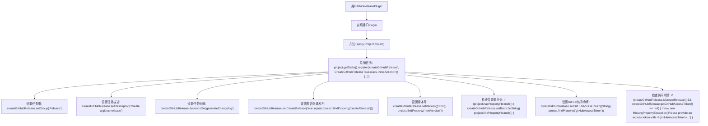

# 基础信息

|      |      |
|------|------|
| 名称 | GitHubReleasePlugin |
| 编码语言 | .java |
| 代码路径 | spring-ldap/buildSrc/src/main/java/org/springframework/gradle/github/release/GitHubReleasePlugin.java |
| 包名 | org.springframework.gradle.github.release |
| 依赖项 | ['groovy.lang.MissingPropertyException', 'org.gradle.api.Action', 'org.gradle.api.Plugin', 'org.gradle.api.Project'] |
| 概述说明 | GitHubReleasePlugin创建发布任务，依赖日志生成，需访问令牌。 |

# 说明

GitHubReleasePlugin用于注册和创建GitHub发布任务，该插件依赖于生成日志的功能，并且需要提供有效的GitHub访问令牌以进行身份验证和授权。

# 类列表 Class Summary

| 名称   | 类型  | 说明 |
|-------|------|-------------|
| GitHubReleasePlugin | class | GitHubReleasePlugin注册创建GitHub发布任务，依赖生成日志，需提供访问令牌。 |


## 类 GitHubReleasePlugin

|      |      |
|------|------|
| 访问范围 | public |
| 类型 | class |
| 名称 | GitHubReleasePlugin |
| 说明 | GitHubReleasePlugin注册创建GitHub发布任务，依赖生成日志，需提供访问令牌。 |


### UML类图

```mermaid
classDiagram
    class GitHubReleasePlugin {
        +void apply(Project project)
    }
    class Project {
        +TaskContainer getTasks()
        +Object findProperty(String propertyName)
        +boolean hasProperty(String propertyName)
    }
    class TaskContainer {
        +void register(String name, Class~T~ type, Action~? super T~ configuration)
    }
    class CreateGitHubReleaseTask {
        +void setGroup(String group)
        +void setDescription(String description)
        +void dependsOn(Object... paths)
        +void setCreateRelease(boolean createRelease)
        +void setVersion(String version)
        +void setBranch(String branch)
        +void setGitHubAccessToken(String gitHubAccessToken)
        +boolean isCreateRelease()
        +String getGitHubAccessToken()
    }
    class MissingPropertyException {
        +MissingPropertyException(String message)
    }
    interface Action~T~ <<Interface>> {
        +void execute(T t)
    }

    GitHubReleasePlugin --> Project : 依赖
    Project --> TaskContainer : 依赖
    TaskContainer --> CreateGitHubReleaseTask : 依赖
    CreateGitHubReleaseTask --> MissingPropertyException : 依赖
    Action~T~ <|.. GitHubReleasePlugin : 实现
```

这段代码定义了一个`GitHubReleasePlugin`类，它实现了`Plugin<Project>`接口。`GitHubReleasePlugin`的主要作用是在项目构建过程中注册一个名为`createGitHubRelease`的任务，该任务属于`CreateGitHubReleaseTask`类。在任务执行时，会设置任务的组、描述、依赖关系，并根据项目属性配置任务的参数，如是否创建发布、版本号、分支和GitHub访问令牌。如果缺少必要的属性，会抛出`MissingPropertyException`异常。


### 内部方法调用关系图



这段代码描述了一个`GitHubReleasePlugin`类，它实现了`Plugin<Project>`接口。在`apply`方法中，注册了一个名为`createGitHubRelease`的任务，并设置了该任务的各种属性，包括任务组、描述、依赖关系、是否创建发布、版本号、分支和GitHub访问令牌。如果任务需要创建发布但未提供访问令牌，则会抛出`MissingPropertyException`异常。流程图清晰地展示了这些步骤的顺序和关系。

### 字段列表 Field List

| 名称  | 类型  | 说明 |
|-------|-------|------|

### 方法列表 Method List

| 名称  | 类型  | 说明 |
|-------|-------|------|
| apply | void | 注册任务创建GitHub发布，设置依赖和属性，检查访问令牌。 |


