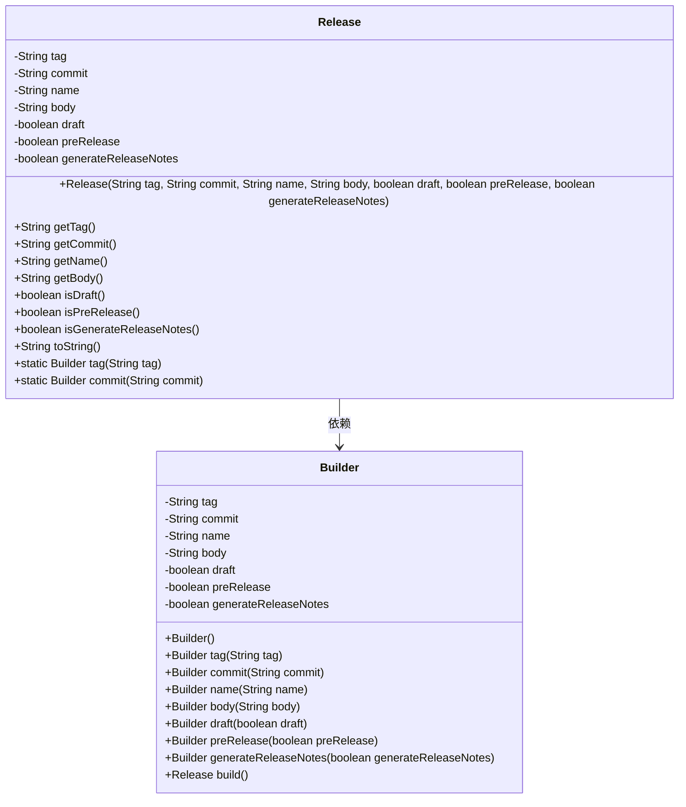

# 基础信息

|      |      |
|------|------|
| 名称 | Release |
| 编码语言 | .java |
| 代码路径 | spring-ldap/buildSrc/src/main/java/org/springframework/gradle/github/release/Release.java |
| 包名 | org.springframework.gradle.github.release |
| 依赖项 | ['com.google.gson.annotations.SerializedName'] |
| 概述说明 | Release类包含标签等属性，支持构建器模式创建实例。 |

# 说明

Release类是一个用于管理软件发布信息的类，包含多个关键属性，包括标签、提交、名称、内容、草稿、预发布和生成发布说明。这些属性分别用于标识发布的版本、关联的提交记录、发布的名称、发布内容的详细描述、是否为草稿状态、是否为预发布版本以及是否自动生成发布说明。为了方便创建Release类的实例，该类提供了构建器模式，允许用户逐步设置各个属性并最终生成完整的发布对象。这种设计使得发布信息的创建过程更加灵活和可控。

# 类列表 Class Summary

| 名称   | 类型  | 说明 |
|-------|------|-------------|
| Release | class | Release类包含标签、提交、名称、内容、草稿、预发布和生成发布说明属性，提供构建器模式创建实例。 |

## 类 Release

|      |      |
|------|------|
| 访问范围 | public |
| 类型 | class |
| 名称 | Release |
| 说明 | Release类包含标签、提交、名称、内容、草稿、预发布和生成发布说明属性，提供构建器模式创建实例。 |

### UML类图

这段代码定义了一个`Release`类，用于表示软件发布的相关信息，包括标签、提交、名称、正文、草稿状态、预发布状态和是否生成发布说明。`Release`类通过一个私有的构造函数来初始化这些字段，并提供了相应的getter方法来访问这些字段。此外，`Release`类还包含一个`Builder`内部类，用于通过链式调用的方式构建`Release`对象。`Builder`类提供了设置各个字段的方法，并在`build`方法中调用`Release`的构造函数来创建`Release`对象。这种设计模式使得对象的创建更加灵活和可读。

### 内部方法调用关系图

```mermaid
graph TD
    A["类Release"]
    B["属性: String tag"]
    C["属性: String commit"]
    D["属性: String name"]
    E["属性: String body"]
    F["属性: boolean draft"]
    G["属性: boolean preRelease"]
    H["属性: boolean generateReleaseNotes"]
    I["构造方法: Release(String tag, String commit, String name, String body, boolean draft, boolean preRelease, boolean generateReleaseNotes)"]
    J["方法: String getTag()"]
    K["方法: String getCommit()"]
    L["方法: String getName()"]
    M["方法: String getBody()"]
    N["方法: boolean isDraft()"]
    O["方法: boolean isPreRelease()"]
    P["方法: boolean isGenerateReleaseNotes()"]
    Q["重写方法: String toString()"]
    R["静态方法: Builder tag(String tag)"]
    S["静态方法: Builder commit(String commit)"]
    T["内部类Builder"]
    U["属性: String tag"]
    V["属性: String commit"]
    W["属性: String name"]
    X["属性: String body"]
    Y["属性: boolean draft"]
    Z["属性: boolean preRelease"]
    AA["属性: boolean generateReleaseNotes"]
    AB["方法: Builder tag(String tag)"]
    AC["方法: Builder commit(String commit)"]
    AD["方法: Builder name(String name)"]
    AE["方法: Builder body(String body)"]
    AF["方法: Builder draft(boolean draft)"]
    AG["方法: Builder preRelease(boolean preRelease)"]
    AH["方法: Builder generateReleaseNotes(boolean generateReleaseNotes)"]
    AI["方法: Release build()"]

    A --> B
    A --> C
    A --> D
    A --> E
    A --> F
    A --> G
    A --> H
    A --> I
    A --> J
    A --> K
    A --> L
    A --> M
    A --> N
    A --> O
    A --> P
    A --> Q
    A --> R
    A --> S
    A --> T
    T --> U
    T --> V
    T --> W
    T --> X
    T --> Y
    T --> Z
    T --> AA
    T --> AB
    T --> AC
    T --> AD
    T --> AE
    T --> AF
    T --> AG
    T --> AH
    T --> AI
```

这段代码定义了一个`Release`类，用于表示软件发布的相关信息，包括标签、提交、名称、正文、草稿状态、预发布状态和是否生成发布笔记。类中包含了一个内部类`Builder`，用于通过链式调用的方式构建`Release`对象。`Release`类提供了多个getter方法以及重写的`toString`方法，用于获取和展示对象的属性。`Builder`类提供了多个设置方法，并通过`build`方法最终生成`Release`对象。

### 字段列表 Field List

| 名称  | 类型  | 说明 |
|-------|-------|------|
| draft | boolean | 类中定义了一个名为draft的私有布尔类型常量。 |
| commit | String | 目标分支或提交标识符的私有最终字符串变量。 |
| tag | String | 代码定义了一个名为tag的私有字符串常量，使用SerializedName注解标记为tag_name。 |
| name | String | 序列化字段“name”的私有字符串变量。 |
| body | String | 类中定义了一个名为body的私有最终字符串变量，使用@SerializedName注解。 |
| preRelease | boolean | prerelease字段为布尔类型，表示是否为预发布版本。 |
| generateReleaseNotes | boolean | 该代码定义了一个布尔类型变量generateReleaseNotes，用于生成发布说明。 |

### 方法列表 Method List

| 名称  | 类型  | 说明 |
|-------|-------|------|
| getTag | String | 获取标签值的字符串方法。 |
| getName | String | 返回字符串类型的name变量值。 |
| isDraft | boolean | 方法isDraft返回布尔值draft的状态。 |
| getCommit | String | 获取commit值的公共方法。 |
| getBody | String | 方法`getBody`返回字符串类型变量`body`。 |
| tag | Builder | 静态方法`tag`返回包含指定标签的`Builder`对象。 |
| toString | String | Release类toString方法返回包含tag、commit、name、body等属性的字符串。 |
| isGenerateReleaseNotes | boolean | 方法返回生成发布说明的布尔值。 |
| commit | Builder | 静态方法返回Builder对象，并设置commit值。 |
| isPreRelease | boolean | 判断是否为预发布版本的方法。 |

