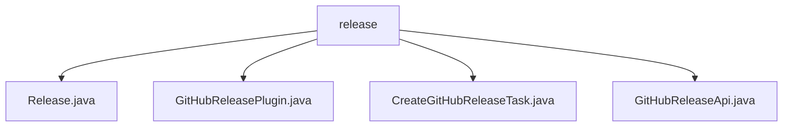

# 基础信息

|      |      |
|------|------|
| 名称 | release |
| 编码语言 | .java |
| 代码路径 | spring-ldap/buildSrc/src/main/java/org/springframework/gradle/github/release |
| 包名 | spring-ldap.buildSrc.src.main.java.org.springframework.gradle.github.release |
| 概述说明 | Release类管理软件发布，支持构建器模式。GitHubReleasePlugin注册发布任务，需GitHub令牌。CreateGitHubReleaseTask支持配置版本号、分支和内容，可模拟发布。GitHubReleaseApi自定义URL和令牌，灵活管理发布。 |

# 说明

## 概述
该代码模块主要用于管理和简化GitHub上的软件版本发布流程。模块的核心功能包括创建发布版本、配置发布信息、验证发布配置以及通过API进行实际发布操作。模块的设计采用了构建器模式和插件机制，使得发布信息的创建和发布过程更加灵活、可控且安全。

## 主要业务场景
1. **发布信息管理**：通过`Release`类，用户可以管理软件发布的详细信息，包括版本标签、提交记录、发布名称、内容描述、草稿状态、预发布版本以及是否自动生成发布说明。构建器模式的使用使得发布信息的创建过程更加灵活。
2. **GitHub发布任务创建**：`GitHubReleasePlugin`插件用于注册和创建GitHub发布任务。该插件依赖于生成日志的功能，并需要提供有效的GitHub访问令牌进行身份验证和授权。
3. **发布版本创建**：`CreateGitHubReleaseTask`类支持在GitHub上创建发布版本，用户可以通过配置版本号、目标分支和发布内容来执行发布操作。用户还可以选择模拟发布以验证配置的正确性，确保发布过程的安全性和可控性。
4. **API发布工具**：`GitHubReleaseApi`类提供了一个灵活的工具，允许用户自定义基础URL和授权令牌，以便根据需要调整API的访问方式和权限控制，确保版本发布过程的安全性和适应性。

该模块旨在简化GitHub版本发布的流程，提供灵活的操作选项，确保发布过程可控且安全。

### 包内部结构视图

该流程图展示了 `release` 目录下的文件结构，包括 `Release.java`、`GitHubReleasePlugin.java`、`CreateGitHubReleaseTask.java` 和 `GitHubReleaseApi.java` 四个文件。这些文件均位于 `release` 目录中，显示了它们在项目中的层级关系。

# 文件列表 File List

| 名称   | 类型  | 说明 |
|-------|------|-------------|
| [GitHubReleasePlugin.java](GitHubReleasePlugin.md) | file | GitHubReleasePlugin创建发布任务，依赖日志生成，需访问令牌。 |
| [GitHubReleaseApi.java](GitHubReleaseApi.md) | file | GitHubReleaseApi类支持自定义URL和授权令牌，用于发布GitHub版本。 |
| [CreateGitHubReleaseTask.java](CreateGitHubReleaseTask.md) | file | 创建GitHub发布任务类，支持版本、分支、内容配置，可选执行或模拟发布。 |
| [Release.java](Release.md) | file | Release类包含标签等属性，支持构建器模式创建实例。 |

