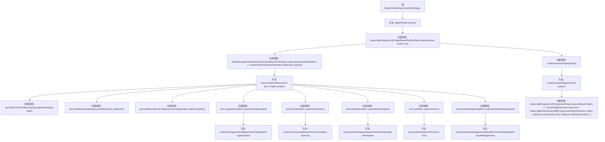

# 基础信息

|      |      |
|------|------|
| 名称 | MavenPublishingConventionsPlugin |
| 编码语言 | .java |
| 代码路径 | spring-ldap/buildSrc/src/main/java/org/springframework/gradle/maven/MavenPublishingConventionsPlugin.java |
| 包名 | org.springframework.gradle.maven |
| 依赖项 | ['org.gradle.api.Action', 'org.gradle.api.Plugin', 'org.gradle.api.Project', 'org.gradle.api.plugins.JavaPlugin', 'org.gradle.api.plugins.JavaPluginExtension', 'org.gradle.api.publish.PublishingExtension', 'org.gradle.api.publish.maven.MavenPom', 'org.gradle.api.publish.maven.MavenPomDeveloperSpec', 'org.gradle.api.publish.maven.MavenPomIssueManagement', 'org.gradle.api.publish.maven.MavenPomLicenseSpec', 'org.gradle.api.publish.maven.MavenPomOrganization', 'org.gradle.api.publish.maven.MavenPomScm', 'org.gradle.api.publish.maven.MavenPublication', 'org.gradle.api.publish.maven.plugins.MavenPublishPlugin'] |
| 概述说明 | MavenPublishingConventionsPlugin用于自定义Maven发布配置，涵盖POM、许可证和开发者信息等。 |

# 说明

MavenPublishingConventionsPlugin是一款用于自定义Maven发布配置的工具，主要功能包括生成和定制POM文件、配置项目许可证信息、管理开发者信息等。通过该插件，用户可以灵活地调整Maven项目的发布设置，确保生成的发布包符合特定的规范和要求。该插件简化了Maven项目的发布流程，提升了配置的灵活性和一致性。

# 类列表 Class Summary

| 名称   | 类型  | 说明 |
|-------|------|-------------|
| MavenPublishingConventionsPlugin | class | MavenPublishingConventionsPlugin自定义Maven发布配置，包括POM、许可证、开发者信息等。 |

## 类 MavenPublishingConventionsPlugin

|      |      |
|------|------|
| 访问范围 | public |
| 类型 | class |
| 名称 | MavenPublishingConventionsPlugin |
| 说明 | MavenPublishingConventionsPlugin自定义Maven发布配置，包括POM、许可证、开发者信息等。 |

### UML类图

```mermaid
classDiagram
    class MavenPublishingConventionsPlugin {
        +void apply(Project project)
        -void customizePom(MavenPom pom, Project project)
        -void customizeOrganization(MavenPomOrganization organization)
        -void customizeLicences(MavenPomLicenseSpec licences)
        -void customizeDevelopers(MavenPomDeveloperSpec developers)
        -void customizeScm(MavenPomScm scm)
        -void customizeIssueManagement(MavenPomIssueManagement issueManagement)
        -void customizeJavaPlugin(Project project)
    }

    class Project {
        +PluginCollection~Plugin~ getPlugins()
        +Provider~String~ getName()
        +Provider~String~ getDescription()
        +ExtensionContainer getExtensions()
    }

    class MavenPublishPlugin {
    }

    class PublishingExtension {
        +NamedDomainObjectSet~MavenPublication~ getPublications()
    }

    class MavenPublication {
        +MavenPom getPom()
    }

    class MavenPom {
        +void organization(Action~MavenPomOrganization~ action)
        +void licenses(Action~MavenPomLicenseSpec~ action)
        +void developers(Action~MavenPomDeveloperSpec~ action)
        +void scm(Action~MavenPomScm~ action)
        +void issueManagement(Action~MavenPomIssueManagement~ action)
        +Property~String~ getUrl()
        +Property~String~ getName()
        +Property~String~ getDescription()
    }

    class MavenPomOrganization {
        +Property~String~ getName()
        +Property~String~ getUrl()
    }

    class MavenPomLicenseSpec {
        +void license(Action~MavenPomLicense~ action)
    }

    class MavenPomLicense {
        +Property~String~ getName()
        +Property~String~ getUrl()
    }

    class MavenPomDeveloperSpec {
        +void developer(Action~MavenPomDeveloper~ action)
    }

    class MavenPomDeveloper {
        +Property~String~ getName()
        +Property~String~ getEmail()
        +Property~String~ getOrganization()
        +Property~String~ getOrganizationUrl()
    }

    class MavenPomScm {
        +Property~String~ getConnection()
        +Property~String~ getDeveloperConnection()
        +Property~String~ getUrl()
    }

    class MavenPomIssueManagement {
        +Property~String~ getSystem()
        +Property~String~ getUrl()
    }

    class JavaPlugin {
    }

    class JavaPluginExtension {
        +void withJavadocJar()
        +void withSourcesJar()
    }

    MavenPublishingConventionsPlugin --> Project : 依赖
    MavenPublishingConventionsPlugin --> MavenPublishPlugin : 依赖
    MavenPublishingConventionsPlugin --> PublishingExtension : 依赖
    MavenPublishingConventionsPlugin --> MavenPublication : 依赖
    MavenPublishingConventionsPlugin --> MavenPom : 依赖
    MavenPublishingConventionsPlugin --> MavenPomOrganization : 依赖
    MavenPublishingConventionsPlugin --> MavenPomLicenseSpec : 依赖
    MavenPublishingConventionsPlugin --> MavenPomLicense : 依赖
    MavenPublishingConventionsPlugin --> MavenPomDeveloperSpec : 依赖
    MavenPublishingConventionsPlugin --> MavenPomDeveloper : 依赖
    MavenPublishingConventionsPlugin --> MavenPomScm : 依赖
    MavenPublishingConventionsPlugin --> MavenPomIssueManagement : 依赖
    MavenPublishingConventionsPlugin --> JavaPlugin : 依赖
    MavenPublishingConventionsPlugin --> JavaPluginExtension : 依赖
```

这段代码定义了一个名为 `MavenPublishingConventionsPlugin` 的类，该类实现了 `Plugin` 接口，并用于自定义 Maven 发布过程中的 POM 文件和其他相关配置。通过 `apply` 方法，插件在项目应用时执行一系列操作，包括自定义 POM 文件中的组织、许可证、开发者、SCM 和问题管理信息，以及为 Java 插件配置 Javadoc 和源代码 JAR 文件。该插件与多个类如 `Project`、`MavenPublishPlugin`、`PublishingExtension` 等有依赖关系，通过这些类获取和修改项目配置。

### 内部方法调用关系图

**描述：**  
该代码定义了一个`MavenPublishingConventionsPlugin`类，用于配置Maven发布过程中的POM文件和相关插件。`apply`方法是入口，通过`MavenPublishPlugin`和`JavaPlugin`的扩展，调用`customizePom`方法对POM文件进行详细配置，包括URL、名称、描述、组织、许可证、开发者、SCM和问题管理等。同时，`customizeJavaPlugin`方法配置了Java插件的Javadoc和Sources JAR。整个流程通过多个内部方法调用完成，确保Maven发布符合规范。

### 字段列表 Field List

| 名称  | 类型  | 说明 |
|-------|-------|------|

### 方法列表 Method List

| 名称  | 类型  | 说明 |
|-------|-------|------|
| customizeLicences | void | 自定义Maven许可证为Apache 2.0。 |
| apply | void | 应用Maven发布插件，自定义POM和Java插件配置。 |
| customizeDevelopers | void | 自定义Maven开发者信息，设置名称、邮箱、组织和组织URL。 |
| customizeScm | void | 自定义SCM连接，设置Git仓库URL及开发者连接。 |
| customizeJavaPlugin | void | 自定义Java插件，生成Javadoc和源码Jar包。 |
| customizeIssueManagement | void | 自定义问题管理系统为GitHub，URL指向Spring LDAP问题页面。 |
| customizeOrganization | void | 自定义MavenPomOrganization，设置名称为Pivotal Software, Inc.，URL为https://spring.io。 |
| customizePom | void | 自定义Maven POM文件，设置URL、名称、描述、组织、许可证、开发者、SCM和问题管理。 |

