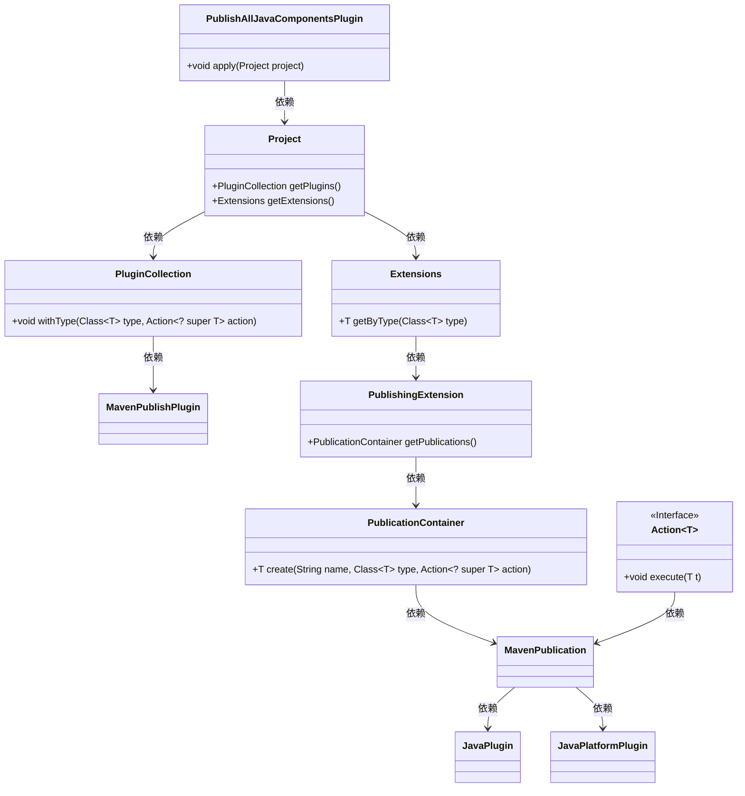
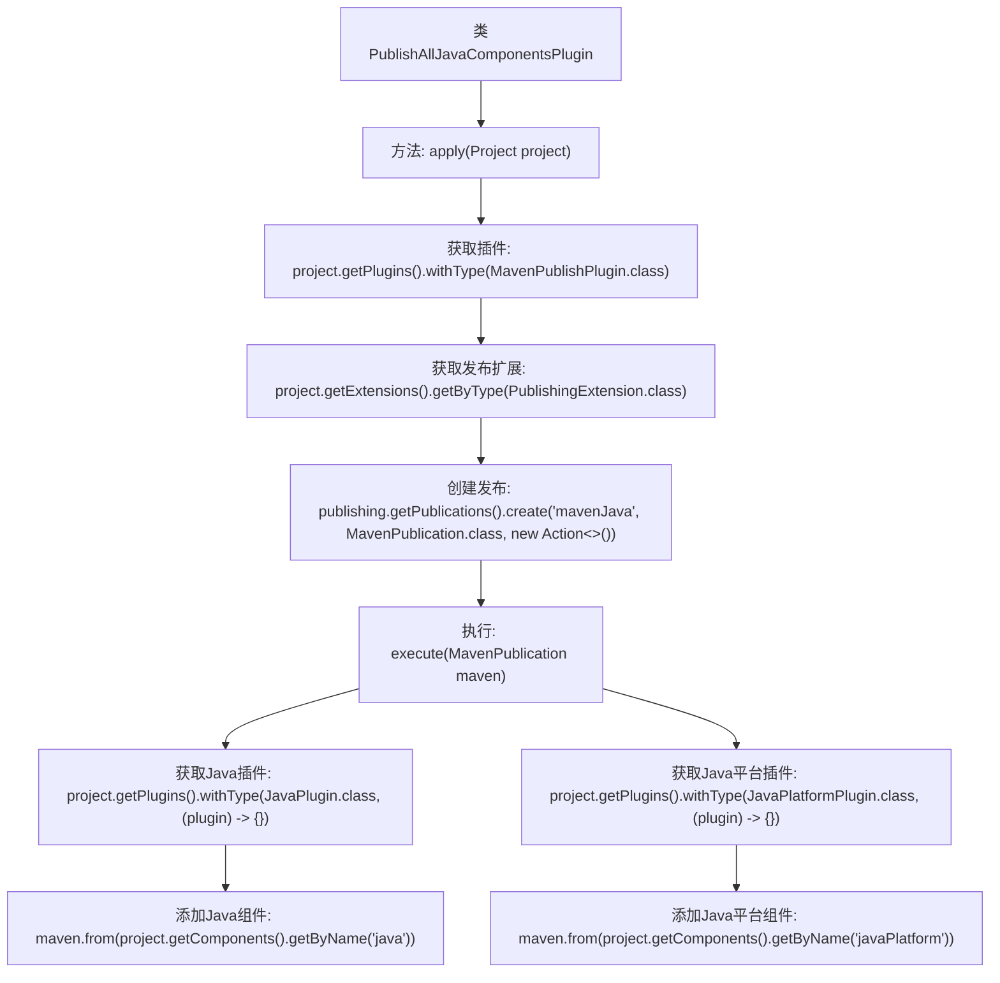

# 基础信息

|      |      |
|------|------|
| 名称 | PublishAllJavaComponentsPlugin |
| 编码语言 | .java |
| 代码路径 | spring-ldap/buildSrc/src/main/java/org/springframework/gradle/maven/PublishAllJavaComponentsPlugin.java |
| 包名 | org.springframework.gradle.maven |
| 依赖项 | ['org.gradle.api.Action', 'org.gradle.api.Plugin', 'org.gradle.api.Project', 'org.gradle.api.plugins.JavaPlatformPlugin', 'org.gradle.api.plugins.JavaPlugin', 'org.gradle.api.publish.PublishingExtension', 'org.gradle.api.publish.maven.MavenPublication', 'org.gradle.api.publish.maven.plugins.MavenPublishPlugin'] |
| 概述说明 | 该插件将Java组件发布至Maven仓库。 |

# 说明

该插件的主要功能是将所有Java组件发布到Maven仓库。通过这一过程，开发者能够将Java项目中的各个组件打包并上传至Maven仓库，便于其他项目依赖和使用。这一操作简化了组件管理和共享的流程，提升了开发效率和项目协作的便利性。

# 类列表 Class Summary

| 名称   | 类型  | 说明 |
|-------|------|-------------|
| PublishAllJavaComponentsPlugin | class | 该插件将所有Java组件发布到Maven仓库。 |

## 类 PublishAllJavaComponentsPlugin

|      |      |
|------|------|
| 访问范围 | public |
| 类型 | class |
| 名称 | PublishAllJavaComponentsPlugin |
| 说明 | 该插件将所有Java组件发布到Maven仓库。 |

### UML类图

### 描述
该代码实现了一个名为 `PublishAllJavaComponentsPlugin` 的 Gradle 插件，用于发布 Java 组件。插件通过 `apply` 方法在项目中配置 Maven 发布任务。首先，插件获取项目的 `MavenPublishPlugin` 插件实例，然后通过 `PublishingExtension` 创建一个名为 "mavenJava" 的 `MavenPublication`。在 `MavenPublication` 中，插件根据项目是否应用了 `JavaPlugin` 或 `JavaPlatformPlugin`，分别将 Java 组件或 Java 平台组件添加到发布中。整个过程通过 `Action` 接口实现回调逻辑。

### 内部方法调用关系图

这段代码定义了一个`PublishAllJavaComponentsPlugin`类，实现了`Plugin<Project>`接口。在`apply`方法中，首先获取`MavenPublishPlugin`插件，然后通过`PublishingExtension`创建一个名为`mavenJava`的`MavenPublication`。在`execute`方法中，分别获取`JavaPlugin`和`JavaPlatformPlugin`插件，并将对应的组件（`java`和`javaPlatform`）添加到`MavenPublication`中。该插件的主要作用是将Java和Java平台组件发布到Maven仓库。

### 字段列表 Field List

| 名称  | 类型  | 说明 |
|-------|-------|------|

### 方法列表 Method List

| 名称  | 类型  | 说明 |
|-------|-------|------|
| apply | void | 为项目配置Maven发布插件，生成Java和Java平台组件发布。 |

