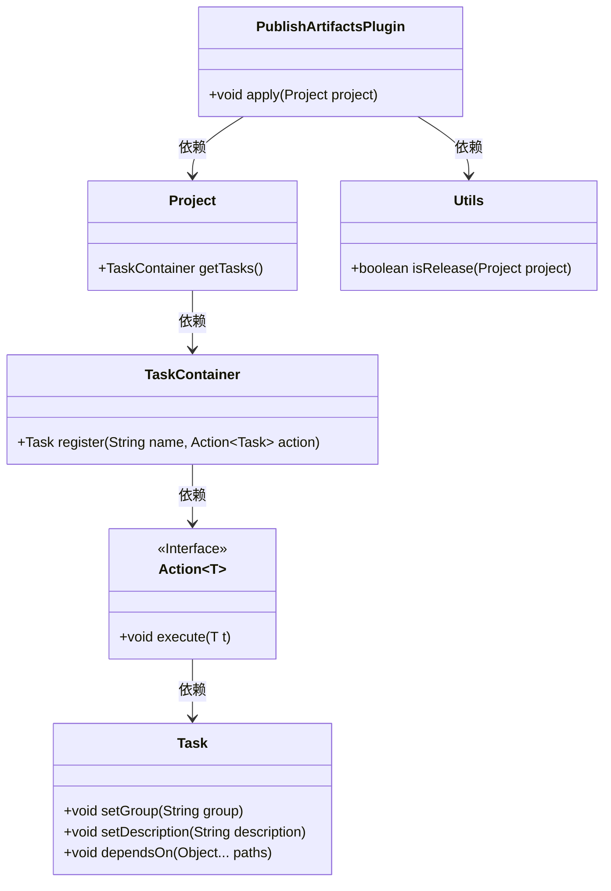
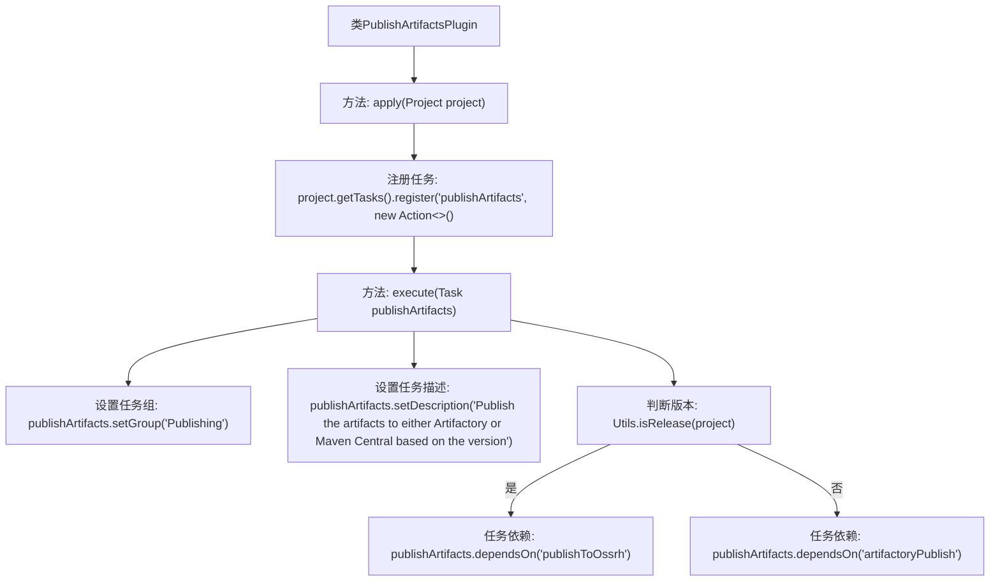

# 基础信息

|      |      |
|------|------|
| 名称 | PublishArtifactsPlugin |
| 编码语言 | .java |
| 代码路径 | spring-ldap/buildSrc/src/main/java/org/springframework/gradle/maven/PublishArtifactsPlugin.java |
| 包名 | org.springframework.gradle.maven |
| 依赖项 | ['io.spring.gradle.convention.Utils', 'org.gradle.api.Action', 'org.gradle.api.Plugin', 'org.gradle.api.Project', 'org.gradle.api.Task'] |
| 概述说明 | PublishArtifactsPlugin插件按版本发布工件至Artifactory或Maven Central。 |

# 说明

PublishArtifactsPlugin插件主要用于将不同版本的工件发布到Artifactory或Maven Central。该插件支持自动化发布流程，确保工件能够准确地部署到指定的仓库中，适用于需要频繁发布和管理工件的开发团队。通过该插件，用户可以简化发布过程，提高效率，并确保工件的版本控制与仓库管理的一致性。

# 类列表 Class Summary

| 名称   | 类型  | 说明 |
|-------|------|-------------|
| PublishArtifactsPlugin | class | PublishArtifactsPlugin插件根据版本发布工件至Artifactory或Maven Central。 |

## 类 PublishArtifactsPlugin

|      |      |
|------|------|
| 访问范围 | public |
| 类型 | class |
| 名称 | PublishArtifactsPlugin |
| 说明 | PublishArtifactsPlugin插件根据版本发布工件至Artifactory或Maven Central。 |

### UML类图

这段代码定义了一个名为 `PublishArtifactsPlugin` 的插件类，它实现了 `Plugin<Project>` 接口。在 `apply` 方法中，插件注册了一个名为 `publishArtifacts` 的任务，该任务根据项目版本决定将工件发布到 OSSRH 还是 Artifactory。任务的组别和描述被设置，并且根据 `Utils.isRelease` 方法的结果，任务会依赖于不同的发布任务。代码展示了插件与项目、任务容器、任务以及工具类之间的依赖关系。

### 内部方法调用关系图

这段代码定义了一个名为`PublishArtifactsPlugin`的插件类，实现了`Plugin<Project>`接口。在`apply`方法中，注册了一个名为`publishArtifacts`的任务。该任务设置了任务组和描述，并根据项目版本决定依赖的任务。如果版本是发布版本，则依赖`publishToOssrh`任务，否则依赖`artifactoryPublish`任务。

### 字段列表 Field List

| 名称  | 类型  | 说明 |
|-------|-------|------|

### 方法列表 Method List

| 名称  | 类型  | 说明 |
|-------|-------|------|
| apply | void | 注册发布任务，根据版本发布到Artifactory或Maven Central。 |

