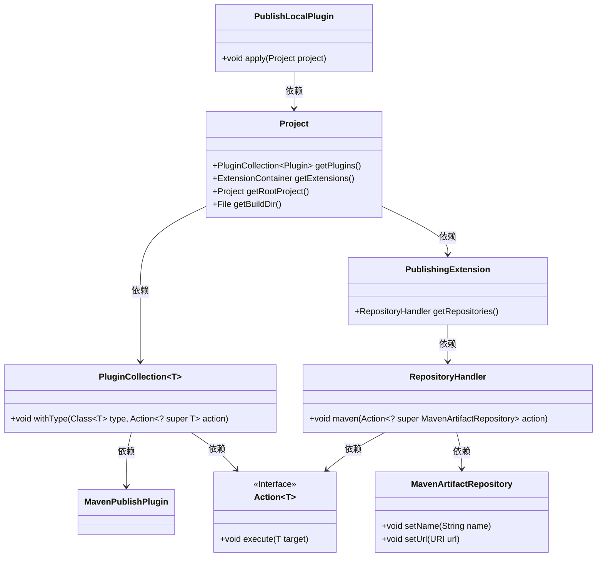
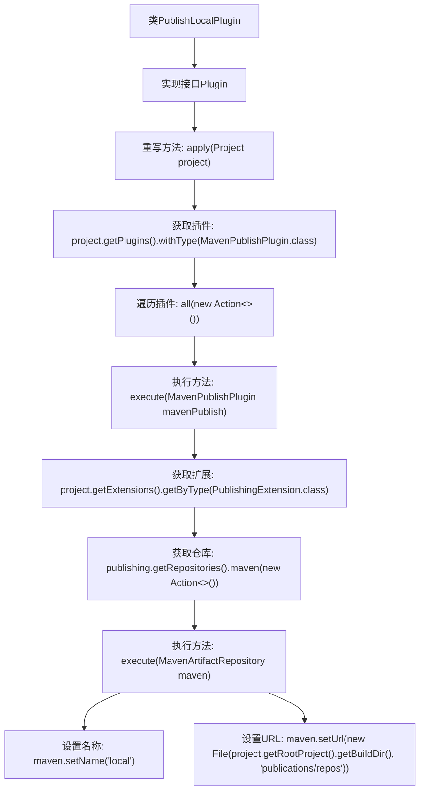

# 基础信息

|      |      |
|------|------|
| 名称 | PublishLocalPlugin |
| 编码语言 | .java |
| 代码路径 | spring-ldap/buildSrc/src/main/java/org/springframework/gradle/maven/PublishLocalPlugin.java |
| 包名 | org.springframework.gradle.maven |
| 依赖项 | ['java.io.File', 'org.gradle.api.Action', 'org.gradle.api.Plugin', 'org.gradle.api.Project', 'org.gradle.api.artifacts.repositories.MavenArtifactRepository', 'org.gradle.api.publish.PublishingExtension', 'org.gradle.api.publish.maven.plugins.MavenPublishPlugin'] |
| 概述说明 | Gradle插件实现本地Maven仓库发布。 |

# 说明

该内容描述了一个用于实现本地Maven仓库发布的Gradle插件。该插件的主要功能是帮助开发者将项目构建的工件（如JAR文件）发布到本地Maven仓库中，以便在本地环境中进行依赖管理和测试。通过使用该插件，开发者可以简化发布流程，确保工件能够被本地其他项目或模块正确引用。该插件适用于需要频繁在本地进行构建和测试的场景，提升开发效率。

# 类列表 Class Summary

| 名称   | 类型  | 说明 |
|-------|------|-------------|
| PublishLocalPlugin | class | 实现本地Maven仓库发布的Gradle插件。 |

## 类 PublishLocalPlugin

|      |      |
|------|------|
| 访问范围 | public |
| 类型 | class |
| 名称 | PublishLocalPlugin |
| 说明 | 实现本地Maven仓库发布的Gradle插件。 |

### UML类图

### 描述
`PublishLocalPlugin` 类实现了 `Plugin<Project>` 接口，其 `apply` 方法用于配置项目的发布设置。通过 `Project` 对象获取 `MavenPublishPlugin` 插件，并进一步获取 `PublishingExtension` 扩展，配置本地 Maven 仓库的路径和名称。整个流程涉及多个类的协作，包括 `PluginCollection`、`Action`、`PublishingExtension`、`RepositoryHandler` 和 `MavenArtifactRepository`，最终实现了将构建产物发布到本地 Maven 仓库的功能。

### 内部方法调用关系图

这段代码定义了一个名为`PublishLocalPlugin`的类，实现了`Plugin<Project>`接口，并重写了`apply`方法。在`apply`方法中，代码首先获取了`MavenPublishPlugin`类型的插件，并遍历这些插件。对于每个插件，代码获取了`PublishingExtension`扩展，并在其仓库中添加了一个新的Maven仓库。最后，代码设置了该仓库的名称为"local"，并指定了其URL为项目构建目录下的`publications/repos`路径。整个流程展示了如何通过插件扩展来配置Maven仓库的过程。

### 字段列表 Field List

| 名称  | 类型  | 说明 |
|-------|-------|------|

### 方法列表 Method List

| 名称  | 类型  | 说明 |
|-------|-------|------|
| apply | void | 该方法为项目配置本地Maven仓库，路径为项目构建目录下的publications/repos。 |

