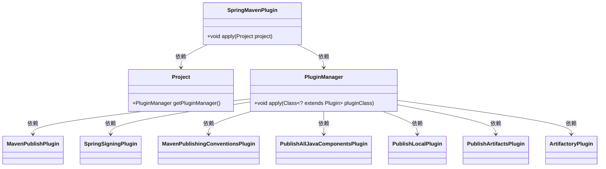
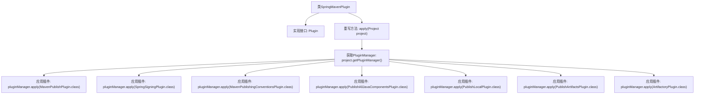

# 基础信息

|      |      |
|------|------|
| 名称 | SpringMavenPlugin |
| 编码语言 | .java |
| 代码路径 | spring-ldap/buildSrc/src/main/java/org/springframework/gradle/maven/SpringMavenPlugin.java |
| 包名 | org.springframework.gradle.maven |
| 依赖项 | ['io.spring.gradle.convention.ArtifactoryPlugin', 'org.gradle.api.Plugin', 'org.gradle.api.Project', 'org.gradle.api.plugins.PluginManager', 'org.gradle.api.publish.maven.plugins.MavenPublishPlugin'] |
| 概述说明 | SpringMavenPlugin实现Plugin接口，集成多个Maven插件。 |

# 说明

SpringMavenPlugin实现了Plugin接口，并集成了多个与Maven相关的插件。该插件通过实现Plugin接口，能够与Maven构建系统无缝集成，支持多种Maven插件的功能扩展和定制化操作。通过这种方式，SpringMavenPlugin增强了Maven项目的构建和管理能力，为开发者提供了更加灵活和高效的开发体验。

# 类列表 Class Summary

| 名称   | 类型  | 说明 |
|-------|------|-------------|
| SpringMavenPlugin | class | SpringMavenPlugin实现Plugin接口，应用多个Maven相关插件。 |

## 类 SpringMavenPlugin

|      |      |
|------|------|
| 访问范围 | public |
| 类型 | class |
| 名称 | SpringMavenPlugin |
| 说明 | SpringMavenPlugin实现Plugin接口，应用多个Maven相关插件。 |

### UML类图

这段代码描述了一个名为 `SpringMavenPlugin` 的类，它实现了 `Plugin<Project>` 接口。该类的主要功能是通过 `apply` 方法，将多个插件应用到 `Project` 对象中。这些插件包括 `MavenPublishPlugin`、`SpringSigningPlugin`、`MavenPublishingConventionsPlugin`、`PublishAllJavaComponentsPlugin`、`PublishLocalPlugin`、`PublishArtifactsPlugin` 和 `ArtifactoryPlugin`。`SpringMavenPlugin` 依赖于 `Project` 和 `PluginManager` 类，而 `PluginManager` 则负责将这些插件应用到项目中。

### 内部方法调用关系图

这段代码描述了一个名为`SpringMavenPlugin`的类，它实现了`Plugin<Project>`接口。在`apply`方法中，首先通过`project.getPluginManager()`获取`PluginManager`实例，然后依次应用了多个插件，包括`MavenPublishPlugin`、`SpringSigningPlugin`、`MavenPublishingConventionsPlugin`等。每个插件的应用都是通过`pluginManager.apply()`方法完成的，最终实现了插件的批量应用。

### 字段列表 Field List

| 名称  | 类型  | 说明 |
|-------|-------|------|

### 方法列表 Method List

| 名称  | 类型  | 说明 |
|-------|-------|------|
| apply | void | 项目应用多个插件，包括Maven发布、Spring签名、发布本地等。 |

