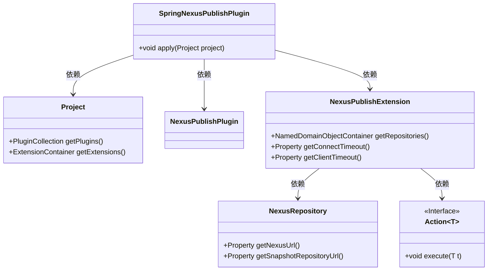
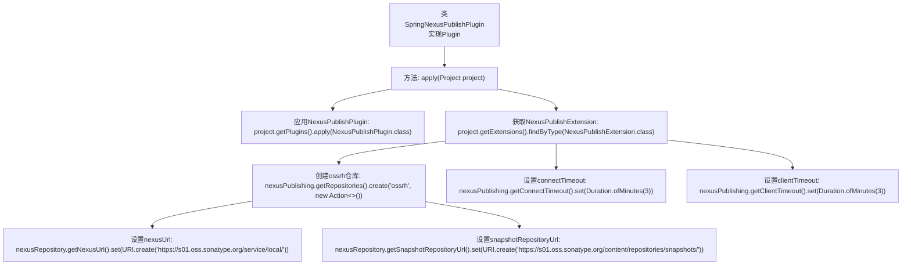

# 基础信息

|      |      |
|------|------|
| 名称 | SpringNexusPublishPlugin |
| 编码语言 | .java |
| 代码路径 | spring-ldap/buildSrc/src/main/java/org/springframework/gradle/maven/SpringNexusPublishPlugin.java |
| 包名 | org.springframework.gradle.maven |
| 依赖项 | ['java.net.URI', 'java.time.Duration', 'io.github.gradlenexus.publishplugin.NexusPublishExtension', 'io.github.gradlenexus.publishplugin.NexusPublishPlugin', 'io.github.gradlenexus.publishplugin.NexusRepository', 'org.gradle.api.Action', 'org.gradle.api.Plugin', 'org.gradle.api.Project'] |
| 概述说明 | SpringNexusPublishPlugin配置OSS仓库及超时时间。 |

# 说明

SpringNexusPublishPlugin插件集成了NexusPublishPlugin，用于配置OSS仓库及其超时时间。该插件通过简化配置流程，帮助开发者高效地将项目发布到指定的OSS仓库中。用户可以通过插件设置仓库地址、认证信息以及超时时间等关键参数，确保发布过程的稳定性和可靠性。该插件适用于需要频繁发布项目的场景，提升了开发效率和发布流程的自动化程度。

# 类列表 Class Summary

| 名称   | 类型  | 说明 |
|-------|------|-------------|
| SpringNexusPublishPlugin | class | SpringNexusPublishPlugin插件应用NexusPublishPlugin，配置OSS仓库及超时时间。 |

## 类 SpringNexusPublishPlugin

|      |      |
|------|------|
| 访问范围 | public |
| 类型 | class |
| 名称 | SpringNexusPublishPlugin |
| 说明 | SpringNexusPublishPlugin插件应用NexusPublishPlugin，配置OSS仓库及超时时间。 |

### UML类图

这段代码定义了一个名为 `SpringNexusPublishPlugin` 的类，它实现了 `Plugin<Project>` 接口。该类的主要功能是通过 `apply` 方法配置 Nexus 发布插件。代码中，`SpringNexusPublishPlugin` 依赖于 `Project`、`NexusPublishPlugin` 和 `NexusPublishExtension` 类。`NexusPublishExtension` 类进一步依赖于 `NexusRepository` 和 `Action<NexusRepository>` 接口。通过 `apply` 方法，代码设置了 Nexus 仓库的 URL 和超时时间，并创建了一个名为 "ossrh" 的仓库。

### 内部方法调用关系图

该流程图描述了`SpringNexusPublishPlugin`类的`apply`方法的执行流程。首先，应用了`NexusPublishPlugin`插件，然后获取了`NexusPublishExtension`扩展，并创建了一个名为`ossrh`的仓库。接着，设置了仓库的`nexusUrl`和`snapshotRepositoryUrl`，最后配置了连接超时和客户端超时时间。整个过程展示了插件如何初始化和配置Nexus发布功能。

### 字段列表 Field List

| 名称  | 类型  | 说明 |
|-------|-------|------|

### 方法列表 Method List

| 名称  | 类型  | 说明 |
|-------|-------|------|
| apply | void | 应用Nexus发布插件，配置ossrh仓库及超时设置。 |

