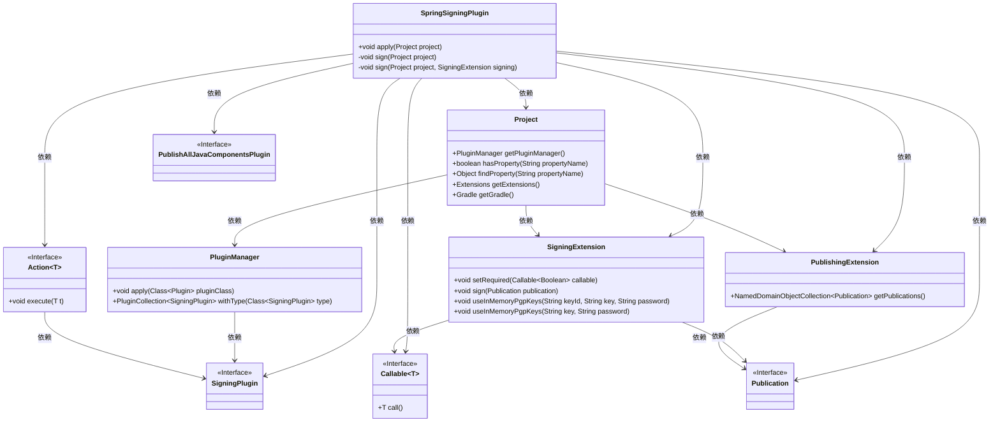
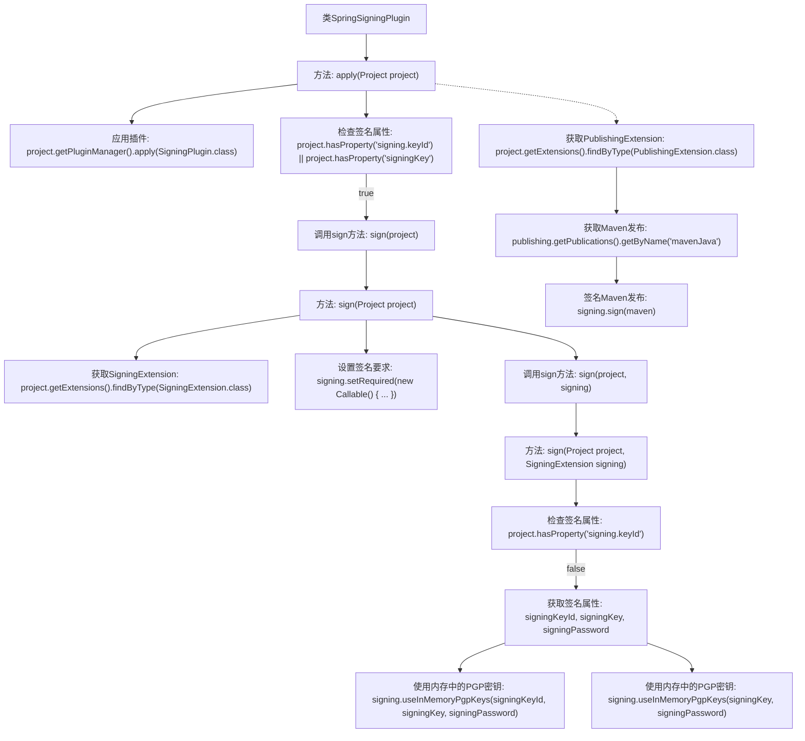

# 基础信息

|      |      |
|------|------|
| 名称 | SpringSigningPlugin |
| 编码语言 | .java |
| 代码路径 | spring-ldap/buildSrc/src/main/java/org/springframework/gradle/maven/SpringSigningPlugin.java |
| 包名 | org.springframework.gradle.maven |
| 依赖项 | ['java.util.concurrent.Callable', 'org.gradle.api.Action', 'org.gradle.api.Plugin', 'org.gradle.api.Project', 'org.gradle.api.publish.Publication', 'org.gradle.api.publish.PublishingExtension', 'org.gradle.plugins.signing.SigningExtension', 'org.gradle.plugins.signing.SigningPlugin'] |
| 概述说明 | SpringSigningPlugin实现Gradle签名功能，支持默认配置和密钥检查。 |

# 说明

SpringSigningPlugin是一款用于实现签名功能的插件，能够自动检查并应用签名密钥，同时支持Gradle的默认配置。该插件简化了签名流程，确保开发者在构建过程中无需手动配置签名信息，提升了开发效率。通过集成该插件，开发者可以轻松管理和应用签名密钥，确保应用程序的安全性。

# 类列表 Class Summary

| 名称   | 类型  | 说明 |
|-------|------|-------------|
| SpringSigningPlugin | class | SpringSigningPlugin实现签名功能，检查并应用签名密钥，支持Gradle默认配置。 |

## 类 SpringSigningPlugin

|      |      |
|------|------|
| 访问范围 | public |
| 类型 | class |
| 名称 | SpringSigningPlugin |
| 说明 | SpringSigningPlugin实现签名功能，检查并应用签名密钥，支持Gradle默认配置。 |

### UML类图

这段代码定义了一个`SpringSigningPlugin`类，它实现了`Plugin<Project>`接口，用于在Gradle项目中应用签名插件并配置签名扩展。代码首先检查是否存在签名密钥，如果存在则调用`sign`方法进行签名配置。`sign`方法进一步配置签名扩展，并根据项目属性设置内存中的PGP密钥。类图展示了`SpringSigningPlugin`与其他相关类之间的依赖关系，包括`Project`、`SigningPlugin`、`SigningExtension`等。

### 内部方法调用关系图

这段代码是一个Gradle插件，用于在Spring项目中自动配置签名。它首先应用了`SigningPlugin`，然后检查项目是否具有签名相关的属性。如果存在签名属性，它会调用`sign`方法进行签名配置。签名配置包括设置签名要求、使用内存中的PGP密钥，并对Maven发布进行签名。该插件通过自动化这些步骤，简化了Spring项目的签名流程。

### 字段列表 Field List

| 名称  | 类型  | 说明 |
|-------|-------|------|

### 方法列表 Method List

| 名称  | 类型  | 说明 |
|-------|-------|------|
| apply | void | 应用签名插件，检查并执行签名操作。 |
| sign | void | 检查项目属性，使用内存PGP密钥进行签名。 |
| sign | void | 项目签名方法：检查发布任务，配置签名扩展，为Maven发布物签名。 |

