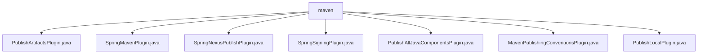

# 基础信息

|      |      |
|------|------|
| 名称 | maven |
| 编码语言 | .java |
| 代码路径 | spring-ldap/buildSrc/src/main/java/org/springframework/gradle/maven |
| 包名 | spring-ldap.buildSrc.src.main.java.org.springframework.gradle.maven |
| 概述说明 | 多个插件简化发布流程，支持Maven和Artifactory集成，提升开发效率和工件管理。 |

# 说明

## 概述
该代码模块主要围绕Maven和Gradle构建系统中的工件发布与管理展开，提供了一系列插件来简化和自动化发布流程。这些插件涵盖了从本地Maven仓库到远程Artifactory、Maven Central以及OSS仓库的发布功能，同时支持签名、POM文件定制、许可证管理等操作。通过这些插件，开发者能够高效地管理和发布Java组件，确保工件的版本控制与仓库管理的一致性，同时提升开发效率和发布流程的自动化程度。

## 主要业务场景
1. **工件发布**：支持将不同版本的工件发布到Artifactory、Maven Central、OSS仓库以及本地Maven仓库，适用于需要频繁发布和管理工件的开发团队。
2. **签名管理**：自动检查并应用签名密钥，简化签名流程，确保应用程序的安全性。
3. **POM文件定制**：生成和定制POM文件，配置项目许可证信息、开发者信息等，确保发布包符合特定规范。
4. **本地测试与依赖管理**：将项目构建的工件发布到本地Maven仓库，便于在本地环境中进行依赖管理和测试。
5. **自动化配置**：通过插件简化仓库地址、认证信息、超时时间等关键参数的配置，提升发布流程的稳定性和可靠性。

### 包内部结构视图

该流程图展示了在`maven`目录下的多个插件文件的层级关系。所有插件文件都直接隶属于`maven`目录，没有进一步的子目录嵌套。这些插件文件包括`PublishArtifactsPlugin.java`、`SpringMavenPlugin.java`等，每个文件都直接与`maven`节点相连，表明它们是同一层级的不同文件。

# 文件列表 File List

| 名称   | 类型  | 说明 |
|-------|------|-------------|
| [MavenPublishingConventionsPlugin.java](MavenPublishingConventionsPlugin.md) | file | MavenPublishingConventionsPlugin用于自定义Maven发布配置，涵盖POM、许可证和开发者信息等。 |
| [SpringNexusPublishPlugin.java](SpringNexusPublishPlugin.md) | file | SpringNexusPublishPlugin配置OSS仓库及超时时间。 |
| [PublishLocalPlugin.java](PublishLocalPlugin.md) | file | Gradle插件实现本地Maven仓库发布。 |
| [PublishAllJavaComponentsPlugin.java](PublishAllJavaComponentsPlugin.md) | file | 该插件将Java组件发布至Maven仓库。 |
| [SpringSigningPlugin.java](SpringSigningPlugin.md) | file | SpringSigningPlugin实现Gradle签名功能，支持默认配置和密钥检查。 |
| [SpringMavenPlugin.java](SpringMavenPlugin.md) | file | SpringMavenPlugin实现Plugin接口，集成多个Maven插件。 |
| [PublishArtifactsPlugin.java](PublishArtifactsPlugin.md) | file | PublishArtifactsPlugin插件按版本发布工件至Artifactory或Maven Central。 |

