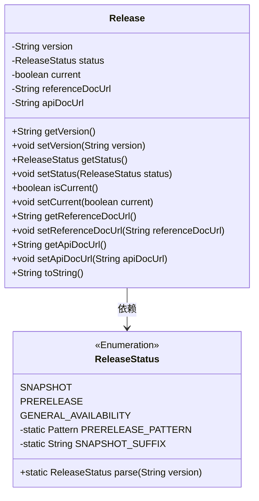

# 基础信息

|      |      |
|------|------|
| 名称 | Release |
| 编码语言 | .java |
| 代码路径 | spring-ldap/buildSrc/src/main/java/org/springframework/gradle/sagan/Release.java |
| 包名 | org.springframework.gradle.sagan |
| 依赖项 | ['java.util.regex.Pattern'] |
| 概述说明 | Release类包含版本、状态、参考文档和API文档URL，支持状态解析。 |

# 说明

Release类用于管理版本相关信息，包含版本号、当前状态、状态解析功能、参考文档链接以及API文档链接。该类支持对状态进行解析，便于开发者获取版本状态的具体信息。通过提供参考文档和API文档的URL，开发者可以快速访问相关资源，确保开发过程的顺利进行。

# 类列表 Class Summary

| 名称   | 类型  | 说明 |
|-------|------|-------------|
| Release | class | Release类包含版本、状态、当前状态、参考文档和API文档URL，支持状态解析。 |

## 类 Release

|      |      |
|------|------|
| 访问范围 | public |
| 类型 | class |
| 名称 | Release |
| 说明 | Release类包含版本、状态、当前状态、参考文档和API文档URL，支持状态解析。 |

### UML类图

**描述：**  
`Release` 类表示一个软件发布版本，包含版本号、状态、是否当前版本、参考文档URL和API文档URL等属性。`ReleaseStatus` 是一个枚举类，定义了三种发布状态：`SNAPSHOT`、`PRERELEASE` 和 `GENERAL_AVAILABILITY`，并提供了从字符串解析发布状态的方法。`Release` 类依赖于 `ReleaseStatus` 枚举类来表示发布状态。

### 内部方法调用关系图

```mermaid
graph TD
    A["类Release"]
    B["属性: String version"]
    C["属性: ReleaseStatus status"]
    D["属性: boolean current"]
    E["属性: String referenceDocUrl"]
    F["属性: String apiDocUrl"]
    G["方法: String getVersion()"]
    H["方法: void setVersion(String version)"]
    I["方法: ReleaseStatus getStatus()"]
    J["方法: void setStatus(ReleaseStatus status)"]
    K["方法: boolean isCurrent()"]
    L["方法: void setCurrent(boolean current)"]
    M["方法: String getReferenceDocUrl()"]
    N["方法: void setReferenceDocUrl(String referenceDocUrl)"]
    O["方法: String getApiDocUrl()"]
    P["方法: void setApiDocUrl(String apiDocUrl)"]
    Q["重写方法: String toString()"]
    R["枚举类ReleaseStatus"]
    S["枚举值: SNAPSHOT"]
    T["枚举值: PRERELEASE"]
    U["枚举值: GENERAL_AVAILABILITY"]
    V["方法: static ReleaseStatus parse(String version)"]

    A --> B
    A --> C
    A --> D
    A --> E
    A --> F
    A --> G
    A --> H
    A --> I
    A --> J
    A --> K
    A --> L
    A --> M
    A --> N
    A --> O
    A --> P
    A --> Q
    A -.-> R
    R --> S
    R --> T
    R --> U
    R --> V
```

该流程图展示了`Release`类的结构及其内部属性和方法之间的关系。`Release`类包含多个属性，如`version`、`status`、`current`、`referenceDocUrl`和`apiDocUrl`，并提供了相应的getter和setter方法。此外，`Release`类还包含一个`toString`方法用于生成对象的字符串表示。`ReleaseStatus`枚举类定义了三种发布状态，并提供了一个`parse`方法用于根据版本字符串解析发布状态。

### 字段列表 Field List

| 名称  | 类型  | 说明 |
|-------|-------|------|
| status | ReleaseStatus | 私有变量status表示发布状态。 |
| version | String | 定义私有字符串变量version。 |
| current | boolean | 定义了一个私有的布尔类型变量current。 |
| apiDocUrl | String | 私有字符串变量apiDocUrl用于存储API文档的URL。 |
| referenceDocUrl | String | 私有字符串变量referenceDocUrl用于存储参考文档的URL。 |

### 方法列表 Method List

| 名称  | 类型  | 说明 |
|-------|-------|------|
| getReferenceDocUrl | String | 方法返回参考文档URL。 |
| setVersion | void | 该方法用于设置版本号。 |
| getStatus | ReleaseStatus | 获取当前发布状态的公共方法。 |
| setCurrent | void | 设置当前状态的布尔值。 |
| getApiDocUrl | String | 获取API文档URL的方法。 |
| isCurrent | boolean | 检查当前状态是否为真。 |
| getVersion | String | 获取版本号的方法。 |
| setApiDocUrl | void | 该方法用于设置API文档的URL地址。 |
| setReferenceDocUrl | void | 设置参考文档URL的方法。 |
| setStatus | void | 设置发布状态的方法，将传入的状态赋值给当前对象的状态变量。 |
| toString | String | 重写toString方法，返回版本、状态、当前值及文档URL的字符串。 |

