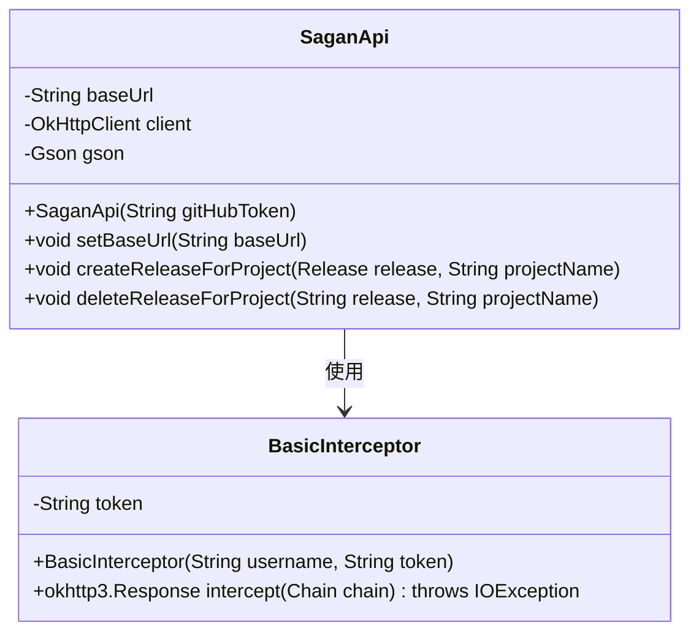
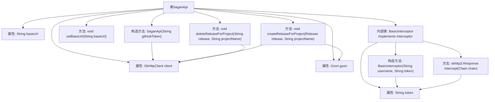

# 基础信息

|      |      |
|------|------|
| 名称 | SaganApi |
| 编码语言 | .java |
| 代码路径 | spring-ldap/buildSrc/src/main/java/org/springframework/gradle/sagan/SaganApi.java |
| 包名 | org.springframework.gradle.sagan |
| 依赖项 | ['java.io.IOException', 'java.util.Base64', 'com.google.gson.Gson', 'okhttp3.Interceptor', 'okhttp3.MediaType', 'okhttp3.OkHttpClient', 'okhttp3.Request', 'okhttp3.RequestBody', 'okhttp3.Response'] |
| 概述说明 | SaganApi类通过OkHttpClient和Gson管理项目发布，支持自定义URL和GitHub Token认证。 |

# 说明

SaganApi类利用OkHttpClient和Gson库，提供创建和删除项目发布的功能。它支持用户自定义基础URL，并通过GitHub Token进行认证，确保操作的安全性和灵活性。

# 类列表 Class Summary

| 名称   | 类型  | 说明 |
|-------|------|-------------|
| SaganApi | class | SaganApi类用于通过OkHttpClient和Gson创建和删除项目发布，支持自定义基础URL和GitHub Token认证。 |

## 类 SaganApi

|      |      |
|------|------|
| 访问范围 | public |
| 类型 | class |
| 名称 | SaganApi |
| 说明 | SaganApi类用于通过OkHttpClient和Gson创建和删除项目发布，支持自定义基础URL和GitHub Token认证。 |

### UML类图

这段代码定义了一个 `SaganApi` 类，用于与Spring API进行交互。`SaganApi` 类包含设置基础URL、创建和删除项目发布的方法。`BasicInterceptor` 是一个内部类，用于在HTTP请求中添加基本的认证头。`SaganApi` 类依赖于 `BasicInterceptor` 来处理认证逻辑，并通过 `OkHttpClient` 发送HTTP请求。

### 内部方法调用关系图

这段代码定义了一个名为 `SaganApi` 的类，用于与Spring API进行交互。它包含了一些属性如 `baseUrl`、`client` 和 `gson`，以及一些方法如 `createReleaseForProject` 和 `deleteReleaseForProject`，用于创建和删除项目的发布。内部类 `BasicInterceptor` 用于处理HTTP请求的拦截，添加授权头。代码通过 `OkHttpClient` 发送HTTP请求，并使用 `Gson` 进行JSON序列化和反序列化。

### 字段列表 Field List

| 名称  | 类型  | 说明 |
|-------|-------|------|
| client | OkHttpClient | 定义了一个私有的OkHttpClient对象。 |
| gson = new Gson() | Gson | 创建Gson对象实例用于JSON处理。 |
| baseUrl = "https://spring.io/api" | String | 定义私有字符串变量baseUrl，值为"https://spring.io/api"。 |

### 方法列表 Method List

| 名称  | 类型  | 说明 |
|-------|-------|------|
| setBaseUrl | void | 设置基础URL的方法。 |
| deleteReleaseForProject | void | 删除指定项目的发布版本，处理异常和响应状态。 |
| createReleaseForProject | void | 方法创建项目发布，将发布对象转为JSON，通过HTTP POST请求发送，处理响应和异常。 |

