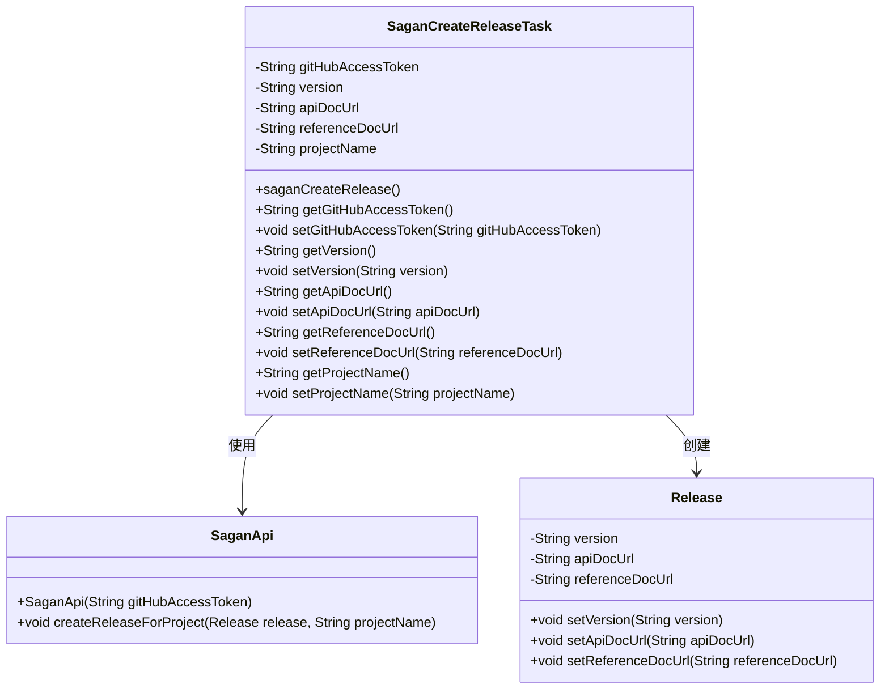

# 基础信息

|      |      |
|------|------|
| 名称 | SaganCreateReleaseTask |
| 编码语言 | .java |
| 代码路径 | spring-ldap/buildSrc/src/main/java/org/springframework/gradle/sagan/SaganCreateReleaseTask.java |
| 包名 | org.springframework.gradle.sagan |
| 依赖项 | ['org.gradle.api.DefaultTask', 'org.gradle.api.tasks.Input', 'org.gradle.api.tasks.TaskAction'] |
| 概述说明 | SaganCreateReleaseTask类用于创建项目发布，含版本和文档URL等参数。 |

# 说明

SaganCreateReleaseTask类专门用于创建项目发布，其主要功能包括处理版本信息、生成API文档以及提供参考文档的URL。该类通过接收这些关键输入参数，确保项目发布的完整性和准确性，从而为开发者和用户提供全面的发布内容。

# 类列表 Class Summary

| 名称   | 类型  | 说明 |
|-------|------|-------------|
| SaganCreateReleaseTask | class | SaganCreateReleaseTask类用于创建项目发布，包含版本、API文档和参考文档URL等输入参数。 |

## 类 SaganCreateReleaseTask

|      |      |
|------|------|
| 访问范围 | public |
| 类型 | class |
| 名称 | SaganCreateReleaseTask |
| 说明 | SaganCreateReleaseTask类用于创建项目发布，包含版本、API文档和参考文档URL等输入参数。 |

### UML类图

类图描述：`SaganCreateReleaseTask` 类是一个任务类，用于创建项目发布。它包含多个输入属性，如 `gitHubAccessToken`、`version`、`apiDocUrl`、`referenceDocUrl` 和 `projectName`。通过 `SaganApi` 类与 `Release` 类交互，最终调用 `createReleaseForProject` 方法完成发布任务。`SaganApi` 类负责与 GitHub API 交互，而 `Release` 类则用于封装发布信息。

### 内部方法调用关系图

```mermaid
graph TD
    A["类SaganCreateReleaseTask"]
    B["属性: String gitHubAccessToken"]
    C["属性: String version"]
    D["属性: String apiDocUrl"]
    E["属性: String referenceDocUrl"]
    F["属性: String projectName"]
    G["方法: saganCreateRelease()"]
    H["方法: String getGitHubAccessToken()"]
    I["方法: void setGitHubAccessToken(String gitHubAccessToken)"]
    J["方法: String getVersion()"]
    K["方法: void setVersion(String version)"]
    L["方法: String getApiDocUrl()"]
    M["方法: void setApiDocUrl(String apiDocUrl)"]
    N["方法: String getReferenceDocUrl()"]
    O["方法: void setReferenceDocUrl(String referenceDocUrl)"]
    P["方法: String getProjectName()"]
    Q["方法: void setProjectName(String projectName)"]
    R["创建对象: SaganApi sagan = new SaganApi(this.gitHubAccessToken)"]
    S["创建对象: Release release = new Release()"]
    T["设置属性: release.setVersion(this.version)"]
    U["设置属性: release.setApiDocUrl(this.apiDocUrl)"]
    V["设置属性: release.setReferenceDocUrl(this.referenceDocUrl)"]
    W["调用方法: sagan.createReleaseForProject(release, this.projectName)"]

    A --> B
    A --> C
    A --> D
    A --> E
    A --> F
    A --> G
    A --> H
    A --> I
    A --> J
    A --> K
    A --> L
    A --> M
    A --> N
    A --> O
    A --> P
    A --> Q
    G --> R
    G --> S
    G --> T
    G --> U
    G --> V
    G --> W
```

这段代码定义了一个名为 `SaganCreateReleaseTask` 的类，该类用于创建一个发布任务。类中包含多个属性，如 `gitHubAccessToken`、`version`、`apiDocUrl`、`referenceDocUrl` 和 `projectName`，以及相应的 getter 和 setter 方法。`saganCreateRelease` 方法是任务的核心逻辑，它首先创建 `SaganApi` 和 `Release` 对象，然后设置 `Release` 对象的属性，最后调用 `SaganApi` 的 `createReleaseForProject` 方法来创建发布。

### 字段列表 Field List

| 名称  | 类型  | 说明 |
|-------|-------|------|
| gitHubAccessToken | String | 定义私有字符串变量gitHubAccessToken。 |
| version | String | 私有字符串变量version用于存储版本信息。 |
| referenceDocUrl | String | 输入包含一个私有字符串变量referenceDocUrl。 |
| apiDocUrl | String | 该代码定义了一个私有字符串变量apiDocUrl。 |
| projectName | String | 输入信息包含一个私有字符串变量projectName。 |

### 方法列表 Method List

| 名称  | 类型  | 说明 |
|-------|-------|------|
| saganCreateRelease | void | 使用SaganApi创建项目版本，设置版本号、API文档和参考文档URL。 |
| setApiDocUrl | void | 设置API文档URL的方法。 |
| setProjectName | void | 设置项目名称的方法，将传入的projectName赋值给当前对象的projectName属性。 |
| getVersion | String | 获取版本号的公共方法。 |
| setGitHubAccessToken | void | 设置GitHub访问令牌的方法。 |
| getGitHubAccessToken | String | 获取GitHub访问令牌的方法。 |
| getApiDocUrl | String | 获取API文档URL的方法。 |
| getProjectName | String | 该方法返回项目名称。 |
| getReferenceDocUrl | String | 获取参考文档URL的方法。 |
| setReferenceDocUrl | void | 设置参考文档URL的方法。 |
| setVersion | void | 设置版本号的公共方法。 |

