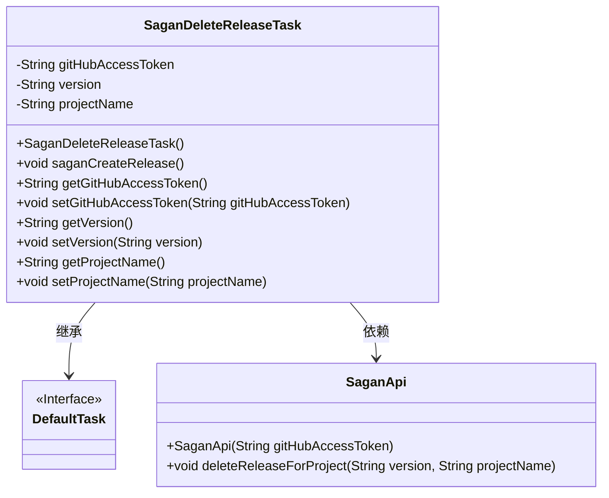
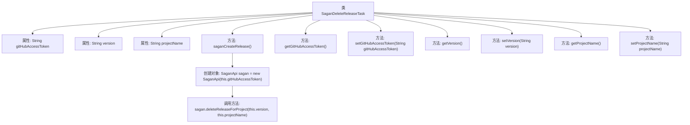

# 基础信息

|      |      |
|------|------|
| 名称 | SaganDeleteReleaseTask |
| 编码语言 | .java |
| 代码路径 | spring-ldap/buildSrc/src/main/java/org/springframework/gradle/sagan/SaganDeleteReleaseTask.java |
| 包名 | org.springframework.gradle.sagan |
| 依赖项 | ['org.gradle.api.DefaultTask', 'org.gradle.api.tasks.Input', 'org.gradle.api.tasks.TaskAction'] |
| 概述说明 | SaganDeleteReleaseTask类用于删除GitHub项目指定版本。 |

# 说明

SaganDeleteReleaseTask类的主要功能是删除GitHub项目中指定的版本发布。该类的设计旨在通过调用相关API或方法，实现对特定版本发布的删除操作。开发者可以使用该类来管理GitHub项目的发布版本，确保版本控制的准确性和项目的整洁性。通过这一功能，用户可以灵活地处理不再需要的版本发布，从而优化项目的版本管理流程。

# 类列表 Class Summary

| 名称   | 类型  | 说明 |
|-------|------|-------------|
| SaganDeleteReleaseTask | class | SaganDeleteReleaseTask类用于删除指定版本的GitHub项目发布。 |

## 类 SaganDeleteReleaseTask

|      |      |
|------|------|
| 访问范围 | public |
| 类型 | class |
| 名称 | SaganDeleteReleaseTask |
| 说明 | SaganDeleteReleaseTask类用于删除指定版本的GitHub项目发布。 |

### UML类图

这段代码定义了一个名为 `SaganDeleteReleaseTask` 的类，该类继承自 `DefaultTask` 接口。`SaganDeleteReleaseTask` 类包含三个私有属性：`gitHubAccessToken`、`version` 和 `projectName`，并提供了相应的 getter 和 setter 方法。该类的主要功能是通过 `saganCreateRelease` 方法调用 `SaganApi` 类的 `deleteReleaseForProject` 方法来删除指定项目的版本发布。`SaganApi` 类负责与 GitHub API 进行交互，执行删除操作。

### 内部方法调用关系图

这段代码定义了一个名为 `SaganDeleteReleaseTask` 的类，该类继承自 `DefaultTask`。类中包含三个私有属性：`gitHubAccessToken`、`version` 和 `projectName`，并提供了相应的 getter 和 setter 方法。`saganCreateRelease` 方法是该类的任务动作，它会创建一个 `SaganApi` 对象，并调用其 `deleteReleaseForProject` 方法来删除指定项目的发布版本。流程图展示了类的结构以及方法之间的调用关系。

### 字段列表 Field List

| 名称  | 类型  | 说明 |
|-------|-------|------|
| gitHubAccessToken | String | 私有字符串变量存储GitHub访问令牌。 |
| projectName | String | 定义私有字符串变量projectName。 |
| version | String | 类中包含一个私有字符串类型的版本变量。 |

### 方法列表 Method List

| 名称  | 类型  | 说明 |
|-------|-------|------|
| setVersion | void | 设置版本号的方法。 |
| getVersion | String | 获取版本号的方法。 |
| getProjectName | String | 获取项目名称的方法，返回项目名称变量。 |
| getGitHubAccessToken | String | 获取GitHub访问令牌的方法。 |
| setGitHubAccessToken | void | 设置GitHub访问令牌的方法。 |
| saganCreateRelease | void | SaganApi创建版本，删除指定项目的版本。 |
| setProjectName | void | 该方法用于设置项目名称，将传入的字符串赋值给类变量projectName。 |

