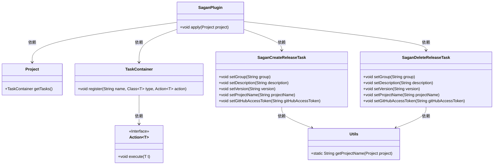
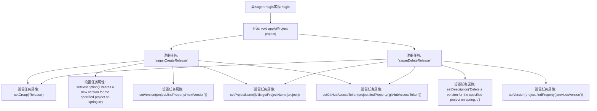

# 基础信息

|      |      |
|------|------|
| 名称 | SaganPlugin |
| 编码语言 | .java |
| 代码路径 | spring-ldap/buildSrc/src/main/java/org/springframework/gradle/sagan/SaganPlugin.java |
| 包名 | org.springframework.gradle.sagan |
| 依赖项 | ['io.spring.gradle.convention.Utils', 'org.gradle.api.Action', 'org.gradle.api.Plugin', 'org.gradle.api.Project'] |
| 概述说明 | SaganPlugin插件管理版本任务，配置版本、项目名和GitHub令牌。 |

# 说明

SaganPlugin插件用于注册、创建和删除版本任务。该插件允许用户设置版本号、项目名称以及GitHub令牌，以便在GitHub平台上进行版本管理操作。通过这些功能，用户可以方便地管理项目的版本发布和更新，确保版本控制的一致性和可追溯性。

# 类列表 Class Summary

| 名称   | 类型  | 说明 |
|-------|------|-------------|
| SaganPlugin | class | SaganPlugin插件注册创建和删除版本任务，设置版本、项目名和GitHub令牌。 |

## 类 SaganPlugin

|      |      |
|------|------|
| 访问范围 | public |
| 类型 | class |
| 名称 | SaganPlugin |
| 说明 | SaganPlugin插件注册创建和删除版本任务，设置版本、项目名和GitHub令牌。 |

### UML类图

该代码描述了一个名为 `SaganPlugin` 的插件类，它实现了 `Plugin<Project>` 接口。`SaganPlugin` 的主要功能是通过 `apply` 方法注册两个任务：`saganCreateRelease` 和 `saganDeleteRelease`。这两个任务分别由 `SaganCreateReleaseTask` 和 `SaganDeleteReleaseTask` 类实现，用于创建和删除 Spring.io 项目中的版本。`Project` 类提供了任务容器 `TaskContainer`，而 `Action<T>` 接口定义了任务的执行逻辑。`Utils` 类提供了获取项目名称的静态方法。整个代码结构清晰地展示了插件如何与任务和项目进行交互。

### 内部方法调用关系图

这段代码定义了一个名为 `SaganPlugin` 的类，该类实现了 `Plugin<Project>` 接口。在 `apply` 方法中，注册了两个任务：`saganCreateRelease` 和 `saganDeleteRelease`。每个任务都设置了多个属性，包括任务组、描述、版本号、项目名称和GitHub访问令牌。这些属性通过 `project.findProperty` 方法从项目配置中获取，并通过 `Utils.getProjectName` 方法获取项目名称。该代码主要用于在Gradle插件中定义和管理与版本发布相关的任务。

### 字段列表 Field List

| 名称  | 类型  | 说明 |
|-------|-------|------|

### 方法列表 Method List

| 名称  | 类型  | 说明 |
|-------|-------|------|
| apply | void | 注册两个任务：saganCreateRelease用于创建spring.io项目新版本，saganDeleteRelease用于删除旧版本。 |

