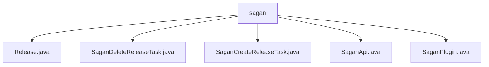

# 基础信息

|      |      |
|------|------|
| 名称 | sagan |
| 编码语言 | .java |
| 代码路径 | spring-ldap/buildSrc/src/main/java/org/springframework/gradle/sagan |
| 包名 | spring-ldap.buildSrc.src.main.java.org.springframework.gradle.sagan |
| 概述说明 | Release类管理版本信息，SaganDeleteReleaseTask删除GitHub发布，SaganCreateReleaseTask创建发布，SaganApi提供发布操作，SaganPlugin管理版本任务。 |

# 说明

## 概述
该代码模块主要用于管理和操作GitHub项目的版本发布。它提供了创建、删除、解析版本信息以及生成相关文档的功能。通过使用OkHttpClient和Gson库，模块支持与GitHub API的交互，并通过GitHub Token进行认证，确保操作的安全性和灵活性。模块的核心功能通过`Release`类、`SaganApi`类以及多个任务类（如`SaganCreateReleaseTask`和`SaganDeleteReleaseTask`）实现，并通过`SaganPlugin`插件将这些功能集成到构建流程中。

## 主要业务场景
1. **版本管理**：通过`Release`类管理版本号、状态以及相关文档链接，提供状态解析功能，帮助开发者获取版本的具体信息。
2. **创建版本发布**：`SaganCreateReleaseTask`类用于创建项目发布，处理版本信息、生成API文档，并提供参考文档的URL，确保发布的完整性和准确性。
3. **删除版本发布**：`SaganDeleteReleaseTask`类用于删除GitHub项目中指定的版本发布，帮助开发者管理不再需要的版本，优化版本控制流程。
4. **API交互**：`SaganApi`类通过OkHttpClient和Gson库，提供创建和删除版本发布的功能，支持自定义基础URL并通过GitHub Token进行认证。
5. **插件集成**：`SaganPlugin`插件用于注册、创建和删除版本任务，允许用户设置版本号、项目名称以及GitHub令牌，方便在GitHub平台上进行版本管理操作。

通过这些功能，该模块为开发者提供了一个完整的版本管理解决方案，确保版本控制的一致性和可追溯性。

### 包内部结构视图

该流程图展示了`spring-ldap/buildSrc/src/main/java/org/springframework/gradle/sagan`目录下的文件层级关系。所有文件都直接位于`sagan`目录下，包括`Release.java`、`SaganDeleteReleaseTask.java`、`SaganCreateReleaseTask.java`、`SaganApi.java`和`SaganPlugin.java`。这些文件都是独立的，没有进一步的子目录或嵌套结构。

# 文件列表 File List

| 名称   | 类型  | 说明 |
|-------|------|-------------|
| [SaganPlugin.java](SaganPlugin.md) | file | SaganPlugin插件管理版本任务，配置版本、项目名和GitHub令牌。 |
| [SaganApi.java](SaganApi.md) | file | SaganApi类通过OkHttpClient和Gson管理项目发布，支持自定义URL和GitHub Token认证。 |
| [SaganCreateReleaseTask.java](SaganCreateReleaseTask.md) | file | SaganCreateReleaseTask类用于创建项目发布，含版本和文档URL等参数。 |
| [SaganDeleteReleaseTask.java](SaganDeleteReleaseTask.md) | file | SaganDeleteReleaseTask类用于删除GitHub项目指定版本。 |
| [Release.java](Release.md) | file | Release类包含版本、状态、参考文档和API文档URL，支持状态解析。 |

