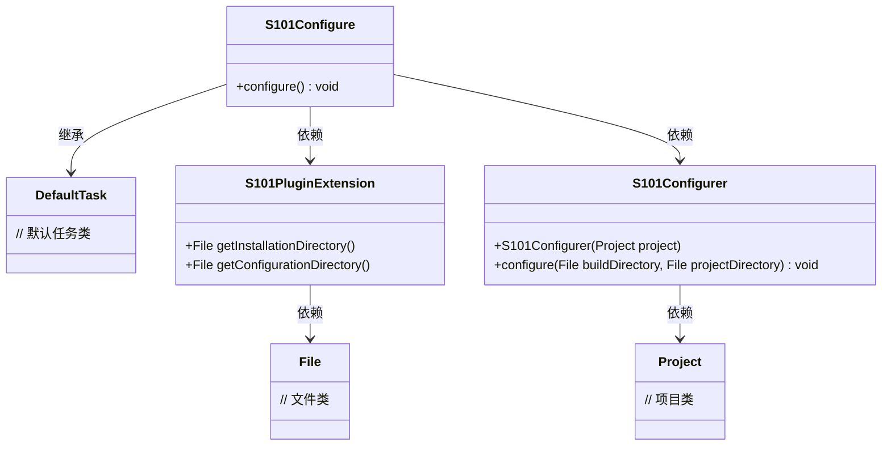
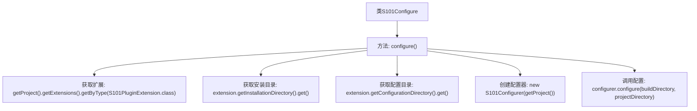

# 基础信息

|      |      |
|------|------|
| 名称 | S101Configure |
| 编码语言 | .java |
| 代码路径 | spring-ldap/buildSrc/src/main/java/s101/S101Configure.java |
| 包名 | None |
| 依赖项 | ['java.io.File', 'org.gradle.api.DefaultTask', 'org.gradle.api.tasks.TaskAction'] |
| 概述说明 | S101Configure类使用TaskAction方法配置S101插件，设置目录并调用配置器完成配置。 |

# 说明

S101Configure类通过TaskAction方法对S101插件扩展进行配置。该方法首先设置构建目录和项目目录，然后调用配置器来完成具体的配置任务。这一过程确保了S101插件的正确初始化和配置，为后续的构建和项目操作提供了基础支持。

# 类列表 Class Summary

| 名称   | 类型  | 说明 |
|-------|------|-------------|
| S101Configure | class | S101Configure类通过TaskAction方法配置S101插件扩展，设置构建和项目目录，并调用配置器完成配置。 |

## 类 S101Configure

|      |      |
|------|------|
| 访问范围 | public |
| 类型 | class |
| 名称 | S101Configure |
| 说明 | S101Configure类通过TaskAction方法配置S101插件扩展，设置构建和项目目录，并调用配置器完成配置。 |

### UML类图

**描述：**  
`S101Configure` 类继承自 `DefaultTask`，并在 `configure` 方法中通过 `S101PluginExtension` 获取安装目录和配置目录，然后使用 `S101Configurer` 进行配置。`S101PluginExtension` 提供了获取目录的方法，`S101Configurer` 则负责实际的配置操作。整个流程依赖于 `File` 和 `Project` 类来完成文件和项目相关的操作。

### 内部方法调用关系图

这段代码定义了一个名为`S101Configure`的类，该类继承自`DefaultTask`。`configure()`方法是该类的任务操作，负责获取项目的扩展配置，包括安装目录和配置目录，然后使用这些目录初始化一个`S101Configurer`对象，并调用其`configure`方法进行配置。流程图展示了从类定义到方法调用的完整流程，清晰地描述了每个步骤的执行顺序。

### 字段列表 Field List

| 名称  | 类型  | 说明 |
|-------|-------|------|

### 方法列表 Method List

| 名称  | 类型  | 说明 |
|-------|-------|------|
| configure | void | 该方法配置S101插件，获取安装和配置目录，并调用配置器进行设置。 |

