# 基础信息

|      |      |
|------|------|
| 名称 | S101Configurer |
| 编码语言 | .java |
| 代码路径 | spring-ldap/buildSrc/src/main/java/s101/S101Configurer.java |
| 包名 | None |
| 依赖项 | ['java.io.File', 'java.io.FileInputStream', 'java.io.FileOutputStream', 'java.io.IOException', 'java.io.InputStream', 'java.io.InputStreamReader', 'java.io.OutputStream', 'java.io.OutputStreamWriter', 'java.io.PrintWriter', 'java.io.UncheckedIOException', 'java.net.URL', 'java.nio.file.Files', 'java.nio.file.Path', 'java.util.ArrayList', 'java.util.HashMap', 'java.util.LinkedHashMap', 'java.util.List', 'java.util.Map', 'java.util.Properties', 'java.util.Set', 'java.util.jar.JarEntry', 'java.util.jar.JarInputStream', 'java.util.regex.Matcher', 'java.util.regex.Pattern', 'java.util.zip.ZipEntry', 'java.util.zip.ZipInputStream', 'com.gargoylesoftware.htmlunit.WebClient', 'com.gargoylesoftware.htmlunit.html.HtmlAnchor', 'com.gargoylesoftware.htmlunit.html.HtmlPage', 'com.github.mustachejava.DefaultMustacheFactory', 'com.github.mustachejava.Mustache', 'com.github.mustachejava.MustacheFactory', 'org.apache.commons.io.IOUtils', 'org.gradle.api.Project', 'org.gradle.api.logging.Logger', 'org.gradle.api.tasks.SourceSet', 'org.gradle.api.tasks.SourceSetContainer', 'org.springframework.core.io.ClassPathResource', 'org.springframework.core.io.Resource'] |
| 概述说明 | S101Configurer类负责Structure101项目的配置与安装，涵盖模板加载、许可证管理、目录删除、构建工具安装及版本配置。 |

# 说明

S101Configurer类主要负责Structure101项目的配置和安装工作，涵盖多个关键操作。其功能包括加载项目模板、管理许可证信息、删除指定目录、安装必要的构建工具以及配置项目版本。通过这些操作，S101Configurer类确保项目在启动和运行过程中具备所需的资源和配置，从而支持项目的顺利部署和管理。

# 类列表 Class Summary

| 名称   | 类型  | 说明 |
|-------|------|-------------|
| S101Configurer | class | S101Configurer类用于配置和安装Structure101项目，包括加载模板、管理许可证、删除目录、安装构建工具、配置项目版本等操作。 |


## 类 S101Configurer

|      |      |
|------|------|
| 访问范围 | public |
| 类型 | class |
| 名称 | S101Configurer |
| 说明 | S101Configurer类用于配置和安装Structure101项目，包括加载模板、管理许可证、删除目录、安装构建工具、配置项目版本等操作。 |


### UML类图

```mermaid
classDiagram
    class S101Configurer {
        -Pattern VERSION
        -int BUFFER
        -long TOOBIG
        -int TOOMANY
        -MustacheFactory mustache
        -Mustache hspTemplate
        -Mustache repositoryTemplate
        -Path licenseDirectory
        -Project project
        -Logger logger
        +S101Configurer(Project project)
        +void license(String licenseId)
        -boolean needsLicense(Path licenseFile, String licenseId)
        -void writeLicense(Path licenseFile, String licenseId)
        +void install(File installationDirectory, File configurationDirectory)
        +void configure(File installationDirectory, File configurationDirectory)
        -String computeVersionFromInstallation(File installationDirectory)
        -boolean deleteDirectory(File directoryToBeDeleted)
        -String installBuildTool(File installationDirectory, File configurationDirectory)
        -void copyZipToFilesystem(String source, File destination, String name)
        -String validateFilename(String filename, String intendedDir)
        -void configureProject(String version, File configurationDirectory)
        -void copyToProject(String location, File destination)
        -void copyToProject(Mustache view, Map~String, Object~ model, File destination)
        -Map~String, Object~ hspTemplateValues(String version, File configurationDirectory)
    }

    class Project {
        <<Interface>>
        +Logger getLogger()
        +File getProjectDir()
        +Set~Project~ getAllprojects()
        +Object findByName(String name)
    }

    class Logger {
        <<Interface>>
        +void info(String message)
    }

    class MustacheFactory {
        <<Interface>>
        +Mustache compile(Reader reader, String name)
    }

    class Mustache {
        <<Interface>>
        +void execute(Writer writer, Map~String, Object~ model)
    }

    class Resource {
        <<Interface>>
        +InputStream getInputStream()
    }

    class WebClient {
        +HtmlPage getPage(String url)
    }

    class HtmlPage {
        +List~HtmlAnchor~ getAnchors()
    }

    class HtmlAnchor {
        +String getHrefAttribute()
    }

    class ZipInputStream {
        +ZipEntry getNextEntry()
    }

    class ZipEntry {
        +String getName()
    }

    class File {
        +boolean exists()
        +boolean mkdirs()
        +boolean delete()
        +File[] listFiles()
        +String getCanonicalPath()
    }

    class Path {
        +File toFile()
        +Path resolve(String other)
        +void forEach(Consumer~Path~ action)
    }

    class Properties {
        +String getProperty(String key)
        +void load(InputStream inStream)
    }

    class Map~K, V~ {
        <<Interface>>
        +void put(K key, V value)
        +V get(K key)
    }

    class List~E~ {
        <<Interface>>
        +void add(E e)
    }

    class Set~E~ {
        <<Interface>>
        +Iterator~E~ iterator()
    }

    S101Configurer --> Project : 依赖
    S101Configurer --> Logger : 依赖
    S101Configurer --> MustacheFactory : 依赖
    S101Configurer --> Mustache : 依赖
    S101Configurer --> Resource : 依赖
    S101Configurer --> WebClient : 依赖
    S101Configurer --> ZipInputStream : 依赖
    S101Configurer --> File : 依赖
    S101Configurer --> Path : 依赖
    S101Configurer --> Properties : 依赖
    S101Configurer --> Map~String, Object~ : 依赖
    S101Configurer --> List~Map~String, Object~~ : 依赖
    S101Configurer --> Set~Project~ : 依赖
    WebClient --> HtmlPage : 依赖
    HtmlPage --> HtmlAnchor : 依赖
    ZipInputStream --> ZipEntry : 依赖
```

### 描述
`S101Configurer` 类负责配置和安装 Structure101 工具。它通过读取模板文件、验证许可证、下载和安装构建工具、配置项目目录等步骤来完成这些任务。该类依赖于多个外部类和接口，如 `Project`、`Logger`、`MustacheFactory` 等，以完成其功能。通过流程图和时序图，可以清晰地看到各个类之间的交互关系和依赖关系。


### 内部方法调用关系图

```mermaid
graph TD
    A["类S101Configurer"]
    B["属性: Pattern VERSION"]
    C["属性: int BUFFER"]
    D["属性: long TOOBIG"]
    E["属性: int TOOMANY"]
    F["属性: MustacheFactory mustache"]
    G["属性: Mustache hspTemplate"]
    H["属性: Mustache repositoryTemplate"]
    I["属性: Path licenseDirectory"]
    J["属性: Project project"]
    K["属性: Logger logger"]
    L["构造方法: S101Configurer(Project project)"]
    M["方法: void license(String licenseId)"]
    N["方法: boolean needsLicense(Path licenseFile, String licenseId)"]
    O["方法: void writeLicense(Path licenseFile, String licenseId)"]
    P["方法: void install(File installationDirectory, File configurationDirectory)"]
    Q["方法: void configure(File installationDirectory, File configurationDirectory)"]
    R["方法: String computeVersionFromInstallation(File installationDirectory)"]
    S["方法: boolean deleteDirectory(File directoryToBeDeleted)"]
    T["方法: String installBuildTool(File installationDirectory, File configurationDirectory)"]
    U["方法: void copyZipToFilesystem(String source, File destination, String name)"]
    V["方法: String validateFilename(String filename, String intendedDir)"]
    W["方法: void configureProject(String version, File configurationDirectory)"]
    X["方法: void copyToProject(String location, File destination)"]
    Y["方法: void copyToProject(Mustache view, Map<String, Object> model, File destination)"]
    Z["方法: Map<String, Object> hspTemplateValues(String version, File configurationDirectory)"]

    A --> B
    A --> C
    A --> D
    A --> E
    A --> F
    A --> G
    A --> H
    A --> I
    A --> J
    A --> K
    A --> L
    A --> M
    M --> N
    M --> O
    A --> P
    P --> S
    P --> T
    T --> U
    U --> V
    A --> Q
    Q --> R
    Q --> W
    W --> Y
    W --> X
    W --> Z
```



这段代码定义了一个名为 `S101Configurer` 的类，用于配置和安装一个名为 Structure101 的工具。类中包含多个属性和方法，用于处理许可证管理、安装和配置过程。代码通过读取模板文件、处理 ZIP 文件、验证文件名等操作，确保 Structure101 的正确安装和配置。流程图展示了类中各个方法的调用关系，从构造方法到各个功能方法的调用路径，清晰地展示了代码的执行流程。

### 字段列表 Field List

| 名称  | 类型  | 说明 |
|-------|-------|------|
| logger | Logger | 私有日志记录器实例声明。 |
| project | Project | 私有不可变的项目实例变量。 |
| BUFFER = 1024 | int | 定义了一个私有静态常量BUFFER，值为1024。 |
| licenseDirectory | Path | 私有最终路径变量licenseDirectory。 |
| mustache = new DefaultMustacheFactory() | MustacheFactory | 创建并初始化Mustache模板工厂实例。 |
| TOOBIG = 0x10000000 | long | 定义一个静态长整型常量TOOBIG，值为268435456。 |
| VERSION = Pattern.compile("<local-project .* version=\"(.*?)\"") | Pattern | 提取版本号的静态正则表达式模式。 |
| TOOMANY = 200 | int | 定义常量TOOMANY，值为200。 |
| hspTemplate | Mustache | 私有且不可变的Mustache模板变量hspTemplate。 |
| repositoryTemplate | Mustache | 私有Mustache类型的repositoryTemplate变量。 |

### 方法列表 Method List

| 名称  | 类型  | 说明 |
|-------|-------|------|
| deleteDirectory | boolean | 递归删除目录及其所有内容。 |
| license | void | 该方法检查并写入指定ID的许可证文件。 |
| installBuildTool | String | 从指定URL下载并安装结构101构建工具到指定目录。 |
| copyToProject | void | 将Mustache视图和模型数据写入目标文件，处理IO异常。 |
| copyToProject | void | 将指定位置的资源复制到目标文件，处理IO异常。 |
| computeVersionFromInstallation | String | 从安装目录读取JAR文件，提取版本信息并返回。 |
| validateFilename | String | 验证文件路径是否在目标目录内，否则抛出异常。 |
| writeLicense | void | 方法writeLicense创建或覆盖license文件，写入licenseId，处理异常。 |
| configureProject | void | 配置项目，创建目录，复制模板和配置文件，处理仓库和快照目录。 |
| needsLicense | boolean | 检查许可证文件是否存在且包含指定ID。 |
| install | void | 删除指定目录并安装构建工具。 |
| copyZipToFilesystem | void | 该方法从指定URL下载ZIP文件，解压并复制到目标路径，过滤特定文件，限制文件数量和大小。 |
| hspTemplateValues | Map<String, Object> | 生成包含版本、补丁版本及项目路径的映射，并收集所有项目的类目录信息。 |
| configure | void | 删除配置目录，计算安装目录版本，配置项目。 |


