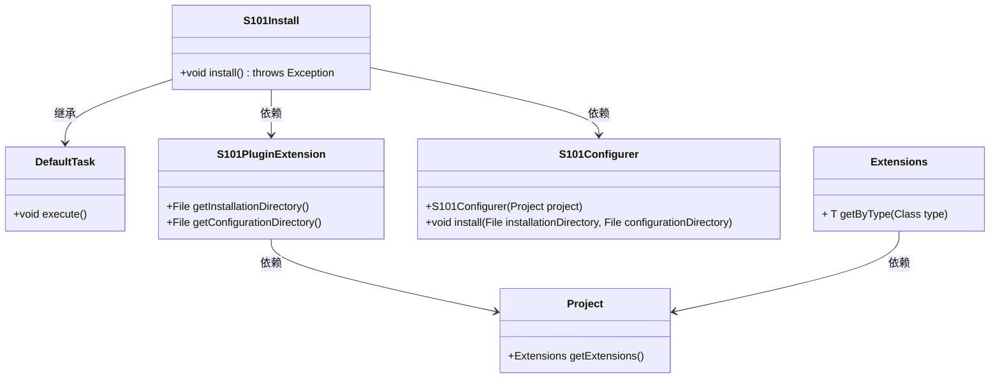
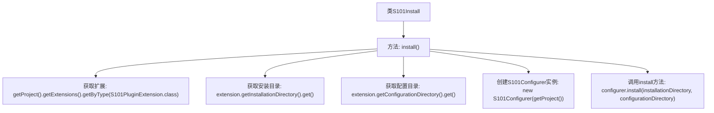

# 基础信息

|      |      |
|------|------|
| 名称 | S101Install |
| 编码语言 | .java |
| 代码路径 | spring-ldap/buildSrc/src/main/java/s101/S101Install.java |
| 包名 | None |
| 依赖项 | ['java.io.File', 'org.gradle.api.DefaultTask', 'org.gradle.api.tasks.TaskAction'] |
| 概述说明 | S101Install类执行安装，获取扩展配置并调用S101Configurer完成安装。 |

# 说明

S101Install类负责执行安装任务，主要功能包括获取扩展配置并调用S101Configurer进行安装。该类通过获取相关配置信息，确保安装过程按照预设的扩展配置进行，最终通过S101Configurer完成安装操作。

# 类列表 Class Summary

| 名称   | 类型  | 说明 |
|-------|------|-------------|
| S101Install | class | S101Install类执行安装任务，获取扩展配置并调用S101Configurer进行安装。 |

## 类 S101Install

|      |      |
|------|------|
| 访问范围 | public |
| 类型 | class |
| 名称 | S101Install |
| 说明 | S101Install类执行安装任务，获取扩展配置并调用S101Configurer进行安装。 |

### UML类图

这段代码定义了一个名为 `S101Install` 的类，它继承自 `DefaultTask` 并实现了 `install` 方法。`S101Install` 类依赖于 `S101PluginExtension` 和 `S101Configurer` 类来完成安装任务。`S101PluginExtension` 类提供了安装目录和配置目录的获取方法，而 `S101Configurer` 类则负责实际的安装操作。整个流程通过 `Project` 和 `Extensions` 类来获取必要的配置信息。

### 内部方法调用关系图

这段代码描述了一个名为`S101Install`的类，其中包含一个`install()`方法。该方法首先从项目中获取`S101PluginExtension`类型的扩展，然后从扩展中获取安装目录和配置目录。接着，它创建了一个`S101Configurer`实例，并调用其`install`方法，将安装目录和配置目录作为参数传递。整个流程展示了如何通过扩展和配置器来完成安装任务。

### 字段列表 Field List

| 名称  | 类型  | 说明 |
|-------|-------|------|

### 方法列表 Method List

| 名称  | 类型  | 说明 |
|-------|-------|------|
| install | void | 安装S101插件，获取安装和配置目录，调用配置器进行安装。 |

