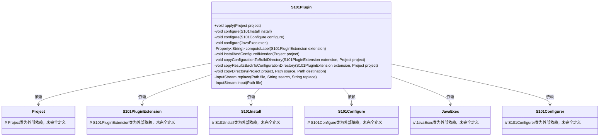
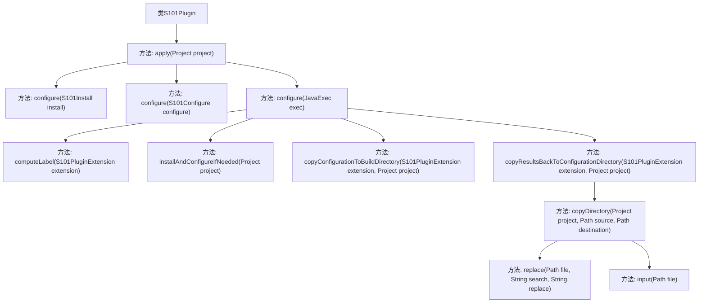

# 基础信息

|      |      |
|------|------|
| 名称 | S101Plugin |
| 编码语言 | .java |
| 代码路径 | spring-ldap/buildSrc/src/main/java/s101/S101Plugin.java |
| 包名 | None |
| 依赖项 | ['java.io.ByteArrayInputStream', 'java.io.File', 'java.io.FileInputStream', 'java.io.IOException', 'java.io.InputStream', 'java.nio.charset.StandardCharsets', 'java.nio.file.Files', 'java.nio.file.Path', 'java.nio.file.StandardCopyOption', 'org.gradle.api.Plugin', 'org.gradle.api.Project', 'org.gradle.api.provider.Property', 'org.gradle.api.tasks.JavaExec'] |
| 概述说明 | S101Plugin实现Structure101任务的安装、配置、运行及自动化分析和文件管理。 |

# 说明

S101Plugin是一款用于实现Structure101任务安装、配置和运行的插件，旨在支持自动化分析和文件管理。该插件通过简化任务设置和执行流程，帮助用户高效管理代码结构，提升软件项目的可维护性和质量。其核心功能包括自动化分析任务的执行和文件管理，确保用户能够轻松集成Structure101工具到现有开发流程中。

# 类列表 Class Summary

| 名称   | 类型  | 说明 |
|-------|------|-------------|
| S101Plugin | class | S101Plugin实现安装、配置和运行Structure101任务，支持自动化分析和文件管理。 |

## 类 S101Plugin

|      |      |
|------|------|
| 访问范围 | public |
| 类型 | class |
| 名称 | S101Plugin |
| 说明 | S101Plugin实现安装、配置和运行Structure101任务，支持自动化分析和文件管理。 |

### UML类图

这段代码定义了一个名为`S101Plugin`的类，它实现了`Plugin<Project>`接口。`S101Plugin`类的主要功能是通过`apply`方法在项目上注册多个任务（如`s101Install`、`s101Configure`和`s101`），并通过`configure`方法配置这些任务的行为。`S101Plugin`依赖于多个外部类，如`Project`、`S101PluginExtension`、`S101Install`、`S101Configure`、`JavaExec`和`S101Configurer`，这些类在代码中未完全定义。`S101Plugin`通过调用这些外部类的方法来完成安装、配置和执行任务的操作。

### 内部方法调用关系图

这段代码定义了一个名为 `S101Plugin` 的类，该类实现了 `Plugin<Project>` 接口。`apply` 方法是插件的入口点，它注册了三个任务：`s101Install`、`s101Configure` 和 `s101`。每个任务都有一个对应的 `configure` 方法，用于设置任务的描述和执行逻辑。`configure(JavaExec exec)` 方法负责配置 `JavaExec` 任务，包括设置工作目录、类路径、参数和系统属性，并在任务执行前后执行安装、配置和结果复制操作。其他辅助方法如 `computeLabel`、`installAndConfigureIfNeeded`、`copyConfigurationToBuildDirectory` 和 `copyResultsBackToConfigurationDirectory` 用于支持这些操作。

### 字段列表 Field List

| 名称  | 类型  | 说明 |
|-------|-------|------|

### 方法列表 Method List

| 名称  | 类型  | 说明 |
|-------|-------|------|
| copyConfigurationToBuildDirectory | void | 将配置目录复制到构建目录。 |
| apply | void | 项目扩展添加S101插件，并注册安装、配置和执行任务。 |
| configure | void | 配置S101项目默认结构设置。 |
| copyDirectory | void | 递归复制目录，处理特定文件内容并替换。 |
| configure | void | 配置S101安装，设置描述为“安装Structure101到文件系统”。 |
| input | InputStream | 私有方法input接收Path参数，返回FileInputStream，异常时抛出RuntimeException。 |
| copyResultsBackToConfigurationDirectory | void | 将构建配置目录中的结果复制回指定配置目录，处理新基线情况。 |
| replace | InputStream | 私有方法替换文件内容为输入流，异常抛出运行时错误。 |
| computeLabel | Property<String> | 方法根据路径判断是否存在基线文件，决定返回默认标签。 |
| configure | void | 配置JavaExec任务，设置描述、依赖、工作目录、类路径、参数、系统属性，并执行前后操作。 |
| installAndConfigureIfNeeded | void | 检查并安装配置S101插件，设置许可证和目录。 |

