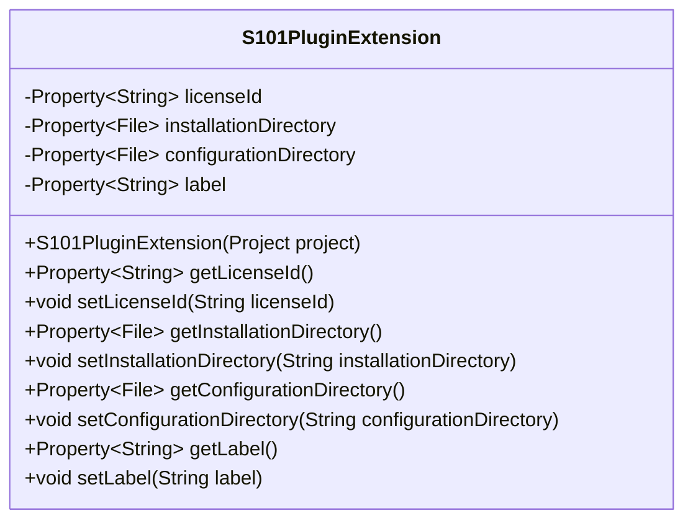

# 基础信息

|      |      |
|------|------|
| 名称 | S101PluginExtension |
| 编码语言 | .java |
| 代码路径 | spring-ldap/buildSrc/src/main/java/s101/S101PluginExtension.java |
| 包名 | None |
| 依赖项 | ['java.io.File', 'org.gradle.api.Project', 'org.gradle.api.provider.Property', 'org.gradle.api.tasks.Input', 'org.gradle.api.tasks.InputDirectory'] |
| 概述说明 | S101插件扩展类包含许可证ID、安装目录、配置目录和标签属性，提供设置和获取方法。 |

# 说明

S101插件扩展类是一个用于管理和操作插件相关信息的类。该类包含多个关键属性，包括许可证ID、安装目录、配置目录和标签属性。通过这些属性，用户可以获取和设置插件的具体信息。此外，该类提供了相应的设置和获取方法，使用户能够方便地管理和配置插件的各项参数。这些功能使得S101插件扩展类在插件管理和配置方面具有高度的灵活性和可操作性。

# 类列表 Class Summary

| 名称   | 类型  | 说明 |
|-------|------|-------------|
| S101PluginExtension | class | S101插件扩展类，包含许可证ID、安装目录、配置目录和标签属性，提供设置和获取方法。 |

## 类 S101PluginExtension

|      |      |
|------|------|
| 访问范围 | public |
| 类型 | class |
| 名称 | S101PluginExtension |
| 说明 | S101插件扩展类，包含许可证ID、安装目录、配置目录和标签属性，提供设置和获取方法。 |

### UML类图

这段代码定义了一个名为 `S101PluginExtension` 的类，主要用于管理插件扩展的配置。该类包含四个私有属性：`licenseId`、`installationDirectory`、`configurationDirectory` 和 `label`，分别用于存储许可证ID、安装目录、配置目录和标签。每个属性都有对应的 getter 和 setter 方法，并且通过 `@Input` 和 `@InputDirectory` 注解标记为输入属性。构造函数 `S101PluginExtension` 接受一个 `Project` 对象，并初始化这些属性，同时根据项目属性设置默认值或从项目配置中获取值。

### 内部方法调用关系图

```mermaid
graph TD
    A["类S101PluginExtension"]
    B["属性: Property<String> licenseId"]
    C["属性: Property<File> installationDirectory"]
    D["属性: Property<File> configurationDirectory"]
    E["属性: Property<String> label"]
    F["方法: Property<String> getLicenseId()"]
    G["方法: void setLicenseId(String licenseId)"]
    H["方法: Property<File> getInstallationDirectory()"]
    I["方法: void setInstallationDirectory(String installationDirectory)"]
    J["方法: Property<File> getConfigurationDirectory()"]
    K["方法: void setConfigurationDirectory(String configurationDirectory)"]
    L["方法: Property<String> getLabel()"]
    M["方法: void setLabel(String label)"]
    N["构造方法: S101PluginExtension(Project project)"]
    O["初始化: this.licenseId = project.getObjects().property(String.class)"]
    P["条件判断: if (project.hasProperty('s101.licenseId'))"]
    Q["调用: setLicenseId((String) project.findProperty('s101.licenseId'))"]
    R["初始化: this.installationDirectory = project.getObjects().property(File.class).convention(new File(project.getBuildDir(), 's101'))"]
    S["初始化: this.configurationDirectory = project.getObjects().property(File.class).convention(new File(project.getProjectDir(), 's101'))"]
    T["初始化: this.label = project.getObjects().property(String.class)"]
    U["条件判断: if (project.hasProperty('s101.label'))"]
    V["调用: setLabel((String) project.findProperty('s101.label'))"]

    A --> B
    A --> C
    A --> D
    A --> E
    A --> F
    A --> G
    A --> H
    A --> I
    A --> J
    A --> K
    A --> L
    A --> M
    A --> N
    N --> O
    N --> P
    P -->|true| Q
    N --> R
    N --> S
    N --> T
    N --> U
    U -->|true| V
```

这段代码定义了一个名为 `S101PluginExtension` 的类，用于管理插件的配置属性。类中包含四个主要属性：`licenseId`、`installationDirectory`、`configurationDirectory` 和 `label`，每个属性都有对应的 `getter` 和 `setter` 方法。构造方法 `S101PluginExtension` 初始化这些属性，并根据项目配置设置默认值或从项目属性中读取值。流程图展示了类的结构、属性初始化流程以及条件判断的逻辑。

### 字段列表 Field List

| 名称  | 类型  | 说明 |
|-------|-------|------|
| licenseId | Property<String> | 私有属性licenseId，类型为Property<String>。 |
| configurationDirectory | Property<File> | 私有属性配置目录为文件类型。 |
| label | Property<String> | 私有且不可变的字符串类型属性标签。 |
| installationDirectory | Property<File> | 私有最终属性，类型为文件，表示安装目录。 |

### 方法列表 Method List

| 名称  | 类型  | 说明 |
|-------|-------|------|
| setLabel | void | 设置标签值为指定字符串。 |
| getInstallationDirectory | Property<File> | 获取安装目录的公共属性方法。 |
| getLabel | Property<String> | 获取字符串类型的标签属性。 |
| setConfigurationDirectory | void | 设置配置目录路径为指定文件对象。 |
| getLicenseId | Property<String> | 获取许可证ID的公共方法。 |
| setInstallationDirectory | void | 设置安装目录路径方法。 |
| getConfigurationDirectory | Property<File> | 获取配置目录的公共属性方法。 |
| setLicenseId | void | 设置许可证ID的方法。 |

