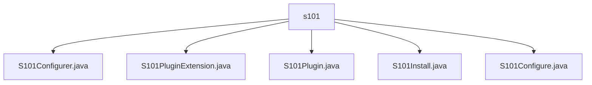

# 基础信息

|      |      |
|------|------|
| 名称 | s101 |
| 编码语言 | .java |
| 代码路径 | spring-ldap/buildSrc/src/main/java/s101 |
| 包名 | spring-ldap.buildSrc.src.main.java.s101 |
| 概述说明 | S101类负责配置、安装和管理Structure101项目及插件，确保资源与配置支持项目顺利部署。 |

# 说明

## 概述

该代码模块主要用于支持Structure101项目的配置、安装和管理。模块包含多个类，分别负责不同的功能，如加载项目模板、管理许可证信息、安装构建工具、配置项目版本、执行安装任务以及管理插件扩展。通过这些类的协同工作，模块确保项目在启动和运行过程中具备所需的资源和配置，从而支持项目的顺利部署和管理。

## 主要业务场景

1. **项目配置与安装**：
   - **S101Configurer类**：负责加载项目模板、管理许可证信息、删除指定目录、安装必要的构建工具以及配置项目版本。确保项目在启动和运行过程中具备所需的资源和配置。
   - **S101Install类**：执行安装任务，获取扩展配置并调用S101Configurer进行安装，确保安装过程按照预设的扩展配置进行。

2. **插件管理与配置**：
   - **S101PluginExtension类**：管理和操作插件相关信息，包括许可证ID、安装目录、配置目录和标签属性。提供设置和获取方法，方便用户管理和配置插件的各项参数。
   - **S101Configure类**：通过TaskAction方法对S101插件扩展进行配置，设置构建目录和项目目录，调用配置器完成具体配置任务，确保插件的正确初始化和配置。

3. **自动化分析与文件管理**：
   - **S101Plugin类**：实现Structure101任务的安装、配置和运行，支持自动化分析和文件管理。简化任务设置和执行流程，帮助用户高效管理代码结构，提升软件项目的可维护性和质量。

通过这些业务场景，该模块为Structure101项目的自动化管理提供了全面的支持，确保项目能够高效、顺利地运行和维护。

### 包内部结构视图

该流程图展示了在`s101`目录下的文件层级关系。`s101`作为根节点，包含了五个文件：`S101Configurer.java`、`S101PluginExtension.java`、`S101Plugin.java`、`S101Install.java`和`S101Configure.java`。这些文件直接位于`s101`目录下，没有进一步的子目录结构。

# 文件列表 File List

| 名称   | 类型  | 说明 |
|-------|------|-------------|
| [S101Install.java](S101Install.md) | file | S101Install类执行安装，获取扩展配置并调用S101Configurer完成安装。 |
| [S101Configure.java](S101Configure.md) | file | S101Configure类使用TaskAction方法配置S101插件，设置目录并调用配置器完成配置。 |
| [S101Plugin.java](S101Plugin.md) | file | S101Plugin实现Structure101任务的安装、配置、运行及自动化分析和文件管理。 |
| [S101PluginExtension.java](S101PluginExtension.md) | file | S101插件扩展类包含许可证ID、安装目录、配置目录和标签属性，提供设置和获取方法。 |
| [S101Configurer.java](S101Configurer.md) | file | S101Configurer类负责Structure101项目的配置与安装，涵盖模板加载、许可证管理、目录删除、构建工具安装及版本配置。 |

