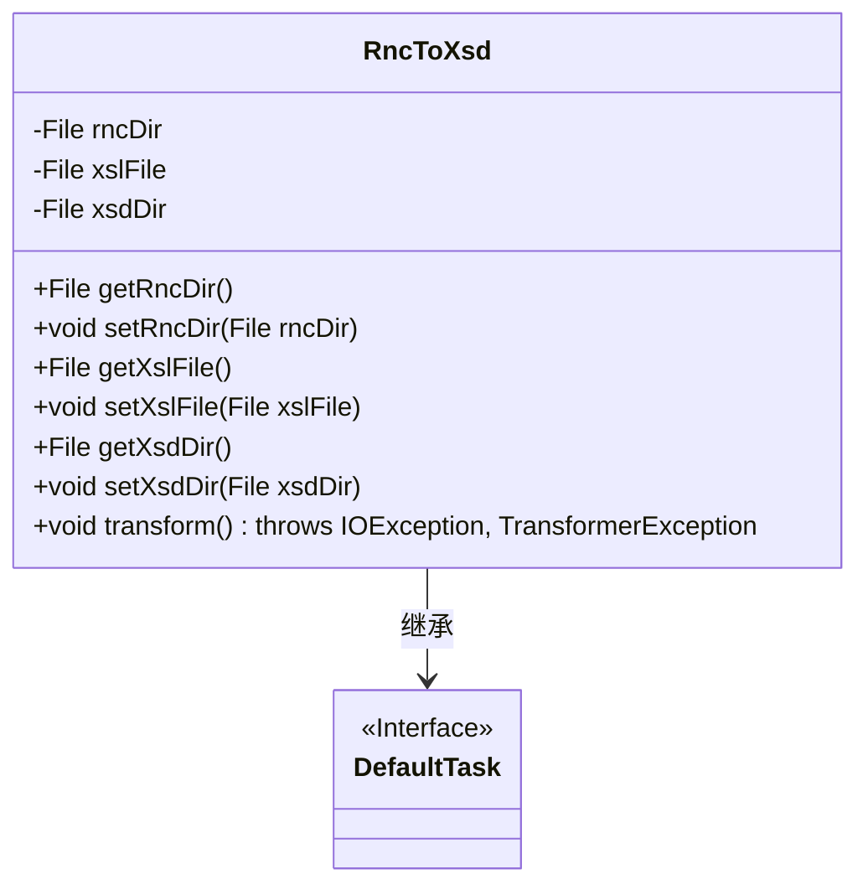
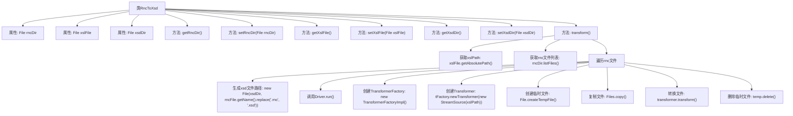

# 基础信息

|      |      |
|------|------|
| 名称 | RncToXsd |
| 编码语言 | .java |
| 代码路径 | spring-ldap/buildSrc/src/main/java/trang/RncToXsd.java |
| 包名 | None |
| 依赖项 | ['java.io.File', 'java.io.IOException', 'java.nio.file.Files', 'java.nio.file.StandardCopyOption', 'javax.xml.transform.Transformer', 'javax.xml.transform.TransformerException', 'javax.xml.transform.TransformerFactory', 'javax.xml.transform.stream.StreamResult', 'javax.xml.transform.stream.StreamSource', 'com.thaiopensource.relaxng.translate.Driver', 'net.sf.saxon.TransformerFactoryImpl', 'org.gradle.api.DefaultTask', 'org.gradle.api.tasks.InputDirectory', 'org.gradle.api.tasks.InputFile', 'org.gradle.api.tasks.OutputDirectory', 'org.gradle.api.tasks.TaskAction'] |
| 概述说明 | RncToXsd类通过XSLT将RNC文件转换为XSD文件。 |

# 说明

RncToXsd类负责将RNC文件转换为XSD文件，这一转换过程通过XSLT技术进行格式处理，确保文件格式的准确性和一致性。该类的核心功能在于处理文件格式转换，利用XSLT的强大功能实现RNC到XSD的无缝转换，从而满足不同应用场景的需求。

# 类列表 Class Summary

| 名称   | 类型  | 说明 |
|-------|------|-------------|
| RncToXsd | class | RncToXsd类将RNC文件转换为XSD文件，使用XSLT进行格式处理。 |

## 类 RncToXsd

|      |      |
|------|------|
| 访问范围 | public |
| 类型 | class |
| 名称 | RncToXsd |
| 说明 | RncToXsd类将RNC文件转换为XSD文件，使用XSLT进行格式处理。 |

### UML类图

该代码定义了一个 `RncToXsd` 类，继承自 `DefaultTask` 接口。`RncToXsd` 类包含三个私有成员变量：`rncDir`、`xslFile` 和 `xsdDir`，分别表示 RNC 文件目录、XSL 文件和 XSD 文件目录。类中提供了这些变量的 getter 和 setter 方法，并且定义了一个 `transform` 方法，用于将 RNC 文件转换为 XSD 文件。`transform` 方法通过调用 `Driver` 类和 `TransformerFactory` 来实现文件格式的转换和内容的处理。

### 内部方法调用关系图

这段代码定义了一个名为 `RncToXsd` 的类，用于将 `.rnc` 文件转换为 `.xsd` 文件。类中包含三个属性：`rncDir`、`xslFile` 和 `xsdDir`，分别表示 `.rnc` 文件目录、XSL 转换文件和 `.xsd` 输出目录。`transform` 方法是核心逻辑，它遍历 `rncDir` 中的所有 `.rnc` 文件，使用 `Driver` 类将其转换为 `.xsd` 文件，并通过 XSL 转换进一步处理生成最终的 `.xsd` 文件。流程图展示了从文件获取、转换到最终输出的完整流程。

### 字段列表 Field List

| 名称  | 类型  | 说明 |
|-------|-------|------|
| rncDir | File | 私有文件类型变量rncDir声明。 |
| xsdDir | File | 私有文件变量xsdDir。 |
| xslFile | File | 私有文件对象xslFile。 |

### 方法列表 Method List

| 名称  | 类型  | 说明 |
|-------|-------|------|
| setXslFile | void | 设置XSL文件的方法。 |
| getRncDir | File | 获取RNC目录的公共方法。 |
| setXsdDir | void | 该方法用于设置XSD目录路径。 |
| getXslFile | File | 获取XSL文件的方法，返回xslFile对象。 |
| getXsdDir | File | 该方法返回名为xsdDir的File对象。 |
| setRncDir | void | 设置RNC目录方法，参数为File类型。 |
| transform | void | 方法转换.rnc文件为.xsd，使用XSLT进行格式转换并保存。 |

