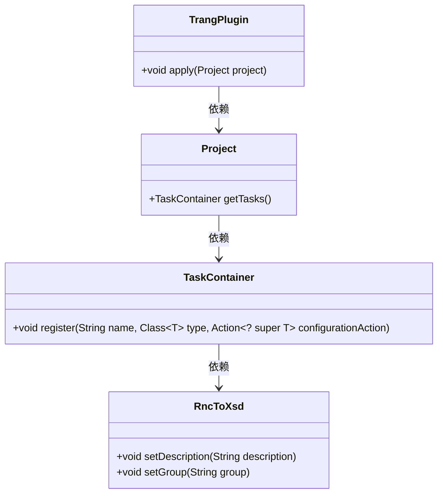
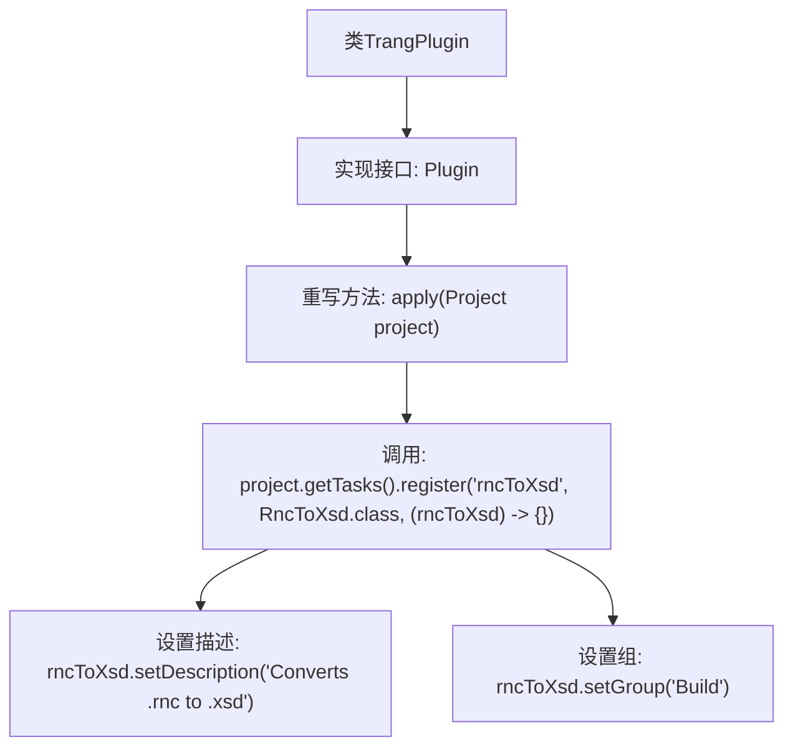

# 基础信息

|      |      |
|------|------|
| 名称 | TrangPlugin |
| 编码语言 | .java |
| 代码路径 | spring-ldap/buildSrc/src/main/java/trang/TrangPlugin.java |
| 包名 | None |
| 依赖项 | ['org.gradle.api.Plugin', 'org.gradle.api.Project'] |
| 概述说明 | TrangPlugin类实现Plugin接口，注册rncToXsd任务，转换.rnc为.xsd。 |

# 说明

TrangPlugin类实现了Plugin接口，其主要功能是注册一个名为rncToXsd的任务。该任务的作用是将以.rnc为扩展名的文件转换为以.xsd为扩展名的文件。通过这种方式，TrangPlugin类提供了从Relax NG Compact Syntax（RNC）到XML Schema Definition（XSD）的转换能力。

# 类列表 Class Summary

| 名称   | 类型  | 说明 |
|-------|------|-------------|
| TrangPlugin | class | TrangPlugin类实现Plugin接口，注册rncToXsd任务，将.rnc转换为.xsd。 |

## 类 TrangPlugin

|      |      |
|------|------|
| 访问范围 | public |
| 类型 | class |
| 名称 | TrangPlugin |
| 说明 | TrangPlugin类实现Plugin接口，注册rncToXsd任务，将.rnc转换为.xsd。 |

### UML类图

**描述：**  
`TrangPlugin` 是一个实现了 `Plugin<Project>` 接口的类，其主要功能是在 Gradle 项目中注册一个名为 `rncToXsd` 的任务。该任务属于 `Build` 组，描述为 "Converts .rnc to .xsd"。`TrangPlugin` 依赖于 `Project` 类，`Project` 类又依赖于 `TaskContainer`，`TaskContainer` 负责注册任务并配置 `RncToXsd` 实例。

### 内部方法调用关系图

这段代码定义了一个名为 `TrangPlugin` 的类，该类实现了 `Plugin<Project>` 接口，并重写了 `apply` 方法。在 `apply` 方法中，通过 `project.getTasks().register` 注册了一个名为 `rncToXsd` 的任务，该任务属于 `RncToXsd` 类。注册过程中，设置了任务的描述为 "Converts .rnc to .xsd"，并将其分组为 "Build"。这段代码的主要作用是在 Gradle 项目中注册一个用于将 `.rnc` 文件转换为 `.xsd` 文件的任务。

### 字段列表 Field List

| 名称  | 类型  | 说明 |
|-------|-------|------|

### 方法列表 Method List

| 名称  | 类型  | 说明 |
|-------|-------|------|
| apply | void | 项目注册任务rncToXsd，将.rnc转换为.xsd，分组为Build。 |

