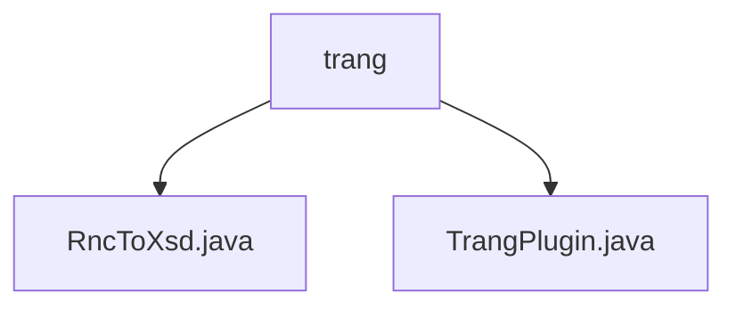

# 基础信息

|      |      |
|------|------|
| 名称 | trang |
| 编码语言 | .java |
| 代码路径 | spring-ldap/buildSrc/src/main/java/trang |
| 包名 | spring-ldap.buildSrc.src.main.java.trang |
| 概述说明 | RncToXsd类通过XSLT将RNC转换为XSD，TrangPlugin类注册任务实现此转换。 |

# 说明

## 概述

该代码模块主要实现了将Relax NG Compact Syntax（RNC）文件转换为XML Schema Definition（XSD）文件的功能。模块通过使用XSLT技术处理文件格式转换，确保转换过程的准确性和一致性。模块的核心类包括`RncToXsd`和`TrangPlugin`，分别负责具体的转换逻辑和任务注册。

## 主要业务场景

1. **文件格式转换**：`RncToXsd`类通过XSLT技术将RNC文件转换为XSD文件，确保文件格式的准确性和一致性。这一功能满足了不同应用场景中对文件格式转换的需求。

2. **任务注册与执行**：`TrangPlugin`类实现了Plugin接口，注册了一个名为`rncToXsd`的任务。该任务负责将以`.rnc`为扩展名的文件转换为以`.xsd`为扩展名的文件，提供了从RNC到XSD的转换能力。

3. **自动化构建**：该模块可以在自动化构建过程中使用，通过注册的任务自动完成RNC到XSD的转换，提高开发效率并减少手动操作带来的错误。

### 包内部结构视图

该流程图展示了`trang`目录下的两个Java文件：`RncToXsd.java`和`TrangPlugin.java`。这两个文件直接位于`trang`目录下，没有更深层次的子目录结构。

# 文件列表 File List

| 名称   | 类型  | 说明 |
|-------|------|-------------|
| [TrangPlugin.java](TrangPlugin.md) | file | TrangPlugin类实现Plugin接口，注册rncToXsd任务，转换.rnc为.xsd。 |
| [RncToXsd.java](RncToXsd.md) | file | RncToXsd类通过XSLT将RNC文件转换为XSD文件。 |

