# 基础信息

|      |      |
|------|------|
| 名称 | LdapTemplateLookupOpenLdapITests |
| 编码语言 | .java |
| 代码路径 | spring-ldap/core/src/itest-openldap/java/org/springframework/ldap/LdapTemplateLookupOpenLdapITests.java |
| 包名 | org.springframework.ldap |
| 依赖项 | ['javax.naming.NamingException', 'javax.naming.directory.Attributes', 'org.springframework.ldap.core.AttributesMapper', 'org.springframework.ldap.core.ContextMapper', 'org.springframework.ldap.core.DirContextAdapter', 'org.springframework.ldap.core.DistinguishedName', 'org.springframework.ldap.core.LdapTemplate', 'org.springframework.test.AbstractDependencyInjectionSpringContextTests'] |
| 概述说明 | 测试LDAP模板查找功能，验证映射器和返回属性正确性。 |

# 说明

LdapTemplateLookupOpenLdapITests类专注于测试LDAP模板查找功能，通过验证不同映射器和返回属性的正确性来确保系统在处理LDAP查询时的准确性和可靠性。该测试类旨在确保模板查找功能在各种配置和映射场景下都能正确执行，从而保障LDAP查询结果的准确性和一致性。

# 类列表 Class Summary

| 名称   | 类型  | 说明 |
|-------|------|-------------|
| LdapTemplateLookupOpenLdapITests | class | LdapTemplateLookupOpenLdapITests类测试LDAP模板查找功能，验证不同映射器和返回属性的正确性。 |

## 类 LdapTemplateLookupOpenLdapITests

|      |      |
|------|------|
| 访问范围 | public |
| 类型 | class |
| 名称 | LdapTemplateLookupOpenLdapITests |
| 说明 | LdapTemplateLookupOpenLdapITests类测试LDAP模板查找功能，验证不同映射器和返回属性的正确性。 |

### UML类图

```mermaid
classDiagram
    class LdapTemplateLookupOpenLdapITests {
        -LdapTemplate tested
        +String[] getConfigLocations()
        +void testLookup_Plain()
        +void testLookup_AttributesMapper()
        +void testLookup_AttributesMapper_DistinguishedName()
        +void testLookup_ReturnAttributes_AttributesMapper()
        +void testLookup_ReturnAttributes_AttributesMapper_DistinguishedName()
        +void testLookup_ContextMapper()
        +void testLookup_ReturnAttributes_ContextMapper()
        +void testLookup_MultiValuedRdn()
        +void testLookup_MultiValuedRdn_DirContextAdapter()
        +void testLookup_GetNameInNamespace_Plain()
        +void testLookup_GetNameInNamespace_MultiRdn()
        +void setTested(LdapTemplate tested)
    }

    class AbstractDependencyInjectionSpringContextTests {
        +String[] getConfigLocations()
    }

    class LdapTemplate {
        +Object lookup(String dn)
        +Object lookup(String dn, AttributesMapper mapper)
        +Object lookup(DistinguishedName dn, AttributesMapper mapper)
        +Object lookup(String dn, String[] attrs, AttributesMapper mapper)
        +Object lookup(DistinguishedName dn, String[] attrs, AttributesMapper mapper)
        +Object lookup(String dn, ContextMapper mapper)
        +Object lookup(String dn, String[] attrs, ContextMapper mapper)
    }

    class DirContextAdapter {
        +String getStringAttribute(String attr)
        +DistinguishedName getDn()
        +String getNameInNamespace()
    }

    class Person {
        +String getFullname()
        +String getLastname()
        +String getDescription()
        +void setFullname(String fullname)
        +void setLastname(String lastname)
        +void setDescription(String description)
    }

    class AttributesMapper {
        <<Interface>>
        +Object mapFromAttributes(Attributes attributes)
    }

    class SubsetPersonAttributesMapper {
        +Object mapFromAttributes(Attributes attributes)
    }

    class ContextMapper {
        <<Interface>>
        +Object mapFromContext(Object ctx)
    }

    class PersonAttributesMapper {
        +Object mapFromAttributes(Attributes attributes)
    }

    class PersonContextMapper {
        +Object mapFromContext(Object ctx)
    }

    class DistinguishedName {
        +String toString()
    }

    LdapTemplateLookupOpenLdapITests --> AbstractDependencyInjectionSpringContextTests : 继承
    LdapTemplateLookupOpenLdapITests --> LdapTemplate : 依赖
    LdapTemplateLookupOpenLdapITests --> DirContextAdapter : 依赖
    LdapTemplateLookupOpenLdapITests --> Person : 依赖
    LdapTemplateLookupOpenLdapITests --> AttributesMapper : 依赖
    LdapTemplateLookupOpenLdapITests --> SubsetPersonAttributesMapper : 依赖
    LdapTemplateLookupOpenLdapITests --> ContextMapper : 依赖
    LdapTemplateLookupOpenLdapITests --> PersonAttributesMapper : 依赖
    LdapTemplateLookupOpenLdapITests --> PersonContextMapper : 依赖
    LdapTemplateLookupOpenLdapITests --> DistinguishedName : 依赖
    SubsetPersonAttributesMapper ..|> AttributesMapper : 实现
    PersonAttributesMapper ..|> AttributesMapper : 实现
    PersonContextMapper ..|> ContextMapper : 实现
```

**描述：**
`LdapTemplateLookupOpenLdapITests` 是一个继承自 `AbstractDependencyInjectionSpringContextTests` 的测试类，主要用于测试 `LdapTemplate` 的查找功能。它依赖于 `LdapTemplate` 来执行各种查找操作，并使用 `DirContextAdapter` 和 `Person` 类来处理查找结果。该类还使用了多个映射器接口（如 `AttributesMapper` 和 `ContextMapper`）及其实现类（如 `SubsetPersonAttributesMapper` 和 `PersonAttributesMapper`）来映射查找结果。通过这些测试方法，验证了不同查找场景下的功能正确性。

### 内部方法调用关系图

```mermaid
graph TD
    A["类LdapTemplateLookupOpenLdapITests"]
    B["继承: AbstractDependencyInjectionSpringContextTests"]
    C["属性: LdapTemplate tested"]
    D["方法: String[] getConfigLocations()"]
    E["方法: void testLookup_Plain()"]
    F["方法: void testLookup_AttributesMapper()"]
    G["方法: void testLookup_AttributesMapper_DistinguishedName()"]
    H["内部类: SubsetPersonAttributesMapper"]
    I["方法: void testLookup_ReturnAttributes_AttributesMapper()"]
    J["方法: void testLookup_ReturnAttributes_AttributesMapper_DistinguishedName()"]
    K["方法: void testLookup_ContextMapper()"]
    L["方法: void testLookup_ReturnAttributes_ContextMapper()"]
    M["方法: void testLookup_MultiValuedRdn()"]
    N["方法: void testLookup_MultiValuedRdn_DirContextAdapter()"]
    O["方法: void testLookup_GetNameInNamespace_Plain()"]
    P["方法: void testLookup_GetNameInNamespace_MultiRdn()"]
    Q["方法: void setTested(LdapTemplate tested)"]

    A --> B
    A --> C
    A --> D
    A --> E
    A --> F
    A --> G
    A --> H
    A --> I
    A --> J
    A --> K
    A --> L
    A --> M
    A --> N
    A --> O
    A --> P
    A --> Q
```

这段代码定义了一个名为 `LdapTemplateLookupOpenLdapITests` 的类，继承自 `AbstractDependencyInjectionSpringContextTests`。该类包含多个测试方法，用于验证 `LdapTemplate` 的不同查找功能。每个测试方法通过调用 `LdapTemplate` 的 `lookup` 方法，并使用不同的映射器（如 `AttributesMapper` 和 `ContextMapper`）来处理返回的LDAP条目。测试方法还验证了返回的属性值是否符合预期。代码中还包含一个内部类 `SubsetPersonAttributesMapper`，用于映射LDAP条目的子集属性。

### 字段列表 Field List

| 名称  | 类型  | 说明 |
|-------|-------|------|
| tested | LdapTemplate | 私有LdapTemplate已测试。 |

### 方法列表 Method List

| 名称  | 类型  | 说明 |
|-------|-------|------|
| testLookup_ContextMapper | void | 测试通过ContextMapper查找Person对象并验证其属性。 |
| setTested | void | 设置LdapTemplate实例到当前对象的tested属性。 |
| testLookup_AttributesMapper | void | 测试用例验证Person对象属性映射和断言结果。 |
| testLookup_ReturnAttributes_ContextMapper | void | 测试查找功能，验证返回属性和上下文映射器。 |
| testLookup_MultiValuedRdn | void | 测试多值RDN查找，验证姓名、姓氏和描述信息正确。 |
| testLookup_ReturnAttributes_AttributesMapper | void | 测试方法验证通过属性映射器返回的人员属性。 |
| testLookup_MultiValuedRdn_DirContextAdapter | void | 测试多值RDN查找，验证DirContextAdapter属性值正确性。 |
| testLookup_GetNameInNamespace_Plain | void | 测试方法验证查找功能，检查返回的DN和命名空间名称是否匹配预期值。 |
| testLookup_ReturnAttributes_AttributesMapper_DistinguishedName | void | 测试查找返回属性，验证全名正确且姓氏描述为空。 |
| testLookup_Plain | void | 测试方法验证查找功能，检查返回的DirContextAdapter对象属性值是否正确。 |
| getConfigLocations | String[] | 该方法返回配置文件路径为`/conf/ldapTemplateTestContext-openldap.xml`。 |
| testLookup_GetNameInNamespace_MultiRdn | void | 测试方法验证多级RDN查找及命名空间名称正确性。 |
| testLookup_AttributesMapper_DistinguishedName | void | 测试通过属性映射器查找并验证人员信息。 |

