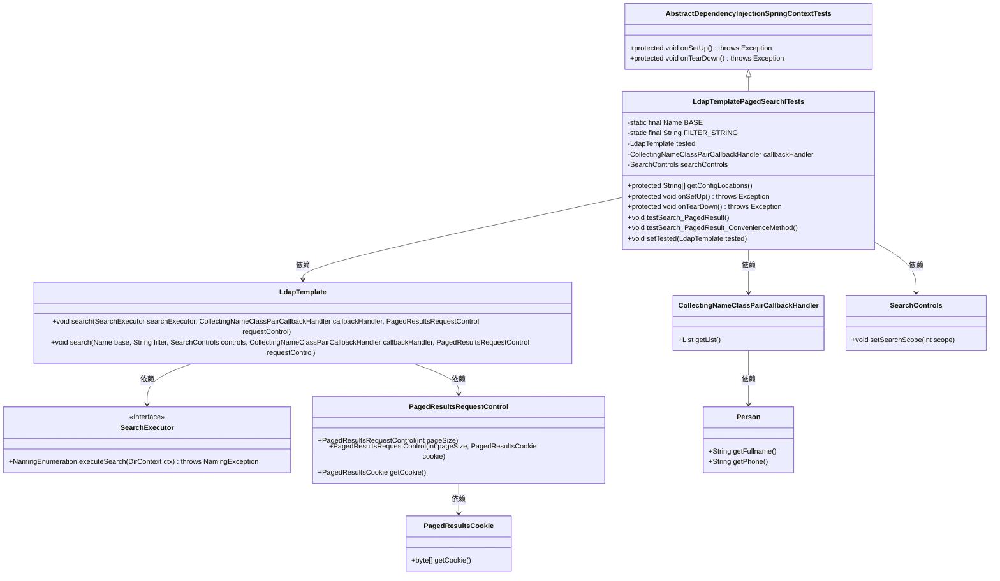
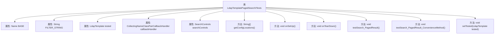

# 基础信息

|      |      |
|------|------|
| 名称 | LdapTemplatePagedSearchITests |
| 编码语言 | .java |
| 代码路径 | spring-ldap/core/src/itest-openldap/java/org/springframework/ldap/control/LdapTemplatePagedSearchITests.java |
| 包名 | org.springframework.ldap.control |
| 依赖项 | ['java.util.List', 'javax.naming.Name', 'javax.naming.NamingEnumeration', 'javax.naming.NamingException', 'javax.naming.directory.DirContext', 'javax.naming.directory.SearchControls', 'org.springframework.ldap.Person', 'org.springframework.ldap.PersonAttributesMapper', 'org.springframework.ldap.core.AttributesMapperCallbackHandler', 'org.springframework.ldap.core.CollectingNameClassPairCallbackHandler', 'org.springframework.ldap.core.DistinguishedName', 'org.springframework.ldap.core.LdapTemplate', 'org.springframework.ldap.core.SearchExecutor', 'org.springframework.test.AbstractDependencyInjectionSpringContextTests'] |
| 概述说明 | 测试LDAP分页搜索功能，验证结果和Cookie准确性。 |

# 说明

测试LDAP分页搜索功能，主要验证搜索结果和Cookie的正确性。通过分页搜索，确保每次请求返回的数据量符合预期，且分页机制能够正确处理大量数据。同时，验证Cookie的生成和使用是否正确，确保在分页过程中能够保持会话状态，避免数据丢失或重复。测试过程中需关注分页参数的传递、结果集的完整性以及Cookie的时效性和一致性，确保系统在高负载和大数据量情况下仍能稳定运行。

# 类列表 Class Summary

| 名称   | 类型  | 说明 |
|-------|------|-------------|
| LdapTemplatePagedSearchITests | class | 测试LDAP分页搜索功能，验证结果和Cookie的正确性。 |

## 类 LdapTemplatePagedSearchITests

|      |      |
|------|------|
| 访问范围 | public |
| 类型 | class |
| 名称 | LdapTemplatePagedSearchITests |
| 说明 | 测试LDAP分页搜索功能，验证结果和Cookie的正确性。 |

### UML类图

### 描述
`LdapTemplatePagedSearchITests` 类继承自 `AbstractDependencyInjectionSpringContextTests`，用于测试 LDAP 分页搜索功能。它依赖于 `LdapTemplate` 来执行搜索操作，并使用 `CollectingNameClassPairCallbackHandler` 和 `SearchControls` 来处理搜索结果和设置搜索范围。`SearchExecutor` 是一个接口，定义了执行搜索的方法。`PagedResultsRequestControl` 和 `PagedResultsCookie` 用于控制分页搜索的请求和响应。`Person` 类表示搜索结果中的用户信息。

### 内部方法调用关系图

这段代码描述了一个名为`LdapTemplatePagedSearchITests`的类，该类继承自`AbstractDependencyInjectionSpringContextTests`。类中包含多个属性和方法，主要用于处理LDAP（轻量级目录访问协议）的分页搜索操作。`testSearch_PagedResult`和`testSearch_PagedResult_ConvenienceMethod`是两个测试方法，分别验证了分页搜索的功能和便捷方法的使用。代码通过`SearchExecutor`和`PagedResultsRequestControl`实现分页搜索，并对搜索结果进行断言验证。

### 字段列表 Field List

| 名称  | 类型  | 说明 |
|-------|-------|------|
| tested | LdapTemplate | 私有LdapTemplate已测试。 |
| searchControls | SearchControls | 声明了一个私有变量searchControls，类型为SearchControls。 |
| BASE = DistinguishedName.EMPTY_PATH | Name | 定义私有静态常量BASE，初始化为DistinguishedName.EMPTY_PATH。 |
| callbackHandler | CollectingNameClassPairCallbackHandler | 私有变量callbackHandler，类型为CollectingNameClassPairCallbackHandler。 |
| FILTER_STRING = "(&(objectclass=person))" | String | 私有静态字符串常量用于LDAP查询过滤器，筛选对象类为person的条目。 |

### 方法列表 Method List

| 名称  | 类型  | 说明 |
|-------|-------|------|
| setTested | void | 该方法用于设置LdapTemplate类型的tested属性。 |
| testSearch_PagedResult_ConvenienceMethod | void | 测试分页搜索功能，验证结果和Cookie的正确性。 |
| getConfigLocations | String[] | 该方法返回配置文件路径数组，包含一个LDAP测试上下文文件。 |
| onSetUp | void | 初始化测试环境，设置属性映射器、回调处理器及搜索控制范围。 |
| testSearch_PagedResult | void | 测试分页搜索功能，验证搜索结果和Cookie状态。 |
| onTearDown | void | 在`onTearDown`方法中，清空`callbackHandler`、`tested`和`searchControls`对象。 |

