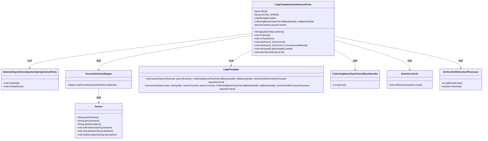

# 基础信息

|      |      |
|------|------|
| 名称 | LdapTemplateSortedSearchITests |
| 编码语言 | .java |
| 代码路径 | spring-ldap/core/src/itest-openldap/java/org/springframework/ldap/control/LdapTemplateSortedSearchITests.java |
| 包名 | org.springframework.ldap.control |
| 依赖项 | ['java.util.List', 'javax.naming.Name', 'javax.naming.NamingEnumeration', 'javax.naming.NamingException', 'javax.naming.directory.Attributes', 'javax.naming.directory.DirContext', 'javax.naming.directory.SearchControls', 'org.springframework.ldap.Person', 'org.springframework.ldap.core.AttributesMapper', 'org.springframework.ldap.core.AttributesMapperCallbackHandler', 'org.springframework.ldap.core.CollectingNameClassPairCallbackHandler', 'org.springframework.ldap.core.DistinguishedName', 'org.springframework.ldap.core.LdapTemplate', 'org.springframework.ldap.core.SearchExecutor', 'org.springframework.test.AbstractDependencyInjectionSpringContextTests'] |
| 概述说明 | LDAP模板测试类验证排序搜索功能，确保结果正确。 |

# 说明

LDAP模板测试类主要用于验证排序搜索功能的正确性。该测试类通过执行特定的搜索操作，并对其结果进行断言，以确保排序功能按照预期工作。测试过程中，系统会检查搜索结果是否与预期顺序一致，从而验证排序算法的准确性。该测试类旨在确保LDAP模板在处理排序搜索时能够返回正确且有序的结果，为系统的稳定性和可靠性提供保障。

# 类列表 Class Summary

| 名称   | 类型  | 说明 |
|-------|------|-------------|
| LdapTemplateSortedSearchITests | class | LDAP模板测试类，验证排序搜索功能，断言结果正确。 |

## 类 LdapTemplateSortedSearchITests

|      |      |
|------|------|
| 访问范围 | public |
| 类型 | class |
| 名称 | LdapTemplateSortedSearchITests |
| 说明 | LDAP模板测试类，验证排序搜索功能，断言结果正确。 |

### UML类图

这段代码定义了一个名为 `LdapTemplateSortedSearchITests` 的测试类，它继承自 `AbstractDependencyInjectionSpringContextTests`。该类主要用于测试 LDAP 模板的排序搜索功能。它通过 `LdapTemplate` 类执行搜索操作，并使用 `SortControlDirContextProcessor` 对搜索结果进行排序。`PersonAttributesMapper` 类用于将 LDAP 属性映射到 `Person` 对象。测试类通过 `testSearch_SortControl` 和 `testSearch_SortControl_ConvenienceMethod` 方法验证搜索结果是否正确排序。

### 内部方法调用关系图

这段代码是一个用于测试LDAP模板排序搜索的集成测试类。它包含了多个方法，用于设置和清理测试环境，执行搜索操作，并验证搜索结果是否按预期排序。代码中还定义了一个内部类`PersonAttributesMapper`，用于将LDAP属性映射到`Person`对象。流程图展示了类的结构及其方法之间的关系，帮助理解代码的执行流程。

### 字段列表 Field List

| 名称  | 类型  | 说明 |
|-------|-------|------|
| BASE = DistinguishedName.EMPTY_PATH | Name | 定义静态常量BASE，初始化为DistinguishedName的空路径。 |
| tested | LdapTemplate | 已测试私有LdapTemplate实例。 |
| searchControls | SearchControls | 声明了一个私有的SearchControls对象变量。 |
| callbackHandler | CollectingNameClassPairCallbackHandler | 私有回调处理器用于收集类名对。 |
| FILTER_STRING = "(&(objectclass=ikeaperson)(cn=gor*))" | String | LDAP过滤字符串，筛选对象类为ikeaperson且cn以gor开头的条目。 |

### 方法列表 Method List

| 名称  | 类型  | 说明 |
|-------|-------|------|
| assertSortedList | void | 验证列表大小为6并按姓名顺序排列。 |
| setTested | void | 设置LDAP模板的测试对象。 |
| testSearch_SortControl_ConvenienceMethod | void | 测试搜索排序控制便捷方法，验证结果排序正确。 |
| onTearDown | void | 在`onTearDown`方法中，释放资源并清空对象引用。 |
| testSearch_SortControl | void | 测试搜索排序控制功能，验证结果是否按指定字段排序。 |
| getConfigLocations | String[] | 方法返回配置文件路径为`/conf/ldapTemplateTestContext-openldap.xml`。 |
| onSetUp | void | 初始化测试环境，设置回调处理器和搜索控件范围。 |

